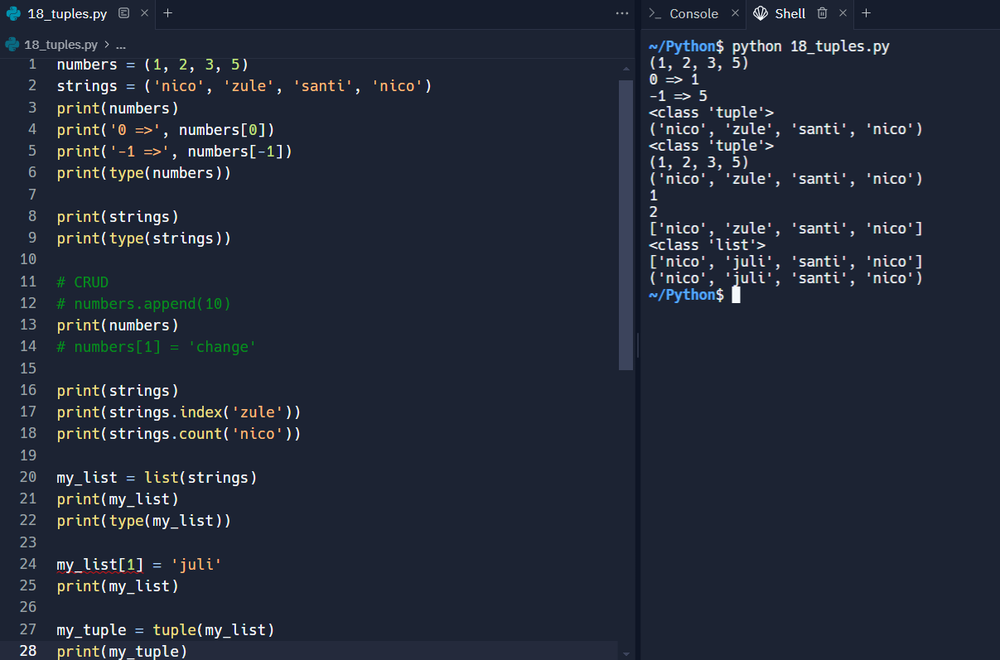
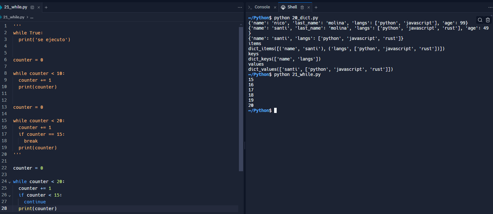

## Curso de Fundamentos de Python

Aprende a programar en Python desde cero. Potencia tu futuro con el lenguaje en auge en data science, desarrollo backend, Machine Learning, IoT y más. Crea tus primeros programas utilizando variables, estructuras de datos, condicionales y ciclos.

### ¿Por qué aprender a programar en Python?

1) Python ocupa siempre los primeros puestos de los lenguajes mas queridos.

2) Es fácil de aprender.

3) Esta en el top 20 de los lenguajes de programación mejor pagos.

4) Puede ser utilizado en diferentes áreas, especialmente en Análisis de datos (51%) y desarrollo web (45%).

5) Tiene una demanda laboral muy grande en el mundo de la tecnología.

#### Recursos

https://insights.stackoverflow.com/survey/2021

https://www.jetbrains.com/lp/devecosystem-2021/


### Herramientas del curso


#### Recursos

https://replit.com/

https://replit.com/@nicobytes/Python101?v=1#01_print.py

###  Tu primer programa con Python

Tener cuidado con la identacion 

```py
print("Hola, esto es el archivo 01")

print("Hola soy Nicolas y tengo 12 años")

# operaciones...

print(12 + 5)
print(10 - 5)
print(2 * 3)
print(8 / 2)

# Esto es un comentario
"""
varias
lineas
otra
"""
'''
varias 
lienas
'''
```

#### Recursos

https://replit.com/@nicobytes/Python101?v=1#01_print.py

https://replit.com/@NicolasMolina13/Python-101

### Herramientas para programar con Python

¡Hola, te doy la bienvenida a esta clase con un mensaje muy especial!


En este curso, gracias a la herramienta de Replit, NO tienes que instalar nada en tu computador para comenzar a programar. Pero te tengo un mensaje del futuro muy importante: en tu día a día programando utilizarás otras herramientas que te permitirán construir software de manera profesional.

Algunas de estas herramientas son las siguientes:

* Editores de código como Visual Studio Code.
* Terminal y línea de comandos en diversos sistemas operativos.
* Jupyter Notebooks (si decides entrar a data science).
* Git para control de versiones.
* Entornos virtuales con PIP.
* Entornos integrados de desarrollo (IDE) como PyCharm, Visual Studio o DataSpell.
  


Por ahora NO nos preocuparemos por todo esto, ni por alguna instalación. Lo más importante en este momento que estás dando tus primeros pasos es que aprendas los fundamentos del lenguaje Python.

En cursos posteriores de la ruta de aprendizaje que sigues, instalarás y conocerás herramientas que te permitirán programar con Python de manera profesional.

¡Sigue avanzando en tu ruta de aprendizaje! 🐍💚

### Variables

Para imprimir directamente el archivo desde la terminal lo realizamos de la siguiente manera:

Ingresamos a la shell

```shell
python 02_vars.py
```

Ejercicios

```py
print("Hola, vars")

# esto es una variable
my_name = "Nicolas"
print(my_name)

# esto es variable con un numero
my_age = 12
print(my_age)

my_name = "Santiago"
print("aqui cambio", my_name)

# input

my_name = input("¿Cuál es tu nombre?")
print("usando input", my_name)
```

#### Recursos

https://www.w3schools.com/python/python_variables.asp

### Tipos de datos

Tipos de datos primitivos

* Integers: números Enteros
* Floats: números de punto flotante (decimales)
* Strings: cadena de caracteres (texto)
* Boolean: boolenaos (Verdadero o Falso)
  
Tipos de dato adicionales

* Datos en texto: str
* Datos numéricos: int, float, complex
* Datos en secuencia: list, tuple, range
* Datos de mapeo: dict
* Set Types: set, frozenset
* Datos booleanos: bool
* Datos binarios: bytes, bytearray, memoryview


```py
# string
my_name = "Nicolas"
my_name = 'Santiago'
my_name = "12"
print('my_name =>', my_name)
print(type(my_name))

# int
my_age = 12
print('my_age =>', my_age)
print(type(my_age))

# boolean
is_single = False
print('is_single =>', is_single)
print(type(is_single))

# inputs
my_age = input('¿Cuál es tu edad? ')
print('my_age =>', my_age)
print(type(my_age))
```

#### Recursos

https://www.w3schools.com/python/python_datatypes.asp


### Strings


Una nueva notación para cadenas llamada cadenas "f", que simplifica la inserción de variables y expresiones en las cadenas.

```py
name = "Nicolas"
last_name = 'Molina Monroy'
print(name)
print(last_name)

full_name = name + " " + last_name
print(full_name)

quote = "I'm Nicolas"
print(quote)

quote2 = ' She said "Hello"  '
print(quote2)

# format
template = "Hola, mi nombre es " + name + " y mi apellido es " + last_name
print('v1 ', template)

template = "Hola, mi nombre es {} y mi apellido es {}".format(name, last_name)

print('v2', template)

template = f"Hola, mi nombre es {name} y mi apellido es {last_name}"
print('v3', template)
```

#### Recursos

https://static.platzi.com/media/public/uploads/04_string_463dac54-1e10-4e3f-b621-478f0a13fbef.py


### Numbers


```py
lives = 3
print(type(lives))
age = 12
budget = 100

temperature = 12.12
print(type(temperature))

lives = 2
print(lives)
lives = 1
print(lives)

lives = 12 + 15
print(lives)

lives = lives - 1
print(lives)

lives -= 1
print(lives)

lives -= 5
print(lives)

lives += 5
print(lives)

number = 4500000000000000000.1
print(number)

number_b = 0.0000000000000001
print(number_b)
```

#### Recursos

https://static.platzi.com/media/public/uploads/05_numbers_05fb89e8-49d2-478c-bbf5-6ac16ccace31.py

### Booleans


```py
is_single = True
print(type(is_single))
is_single = False
print(is_single)

print(not True)
print(not False)

is_single = not is_single
print(is_single)
```

#### Recursos

https://static.platzi.com/media/public/uploads/06_booleans_fb16cc2d-9456-44c8-a1df-198e109c7d55.py

### Transformación de tipos


```py
name = "Nicolas"
print(type(name))
name = 12
print(type(name))
name = True
print(type(name))

print("Nicolas" + " Molina")
print(10 + 20)
print("Nicolas" + "12")

age = 12
print("Mi edad es " + str(age))
print(f"Mi edad es {age}")

age = input('Escribe tu edad => ')
print(type(age))
age = int(age)
age += 10
print(f'Tu edad en 10 años será {age}')
```
#### Recursos

https://www.w3schools.com/python/python_casting.asp

### Operadores aritméticos


```py
print(10 + 10)
print(10 - 5)
print(10 * 2)
print(10 / 2) # 5
print(10 % 2) # 0
print(10 / 3)
print(10 % 3)
print(10 // 3)
print(2 ** 3)
print(2 ** 3 + 3 - 7 / 1 // 4)
print(2 ** 3)
print((7 / 1) // 4)

print(8 + 3 - 1)
print(10 / 0)

print('Hola' + ' mundo')
print('Hola' * 3)
```


#### Recursos

https://www.w3schools.com/python/python_operators.asp

### Operadores de comparación


```py
# > 
print(7 > 3)
print(3 > 7)
print(7 > 7)

# <
print(5 < 6)
print(6 < 5)
print(5 < 5)

# >=
print(2 >= 1)
print(2 >= 3)
print(2 >= 2)

# <=
print(1 <= 2)
print(2 <= 1)
print(2 <= 2)

# ==

print(6 == 6)
print(5 == 2)

# !=

print(6 != 10)
print(6 != 6)

print("Apple" == 'Apple')
print("Apple" == 'apple')
print("1" == 1)

age = 15
print(age >= 18)
```

#### Recursos

https://www.w3schools.com/python/python_operators.asp


### Comparación de números flotantes


```py
x = 3.3
print(x)
y = 1.1 + 2.2
print(y)
print(x == y)

y_str = format(y, ".2g")
print('str =>', y_str)
print(y_str == str(x))

print('*' * 10)

print(y, x)

tolerance = 0.00001
print(abs(x - y) < tolerance)
```

#### Recursos

https://static.platzi.com/media/public/uploads/10_float_583c95ee-c16f-4d38-965e-f25a03500bdb.py


### Operadores lógicos: and y or


```py
# and
print('AND')
print('True and True =>', True and True)
print('True and False =>', True and False)
print('False and True =>', False and True)
print('False and False =>', False and False)

print(10 > 5 and 5 < 10)
print(10 > 5 and 5 > 10)

stock = input('Ingrese el numero de stock => ')
stock = int(stock)

print(stock >= 100 and stock <= 1000)

print('OR')
print('True or True =>', True or True)
print('True or False =>', True or False)
print('False or True =>', False or True)
print('False or False =>', False or False)

role = input('Digita el rol => ')

print(role == 'admin' or role == 'seller')
```

#### Recursos

https://static.platzi.com/media/public/uploads/11_logic_01a3be38-4a56-4644-b91e-afd7492776f0.py

https://www.w3schools.com/python/python_operators.asp

### Operador lógico not


```py
print(not True)
print(not False)

# and
print('NOT AND')
print('not True and True =>', not (True and True))
print('not True and False =>', not (True and False))
print('not False and True =>', not (False and True))
print('not False and False =>', not (False and False))

stock = input('Ingrese el numero de stock => ')
stock = int(stock)

print(not (stock >= 100 and stock <= 1000))
```


#### Recursos

https://static.platzi.com/media/public/uploads/12_not_1d988b7a-3a9e-49ff-b004-0038681f7c0b.py

### Condicionales


```py
if True:
  print('debería ejecutarse')

if False:
  print('nunca se ejecuta')

'''
pet = input('¿Cuál es tu mascota favorita? ')

if pet == 'perro':
  print('genial tienes buen gusto')
elif pet == 'gato':
  print('espero tengas suerte')
elif pet == 'pez':
  print('eres lo maximo')
else:
  print('no tienes ninguna mascota interesante')


stock = int(input('Digita el stock => '))

if stock >= 100 and stock <= 1000:
  print('el stock es correcto')
else:
  print('el stock es incorrecto')

'''

number = int(input('Ingrese un numero => '))
result = number % 2
if (result == 0):
  print('Es par')
else:
  print('Es impar')
```


#### Recursos

https://static.platzi.com/media/public/uploads/13_if_137b0293-f273-4889-92d4-be4c1b1878d0.py

https://www.w3schools.com/python/python_conditions.asp


### Proyecto: condicionales


```py
import random

options = ('piedra', 'papel', 'tijera')

computer_wins = 0
user_wins = 0

rounds = 1

while True:

    print('*' * 10)
    print('ROUND', rounds)
    print('*' * 10)

    print('computer_wins', computer_wins)
    print('user_wins', user_wins)

    user_option = input('piedra, papel o tijera => ')
    user_option = user_option.lower()

    rounds += 1

    if not user_option in options:
      print('esa opcion no es valida')
      continue

    computer_option = random.choice(options)

    print('User option =>', user_option)
    print('Computer option =>', computer_option)

    if user_option == computer_option:
        print('Empate!')
    elif user_option == 'piedra':
        if computer_option == 'tijera':
            print('piedra gana a tijera')
            print('user gano!')
            user_wins += 1
        else:
            print('Papel gana a piedra')
            print('computer gano!')
            computer_wins += 1
    elif user_option == 'papel':
        if computer_option == 'piedra':
            print('papel gana a piedra')
            print('user gano')
            user_wins += 1
        else:
            print('tijera gana a papel')
            print('computer gano!')
            computer_wins += 1
    elif user_option == 'tijera':
        if computer_option == 'papel':
            print('tijera gana a papel')
            print('user gano!')
            user_wins += 1
        else:
            print('piedra gana a tijera')
            print('computer gano!')
            computer_wins += 1

    if computer_wins == 2:
      print('El ganador es la computadora')
      break

    if user_wins == 2:
      print('El ganador es el usuario')
      break
```

#### Recursos

https://static.platzi.com/media/public/uploads/main_92da1810-98e1-4e28-b557-abd418a1be49.py


### String recargado


#### Recursos

https://static.platzi.com/media/public/uploads/14_strings_9cfc1106-2633-4f19-ad61-e0f2d5095fda.py

https://www.w3schools.com/python/python_strings_methods.asp

### Indexing y slicing


```py
text = "Ella sabe Python"
print(text[0])
print(text[1])
# print(text[999])
size = len(text)
print('size => ',size)
print(text[size - 1])
print(text[-1])

# slicing

print(text[0:5])
print(text[10:16])
print(text[:10])
print(text[5:-1])
print(text[5:])
print(text[:])
print(text[10:16:1])
print(text[10:16:2])
print(text[::2])
```

#### Recursos

https://static.platzi.com/media/public/uploads/15_indexing_2e23926a-4049-4659-9a17-cda6dfd1b0a7.py


### Listas

Lista = [1, 2, 3, 4, 5]

Puede ser modificada
Cada elemento esta separado por una coma
Puede contener todo tipo de datos
Metodos para listas
Lista.metodo(indice,elemento) o

Lista.metodo(elemento)

Metodos importantes
.count(elemento) cuenta cuantas veces un elemento esta en una lista

.extend(lista) permite extender una lista agregándole los elementos de otra lista

.pop() elimina y retorna el ultimo elemento de la lista

.reverse() reversa el orden de la lista

.sort() ordena la lista de manera ascendente o descendente

Actualizar un valor

Lista = [1, 2, 3, 4, 5]

Lista[0] = -8

Lista = [-8, 2, 3, 4, 5], resultado de la lista luego de actualizar el valor

Agregar un elemento

Lista.append(indice,elemento) o

Lista.append(elemento) en este caso el nuevo elemento se agrega al final de la lista

Eliminar un elemento

Lista.remove(indice, elemento)


```py
numbers = [1, 2, 3, 4]
print(numbers)
print(type(numbers))

tasks = ['make a dishes', 'play videogames']
print(tasks)

types = [1, True, 'hola']
print(types)

print(numbers[0])
print(tasks[0])
text = 'Hola'
# text[0] = 'W'

tasks[0] = 'watch platzi courses'
print(tasks)

tasks[0] = 'do the dishes'
print(tasks)

print(numbers[:3])
print(True in types)
print('hola' in types)
```


#### Recursos

https://static.platzi.com/media/public/uploads/16_lists_09eb2e15-2c15-4bf1-8a9a-952e49a506be.py

https://www.w3schools.com/python/python_lists.asp


### Métodos de listas

* append(): Añade un ítem al final de la lista.
* clear(): Vacía todos los ítems de una lista.
* extend(): Une una lista a otra.
* count(): Cuenta el número de veces que aparece un ítem.
* index(): Devuelve el índice en el que aparece un ítem (error si no aparece).
* insert(): Agrega un ítem a la lista en un índice específico.
* pop(): Extrae un ítem de la lista y lo borra.
* remove(): Borra el primer ítem de la lista cuyo valor concuerde con el que indicamos.
* reverse(): Le da la vuelta a la lista actual.
* sort(): Ordena automáticamente los ítems de una lista por su valor de menor a mayor.


```py
# CRUD Create, Read, Update & Delete

numbers = [1, 2 , 3 , 4 , 5]
print(numbers[1])
numbers[-1] = 10
print(numbers)

numbers.append(700)
print(numbers)

numbers.insert(0, 'hola')
print(numbers)

numbers.insert(3, 'change')
print(numbers)

tasks = ['todo 1', 'todo 2', 'todo 3']
new_list = numbers + tasks
print(new_list)

index = new_list.index('todo 2')
new_list[index] = 'todo changed'
print(new_list)

new_list.remove('todo 1')
print(new_list)

new_list.pop()
print(new_list)

new_list.pop(0)
print(new_list)

new_list.reverse()
print(new_list)

numbers_a = [1, 4, 6 , 3]
numbers_a.sort()
print(numbers_a)

strings = ['re', 'ab', 'ed']
strings.sort()
print(strings)

new_list.sort()
```

#### Recursos

https://static.platzi.com/media/public/uploads/17_crud_55b70298-7476-41f2-8d00-ebf8d6139135.py


### Tuplas

Estructura de datos inmutables que contiene una secuencia ordenada de elementos

Tupla = (1, 2, 3, 4)

Los elementos están separados por espacios luego de las comas
Puede contener cualquier tipo de datos
Cada posición de la tupla tiene un índice
Es inmutable y por lo tanto no puede ser modificada, lo que permite proteger mejor la data si no queremos que se modifique por error
Acceder a un elemento
Tupla = (”A”, “B”, “C”)

Tupla [0] Indice a consultar

“A” Nos retorna el resultado de la posición 0 en la tupla

Encontrar un elemento
Tupla = (”A”, “B”, “C”)

“A” in Tupla

True

“Z” in Tupla

False

Metodos
Buscar el Indice de un elemento

Tupla = (”A”, “B”, “C”)

Tupla.index(”A”)

0 Nos devuelve el indice del elemento que buscamos

Numero de veces que un elemento aparece en la Tupla

Tupla = (”A”, “B”, “C”)

Tupla.count(elemento)

Tupla.count(”B”)

1 Retorna el numero de veces del elemento en la Tupla




```py
numbers = (1, 2, 3, 5)
strings = ('nico', 'zule', 'santi', 'nico')
print(numbers)
print('0 =>', numbers[0])
print('-1 =>', numbers[-1])
print(type(numbers))

print(strings)
print(type(strings))

# CRUD
# numbers.append(10)
print(numbers)
# numbers[1] = 'change'

print(strings)
print(strings.index('zule'))
print(strings.count('nico'))

my_list = list(strings)
print(my_list)
print(type(my_list))

my_list[1] = 'juli'
print(my_list)

my_tuple = tuple(my_list)
print(my_tuple)

```

#### Recursos

https://static.platzi.com/media/public/uploads/18_tuples_cf380127-9909-410d-b5c9-112951a2d5c7.py

https://www.w3schools.com/python/python_tuples.asp

### Proyecto: tuplas


```py
import random

options = ('piedra', 'papel', 'tijera')

computer_wins = 0
user_wins = 0

rounds = 1

while True:

    print('*' * 10)
    print('ROUND', rounds)
    print('*' * 10)

    print('computer_wins', computer_wins)
    print('user_wins', user_wins)

    user_option = input('piedra, papel o tijera => ')
    user_option = user_option.lower()

    rounds += 1

    if not user_option in options:
      print('esa opcion no es valida')
      continue

    computer_option = random.choice(options)

    print('User option =>', user_option)
    print('Computer option =>', computer_option)

    if user_option == computer_option:
        print('Empate!')
    elif user_option == 'piedra':
        if computer_option == 'tijera':
            print('piedra gana a tijera')
            print('user gano!')
            user_wins += 1
        else:
            print('Papel gana a piedra')
            print('computer gano!')
            computer_wins += 1
    elif user_option == 'papel':
        if computer_option == 'piedra':
            print('papel gana a piedra')
            print('user gano')
            user_wins += 1
        else:
            print('tijera gana a papel')
            print('computer gano!')
            computer_wins += 1
    elif user_option == 'tijera':
        if computer_option == 'papel':
            print('tijera gana a papel')
            print('user gano!')
            user_wins += 1
        else:
            print('piedra gana a tijera')
            print('computer gano!')
            computer_wins += 1

    if computer_wins == 2:
      print('El ganador es la computadora')
      break

    if user_wins == 2:
      print('El ganador es el usuario')
      break
```

#### Recursos

https://static.platzi.com/media/public/uploads/main-1_313db28c-e246-4d9e-a2bf-d689a0fb7004.py


### Diccionarios: definición y lectura


# [ ] = Listas
# ( ) = Tuplas
# { } = Diccionarios

```py
my_dict = {}
print(type(my_dict))

my_dict = {
  'avion': "bla bla bla",
  'name': 'Nicolas',
  'last_name': 'Molina Monroy',
  'age': 87
}

print(my_dict)
print(len(my_dict))

print(my_dict['age'])
print(my_dict['last_name'])
print(my_dict.get('age'))

print('avion' in my_dict)
print('otroqueno' in my_dict)
```

#### Recursos

https://static.platzi.com/media/public/uploads/19_dict_fb406c66-c5cc-499a-a2fd-0cab50eb5409.py

https://www.w3schools.com/python/python_dictionaries.asp

### Diccionarios: inserción y actualización


```py
person = {
  'name': 'nico',
  'last_name': 'molina',
  'langs': ['python', 'javascript'],
  'age': 99
}

print(person)

person['name'] = 'santi'
person['age'] -= 50
person['langs'].append('rust')
print(person)

del person['last_name']
person.pop('age')

print(person)

print('items')
print(person.items())

print('keys')
print(person.keys())

print('values')
print(person.values())
```

#### Recursos

https://static.platzi.com/media/public/uploads/20_dict_58c312ba-c5da-4e5d-a9d4-10677b71e445.py

https://www.w3schools.com/python/python_dictionaries_methods.asp

### Loops: While




```py
'''
while True:
  print('se ejecuto')


counter = 0

while counter < 10:
  counter += 1
  print(counter)


counter = 0

while counter < 20:
  counter += 1
  if counter == 15:
    break
  print(counter)
'''

counter = 0

while counter < 20:
  counter += 1
  if counter < 15:
    continue
  print(counter)
```

#### Recursos

https://static.platzi.com/media/public/uploads/21_while_207a5e7a-0949-4e17-8ec0-e7b4a6237885.py

https://www.w3schools.com/python/python_while_loops.asp