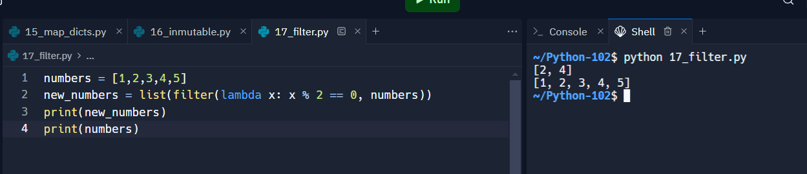
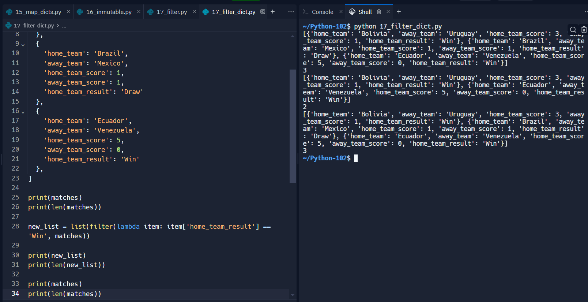
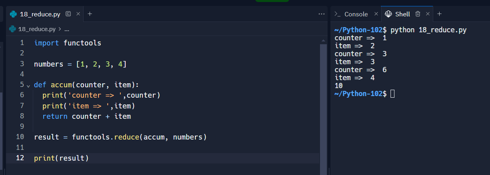
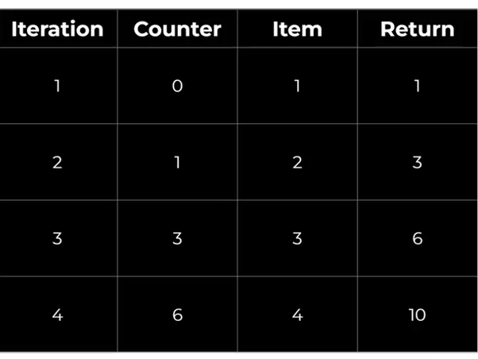
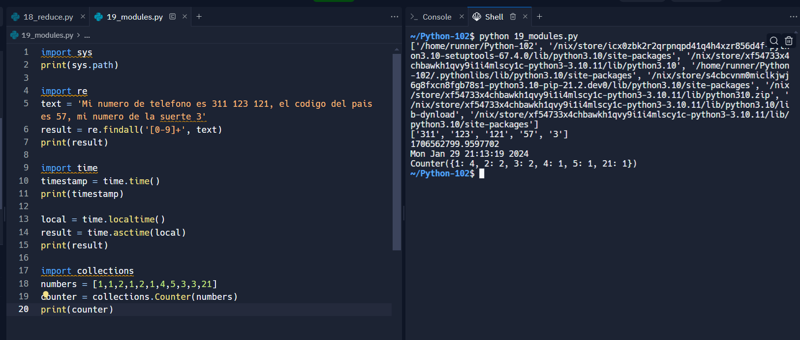
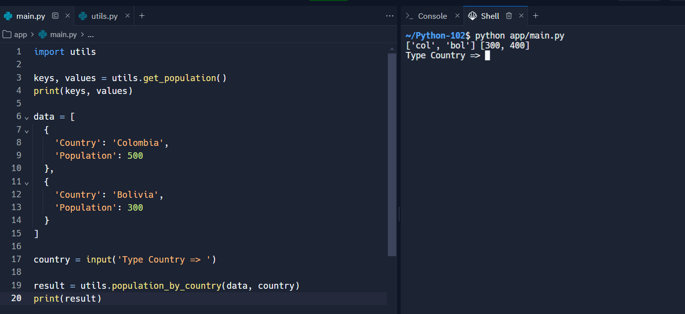
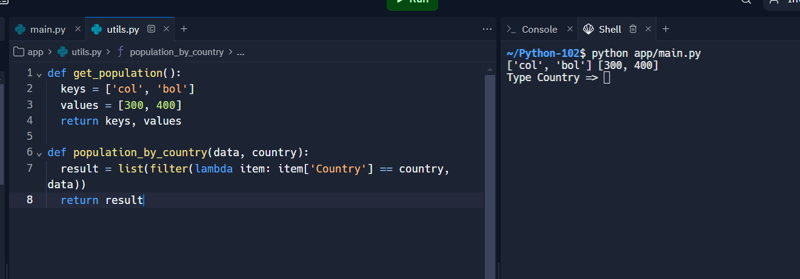
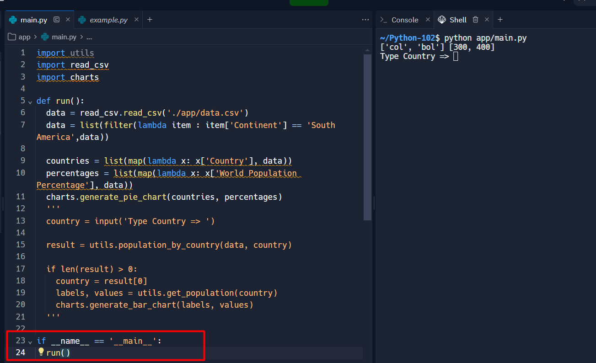
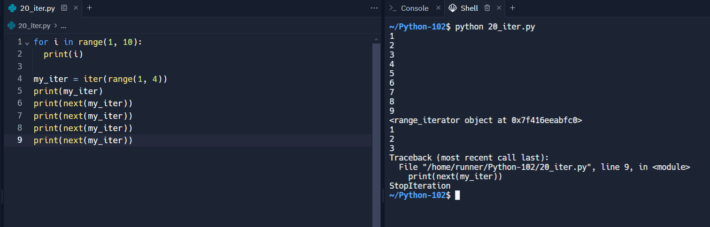

## Curso de Python: Comprehensions, Funciones y Manejo de Errores

### El Zen de Python


#### Recursos

https://static.platzi.com/media/public/uploads/slides-del-curso-de-python-comprehensions-funciones-y-manejo-de-errores_d4ad1632-4a52-4a5b-b74e-5a972a02c404.pdf

https://es.wikipedia.org/wiki/Zen_de_Python


### Sets

* Se pueden modificar
* No tienen un orden
* No pueden tener elementos duplicados


```py
set_countries = {'col', 'mex', 'bol'}
print(set_countries)
print(type(set_countries))

set_numbers = {1, 2, 2, 443, 23}
print(set_numbers)

set_types = {1, 'hola', False, 12.12}
print(set_types)

set_from_string = set('hoola')
print(set_from_string)

set_from_tuples = set(('abc', 'cbv', 'as', 'abc'))
print(set_from_tuples)

numbers = [1,2,3,1,2,3,4]
set_numbers = set(numbers)
print(set_numbers)
unique_numbers = list(set_numbers)
print(unique_numbers)
```

#### Recursos

https://static.platzi.com/media/public/uploads/01_sets_4c6e5f1b-a0b1-46d5-879f-39f81a2119dc.py

https://www.w3schools.com/python/python_sets.asp


### Modificando conjuntos

* add(): Añade un elemento.

* update(): Añade cualquier tipo de objeto iterable como: listas, tuplas.

* discard(): Elimina un elemento y si ya existe no lanza ningún error.

* remove(): Elimina un elemento y si este no existe lanza el error “keyError”.

* pop(): Nos devuelve un elemento aleatorio y lo elimina y si el conjunto está vacío lanza el error “key error”.

* clear(): Elimina todo el contenido del conjunto.


```py
set_countries = {'col', 'mex', 'bol'}

size = len(set_countries)
print(size)

print('col' in set_countries)
print('pe' in set_countries)

# add
set_countries.add('pe')
print(set_countries)
set_countries.add('pe')
print(set_countries)

# update
set_countries.update({'ar', 'ecua', 'pe'})
print(set_countries)

# remove

set_countries.remove('col')
print(set_countries)

set_countries.remove('ar')
set_countries.discard('arg')
print(set_countries)
set_countries.add('arg')
print(set_countries)
set_countries.clear()
print(set_countries)
print(len(set_countries))
```

#### Recursos

https://static.platzi.com/media/public/uploads/02_crud_set_53ad34c2-4b27-4618-a875-315add8a0e71.py


### Operaciones con conjuntos

**union(set)**: Realiza la operacion “union” entre dos conjuntos. La unión entre dos conjuntos es sumar los elementos de estos sin repetir elementos. Esta operación tambien se puede realizar con el signo “|”: set_a | set_b.

**intersection(set)**: Realiza la operacion “intersection” entre dos conjuntos. La intersección entre dos conjuntos es tomar unicamente los elementos en común de los conjutnos. Esta operación tambien se puede realizar con el signo “&”: set_a & set_b.

**difference(set)**: Realiza la operacion “difference” entre dos conjuntos. La diferencia entre dos conjuntos es restar los elementos del segundo conjunto al primero. Esta operación tambien se puede realizar con el signo “-”: set_a - set_b.

**symmetric_difference(set)**: Realiza la operacion “symmetric_difference” entre dos conjuntos. La diferencia simetrica entre dos conjutnos consta de restar todos los elementos de ambos exceptuando el elemento en común. Esta operación tambien se puede realizar con el signo “^”: set_a ^ set_b.


```py
set_a = {'col', 'mex', 'bol'}
set_b = {'pe', 'bol'}

set_c = set_a.union(set_b)
print(set_c)
print(set_a | set_b)

set_c = set_a.intersection(set_b)
print(set_c)
print(set_a & set_b)

set_c = set_a.difference(set_b)
print(set_c)
print(set_a - set_b)

set_c = set_a.symmetric_difference(set_b)
print(set_c)
print(set_a ^ set_b)
```

#### Recursos

https://static.platzi.com/media/public/uploads/03_operations_f46bef8b-d2a2-4da1-9806-a9271df1954d.py

https://www.w3schools.com/python/python_ref_set.asp


### List Comprehension


```py
'''
numbers = []
for element in range(1, 11):
  numbers.append(element * 2)

print(numbers)

numbers_v2 = [element * 2 for element in range(1, 11)]
print(numbers_v2)
'''
numbers = []
for i in range(1, 11):
  if i % 2 == 0:
    numbers.append(i * 2)

print(numbers)

numbers_v2 = [i * 2 for i in range(1, 11) if i % 2 == 0]
print(numbers_v2)
```

#### Recursos

https://static.platzi.com/media/public/uploads/04_lists_54fe02b6-b356-41cd-8e4d-05f0154686be.py

https://www.w3schools.com/python/python_lists_comprehension.asp

### Dictionary Comprehension


```py
'''
dict = {}
for i in range(1, 5):
  dict[i] = i * 2

print(dict)

dict_v2 = { i: i * 2 for i in range(1, 5)}
print(dict_v2)

import random
countries = ['col', 'mex', 'bol', 'pe']
population = {}
for country in countries:
  population[country] = random.randint(1, 100)

print(population)

population_v2 = { country: random.randint(1, 100)  for country in countries}
print(population_v2)
'''
names = ['nico', 'zule', 'santi']
ages = [12, 56, 98]

print(list(zip(names, ages)))

new_dict = {name: age for (name, age) in zip(names, ages)}
print(new_dict)
```

#### Recursos

https://static.platzi.com/media/public/uploads/05_dict_c61ed7f9-deb7-41b8-984d-be47d893676a.py

### Dictionary Comprehension: condition


```py
import random
countries = ['col', 'mex', 'bol', 'pe']

population_v2 = { country: random.randint(1, 100)  for country in countries}
print(population_v2)

result = { country: population for (country, population) in population_v2.items() if population > 50 }
print(result)

text = 'Hola, soy Nicolas'
unique = { c: c.upper() for c in text if c in 'aeiou' }
print(unique)
```

#### Recursos

https://static.platzi.com/media/public/uploads/06_dict_60c32297-cb1e-4f04-9c41-247942c94d16.py


### Lists vs. Tuples vs. Sets


**LIST** Las listasson como matrices de tamaño dinámico que en pocas palabras es una colección de cosas que se almacenan entre corchetes [ ] y separadas por coma ','.

Caracteristicas

* Se pueden escribir como una lista que están separados por comas y encerrados entre corchetes.
* La lista es mutable, con esto se puede transformar a cualquier tipo de dato y puede almacenar cualquier elemento que la contenga.
* Las listas pueden almacenar cualquier tipo de elemento.

**TUPLE** Las Tuplas son una colección muy parecida a una lista, ya que sus valores almacenados pueden ser de cualquier tipo y están indexados por números enteros. Sus valores están separados por 'comas', pero esto no es necesario, ya que lo mas común es encerrarlos entre paréntesis ( ), sus principales características son:

* Tupla es una secuencia inmutable.
* No se pueden cambiar ni reemplazara sus valores ya que es inmutable.
* se define entre parentesis ( ).
* Las tuplas pueden almacenar cualquier tipo de elemento.

**SET** El conjunto es una colección de elementos desordenada que es iterable, mutable y no tiene elementos duplicados. Su principal ventaja al utilizar un conjunto a diferencia de una lista, es su metodo que es altamente optimizado para verificar si un elemento específico esta contenido en un conjunto. Sus principales características son:

* Los conjuntos son una colección de elementos desordenados.
* El orden en como se agregan no es el mismo ya que este puede cambiar.
* Se define entre llaves { }.
* Los conjuntos son mutables, sin embargo solo se pueden almacenar objetos inmutables.

### Funciones


```py
print('Hola')

def my_print(text):
  print(text * 2)

my_print('Este es my texto')
my_print('Hola')

a = 10
b = 90

c = a + b

def suma(a, b):
  my_print(a + b)

suma(1 ,5) # 6
suma(10, 4) # 14

```

#### Recursos

https://static.platzi.com/media/public/uploads/07_func_2a63f6b5-4f49-4353-8e97-3f0006676c56.py

https://www.w3schools.com/python/python_functions.asp

### Funciones: return


```py
def sum_with_range(min, max):
  print(min, max)
  sum = 0
  for x in range(min, max):
    sum += x
  return sum

result = sum_with_range(1, 10)
print(result)
result_2 = sum_with_range(result, result + 10)
print(result_2)
```

#### Recursos

https://static.platzi.com/media/public/uploads/08_return_8c217685-815e-416d-ad2f-94f84c4edbb1.py


### Parámetros por defecto y múltiples returns


```py
def find_volume(length=1, width=1, depth=1):
  return length * width * depth, width, 'hola'

result, width, text = find_volume(width=10)

print(result)
print(width)
print(text)
```

#### Recursos

https://static.platzi.com/media/public/uploads/09_return_ca20822d-c3d8-47df-94ad-ce0157a89eca.py


### El scope | El Alcance

Revisar siempre que una varible tiene un contexto


```py
price = 100 # global
# result = 200

def increment():
  price = 200
  result = price + 10
  print(result)
  return result

print(price)
price_2 = increment()
print(price_2)
# print(result)
```

#### Recursos

https://static.platzi.com/media/public/uploads/10_scope_5739e968-c4fc-4af2-b41d-dc703af33862.py

https://www.w3schools.com/python/python_scope.asp


### Refactor game


```py
import random


def choose_options():
  options = ('piedra', 'papel', 'tijera')
  user_option = input('piedra, papel o tijera => ')
  user_option = user_option.lower()

  if not user_option in options:
    print('esa opcion no es valida')
    # continue
    return None, None

  computer_option = random.choice(options)

  print('User option =>', user_option)
  print('Computer option =>', computer_option)
  return user_option, computer_option

def check_rules(user_option, computer_option, user_wins, computer_wins):
  if user_option == computer_option:
    print('Empate!')
  elif user_option == 'piedra':
    if computer_option == 'tijera':
      print('piedra gana a tijera')
      print('user gano!')
      user_wins += 1
    else:
      print('Papel gana a piedra')
      print('computer gano!')
      computer_wins += 1
  elif user_option == 'papel':
    if computer_option == 'piedra':
      print('papel gana a piedra')
      print('user gano')
      user_wins += 1
    else:
      print('tijera gana a papel')
      print('computer gano!')
      computer_wins += 1
  elif user_option == 'tijera':
    if computer_option == 'papel':
      print('tijera gana a papel')
      print('user gano!')
      user_wins += 1
    else:
      print('piedra gana a tijera')
      print('computer gano!')
      computer_wins += 1
  return user_wins, computer_wins

def run_game():
  computer_wins = 0
  user_wins = 0  
  rounds = 1
  while True:
    print('*' * 10)
    print('ROUND', rounds)
    print('*' * 10)

    print('computer_wins', computer_wins)
    print('user_wins', user_wins)
    rounds += 1

    user_option, computer_option = choose_options()
    user_wins, computer_wins = check_rules(user_option, computer_option, user_wins, computer_wins)

    if computer_wins == 2:
      print('El ganador es la computadora')
      break

    if user_wins == 2:
      print('El ganador es el usuario')
      break

run_game()
```

#### Recursos

https://static.platzi.com/media/public/uploads/11_game_b66a27b7-e014-4d6b-b86f-934606c3b2cb.py

https://static.platzi.com/media/public/uploads/game_914e0cd3-0d5a-4a8f-b894-ad92e23f9179.py


### Funciones anónimas: lambda


```py
def increment(x):
  return x + 1


increment_v2 = lambda x: x + 1

result = increment(10)
print(11)

result = increment_v2(20)
print(result)

full_name = lambda name, last_name: f'Full name is {name.title()} {last_name.title()}'

text = full_name('nicolas', 'perez casas')
print(text)
```

#### Recursos

https://static.platzi.com/media/public/uploads/12_lambda_604e82aa-cab0-43c1-a320-04ad028065d7.py

https://www.w3schools.com/python/python_lambda.asp

### Higher order function: una función dentro de otra función


```py
def increment(x):
  return x + 1

increment_v2 = lambda x: x +1

def high_ord_func(x, func):
  return x + func(x)

high_ord_func_v2 = lambda x, func: x + func(x)

result = high_ord_func(2, increment)
# 2 + (2 + 1)
print(result)

result = high_ord_func_v2(2, increment_v2)
print(result)
result = high_ord_func_v2(2, lambda x: x + 2)
print(result)
## change
result = high_ord_func_v2(2, lambda x: x * 5)
print(result)
```

#### Recursos

https://static.platzi.com/media/public/uploads/13_hof_f948e15c-91ec-4637-abea-7717e9c7177f.py


### Map

MAP( ) La función map () ejecuta una función especifica para cada elemento en un iterable y el elemento se envía a la función como un parámetro.

Sintaxis.
map(function, iterables)

Con esto vamos hacer unos deliciosos tacos, para ello utilizáremos maps()


```py
numbers = [1, 2, 3, 4]
numbers_v2 = []
for i in numbers:
  numbers_v2.append(i * 2)

numbers_v3 = list(map(lambda i: i * 2, numbers))

print(numbers)
print(numbers_v2)
print(numbers_v3)

numbers_1 = [1, 2, 3, 4]
numbers_2 = [5, 6, 7]

print(numbers_1)
print(numbers_2)
result = list(map(lambda x, y: x + y, numbers_1, numbers_2))
print(result)
```

#### Recursos

https://static.platzi.com/media/public/uploads/14_map_5f6cf035-c0c4-411f-866a-b8c849ba6ff1.py

https://www.w3schools.com/python/ref_func_map.asp


### Map con diccionarios

Tener cuidado cuando se modifica un atributo de un diccionario y queda modificado el orignal


```py
items = [
  {
    'product': 'camisa',
    'price': 100,
  },
  {
    'product': 'pantalones',
    'price': 300
  },
  {
    'product': 'pantalones 2',
    'price': 200
  }
]

prices = list(map(lambda item: item['price'], items))
print(items)
print(prices)

def add_taxes(item):
  item['taxes'] = item['price'] * .19
  return item

new_items = list(map(add_taxes, items))
print(new_items)
print(items)
```

#### Recursos

https://static.platzi.com/media/public/uploads/15_map_dicts_050cdf86-6566-4621-a123-96a0439a5a49.py


### Reto: map con inmutabilidad

Hacer que se genere un nuevo diccionario respetando el inicial


```py
items = [
  {
    'product': 'camisa',
    'price': 100,
  },
  {
    'product': 'pantalones',
    'price': 300
  },
  {
    'product': 'pantalones 2',
    'price': 200
  }
]

def add_taxes(item):
  new_item = item.copy()
  new_item['taxes'] = new_item['price'] * .19
  return new_item

new_items = list(map(add_taxes, items))
print('New list')
print(new_items)
print('Old list')
print(items)
```


#### Recursos

https://static.platzi.com/media/public/uploads/16_inmutable_f543bb35-7eea-47bc-8aed-36c9ed6849d5.py


### Filter

FILTER La función filter(), devuelve un valor que esta siendo iterado de la cual su resultado será el valor que se esta buscando en el filter

SINTAXIS
_filter (function, iterable_

Valores.
filter: Una función que se ejecutara para cada elemento iterable iterable: Lo que se va a filtrar.



```py
numbers = [1,2,3,4,5]
new_numbers = list(filter(lambda x: x % 2 == 0, numbers))
print(new_numbers)
print(numbers)
```

#### filter con diccionarios




```py
matches = [
  {
    'home_team': 'Bolivia',
    'away_team': 'Uruguay',
    'home_team_score': 3,
    'away_team_score': 1,
    'home_team_result': 'Win'
  },
  {
    'home_team': 'Brazil',
    'away_team': 'Mexico',
    'home_team_score': 1,
    'away_team_score': 1,
    'home_team_result': 'Draw'
  },
  {
    'home_team': 'Ecuador',
    'away_team': 'Venezuela',
    'home_team_score': 5,
    'away_team_score': 0,
    'home_team_result': 'Win'
  },
]

print(matches)
print(len(matches))

new_list = list(filter(lambda item: item['home_team_result'] == 'Win', matches))

print(new_list)
print(len(new_list))

print(matches)
print(len(matches))
```

#### Recursos

https://static.platzi.com/media/public/uploads/17_filter_dict_7f2a4c30-2934-4f2e-8284-c774081b5734.py

https://static.platzi.com/media/public/uploads/17_filter_d07d9ceb-e28f-49c3-ab99-714d51727d3d.py

https://www.w3schools.com/python/ref_func_filter.asp


### Reduce

En Python, la función reduce es parte del módulo functools y se utiliza para operaciones acumulativas en una secuencia. Aplica sucesivamente una función binaria (una función que toma dos argumentos) a los elementos de un iterable, reduciendo el iterable a un único resultado acumulado.

Aquí tienes la sintaxis básica de la función reduce:

```py
from functools import reduce

resultado = reduce(funcion, iterable, inicializador)
```

* funcion: La función binaria que se aplicará de forma acumulativa a los elementos del iterable.
* iterable: La secuencia de valores que se va a reducir.
* inicializador (opcional): Un valor inicial opcional para la acumulación. Si se proporciona, la función comenzará con este valor inicial y el primer elemento del iterable.
  

Aquí tienes un ejemplo sencillo que utiliza la función reduce para calcular el producto de los elementos en una lista:

```py
from functools import reduce

numeros = [1, 2, 3, 4, 5]

# Define una función binaria para multiplicar dos números
multiplicar = lambda x, y: x * y

# Usa reduce para encontrar el producto de todos los elementos en la lista
resultado = reduce(multiplicar, numeros)

print(resultado)
```

En este ejemplo, la función multiplicar se aplica de forma acumulativa a los elementos de la lista numeros, resultando en el producto de todos los elementos (1 * 2 * 3 * 4 * 5).

Es importante tener en cuenta que, en Python 3, la función reduce se ha movido al módulo functools, por lo que es necesario importarla explícitamente, como se muestra en el ejemplo.





```py
import functools

numbers = [1, 2, 3, 4]

def accum(counter, item):
  print('counter => ',counter)
  print('item => ',item)
  return counter + item

result = functools.reduce(accum, numbers)

print(result)
```

#### Recursos

https://static.platzi.com/media/public/uploads/18_reduce_f7adca6c-b7f0-41d7-babb-477b6e68f1cd.py


### Módulos



```py
#sistema
import sys
print(sys.path)

# Expresiones Regulares
import re
text = 'Mi numero de telefono es 311 123 121, el codigo del pais es 57, mi numero de la suerte 3'
result = re.findall('[0-9]+', text)
print(result)

# hora 
import time
timestamp = time.time()
print(timestamp)

# hora local
local = time.localtime()
result = time.asctime(local)
print(result)

# collections 
import collections
numbers = [1,1,2,1,2,1,4,5,3,3,21]
counter = collections.Counter(numbers)
print(counter)
```


#### Recursos

https://static.platzi.com/media/public/uploads/19_modules_e6cfd282-989a-4b05-8636-bdf9ddcc8ebc.py

https://www.w3schools.com/python/python_modules.asp


### Mis propios módulos





```py
# 02-python-comprension-funcion-control-error\app\main.py
import utils

keys, values = utils.get_population()
print(keys, values)

data = [
  {
    'Country': 'Colombia',
    'Population': 500
  },
  {
    'Country': 'Bolivia',
    'Population': 300
  }
]

country = input('Type Country => ')

result = utils.population_by_country(data, country)
print(result)
```

```py
# 02-python-comprension-funcion-control-error\app\utils.py
def get_population():
  keys = ['col', 'bol']
  values = [300, 400]
  return keys, values

def population_by_country(data, country):
  result = list(filter(lambda item: item['Country'] == country, data))
  return result
```

#### Recursos

https://static.platzi.com/media/public/uploads/main_c976078c-d90a-4214-9560-1b5f44bdd7ea.py

https://static.platzi.com/media/public/uploads/utils_425281f8-3229-4030-85a5-596dc6c6aa38.py


### Módulos como scripts: __name__ y __main__



```py
# 02-python-comprension-funcion-control-error\app\example.py
import main

print(main.data)
main.run()
```

```py
# 02-python-comprension-funcion-control-error\app\main.py
import utils
import read_csv
import charts

def run():
  data = read_csv.read_csv('./app/data.csv')
  data = list(filter(lambda item : item['Continent'] == 'South America',data))

  countries = list(map(lambda x: x['Country'], data))
  percentages = list(map(lambda x: x['World Population Percentage'], data))
  charts.generate_pie_chart(countries, percentages)
  '''
  country = input('Type Country => ')

  result = utils.population_by_country(data, country)

  if len(result) > 0:
    country = result[0]
    labels, values = utils.get_population(country)
    charts.generate_bar_chart(labels, values)
  '''
# linea muy conocida en los proyectos de python con el fin de ejecutar por medio a script a main directamente
if __name__ == '__main__':
  run()
```

#### Recursos

https://static.platzi.com/media/public/uploads/charts_6215f64f-829f-4183-a501-19e8d5613291.py

https://static.platzi.com/media/public/uploads/example_ebc19214-2ef7-460e-8b57-cc6f2a77e093.py

https://static.platzi.com/media/public/uploads/main_72eca5fc-a09c-4e0d-866f-cc567aba12c5.py

https://static.platzi.com/media/public/uploads/read_csv_784f9c37-9c23-4394-ad5b-0d141cc0d033.py

https://static.platzi.com/media/public/uploads/data_1e66c1d8-5b44-40c8-802c-abc17405918f.csv

https://static.platzi.com/media/public/uploads/utils_e2f67b0c-ba79-47ce-9c1a-e312375921ab.py


### Paquetes

```py
'''
from pkg.mod_1 import func_1, func_2
from pkg.mod_2 import func_3, func_4

print(func_1())
print(func_2())
print(func_3())
print(func_4())

'''

# anterior a python 3
import pkg
print(pkg.URL)
print(pkg.mod_1.func_1())
```

#### Recursos

https://static.platzi.com/media/public/uploads/main_c1e69388-8b5a-4967-804a-c998112cd906.py

https://github.com/tiangolo

https://github.com/tiangolo/full-stack-fastapi-postgresql


### Iterables

 Un iterable se define como el objeto que contiene un número contable con valores y este al tener un valor puede recorrer uno a uno los elementos que la contienen como una estructura de datos y operar con ellos, pero a la vez se rigen bajo la instrucción que se le es dada, con lo cual son dependientes de la instrucción a recibir.

Los metodos de su uso son dos __iter__() y __next__() .



```py
for i in range(1, 10):
  print(i)

my_iter = iter(range(1, 4))
print(my_iter)
print(next(my_iter))
print(next(my_iter))
print(next(my_iter))
print(next(my_iter))
```

#### Recursos

https://static.platzi.com/media/public/uploads/20_iter_99777c3d-b4bb-4b4e-b12c-c7825e672664.py

https://www.w3schools.com/python/python_iterators.asp