## Curso de Python: PIP y Entornos Virtuales

### Python en tu propio entorno de desarrollo local

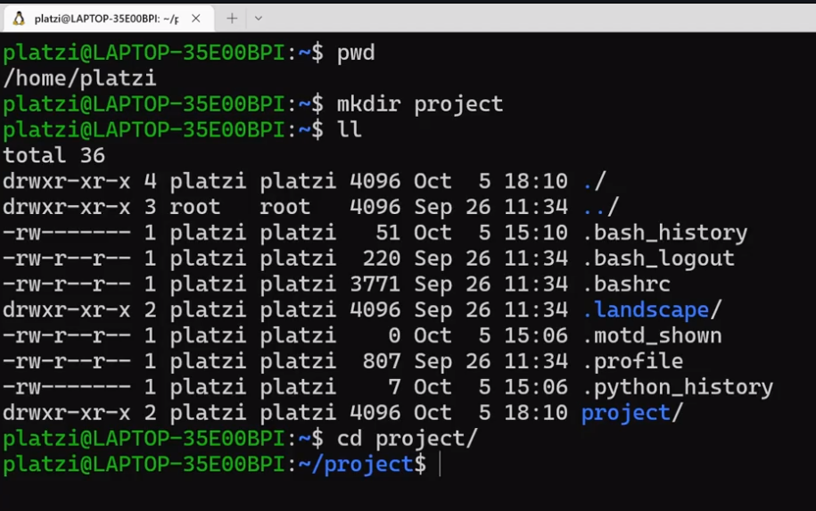

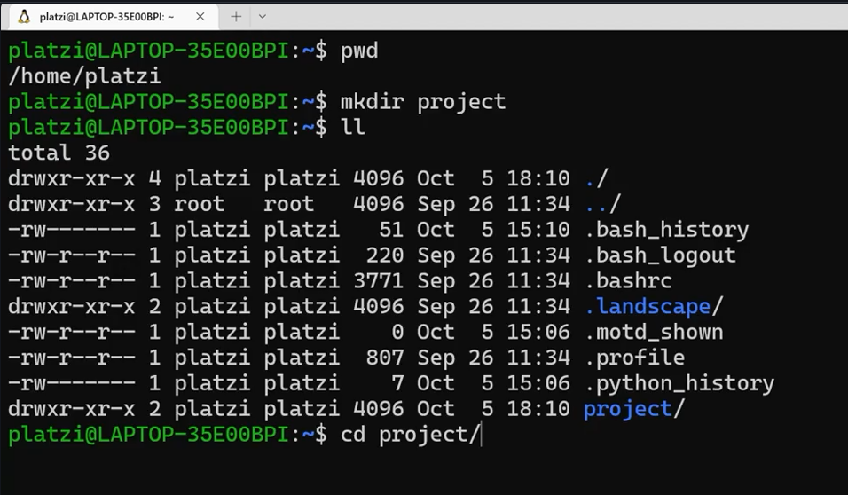

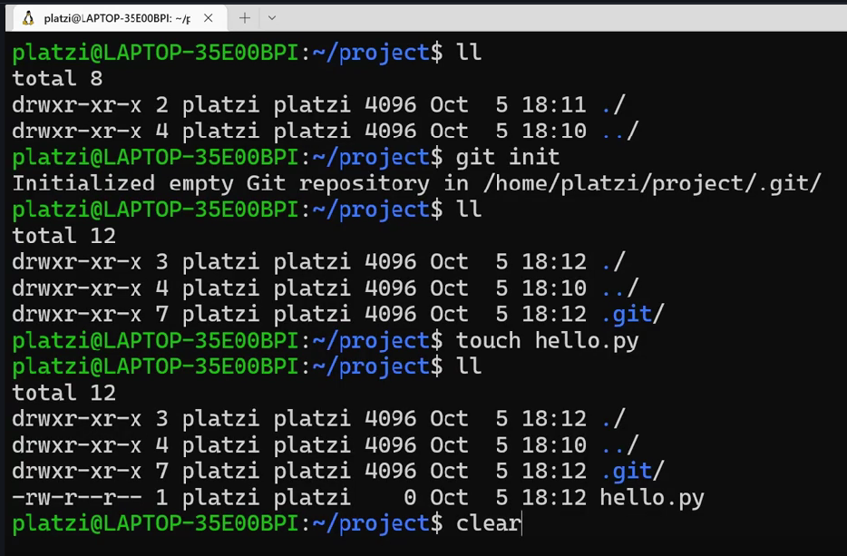

### Instalación en Windows (WSL) y Linux

Instalacion de WSL

1) PowerShell con permisos de administrador
2) comando para ver las distribuciones

```bash
 wsl --list --online
```

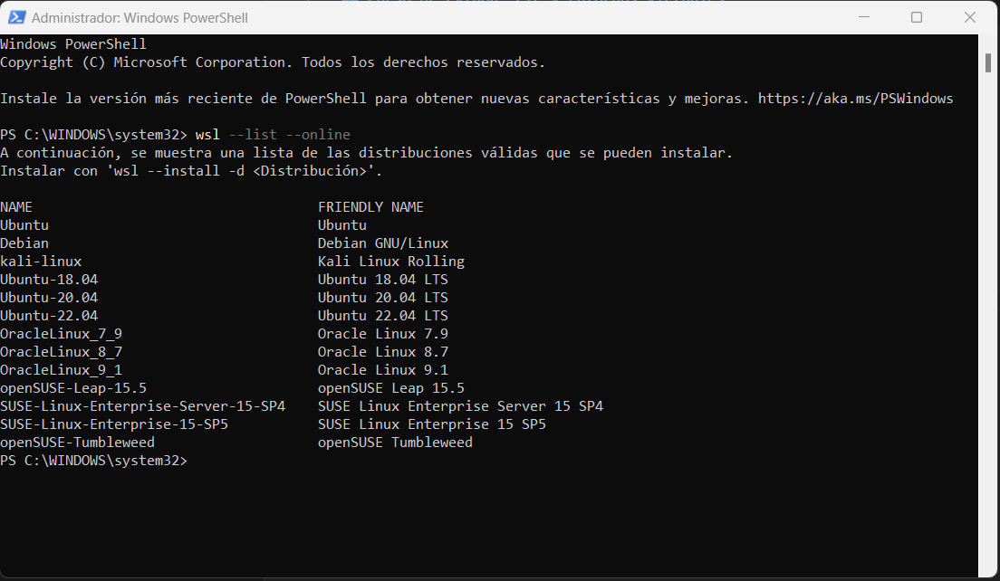

3) instalar la distribucion que se quiere este caso ubuntu

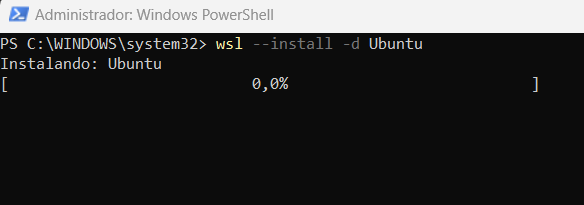

4) instala ubuntu asignar el user y pass en linux

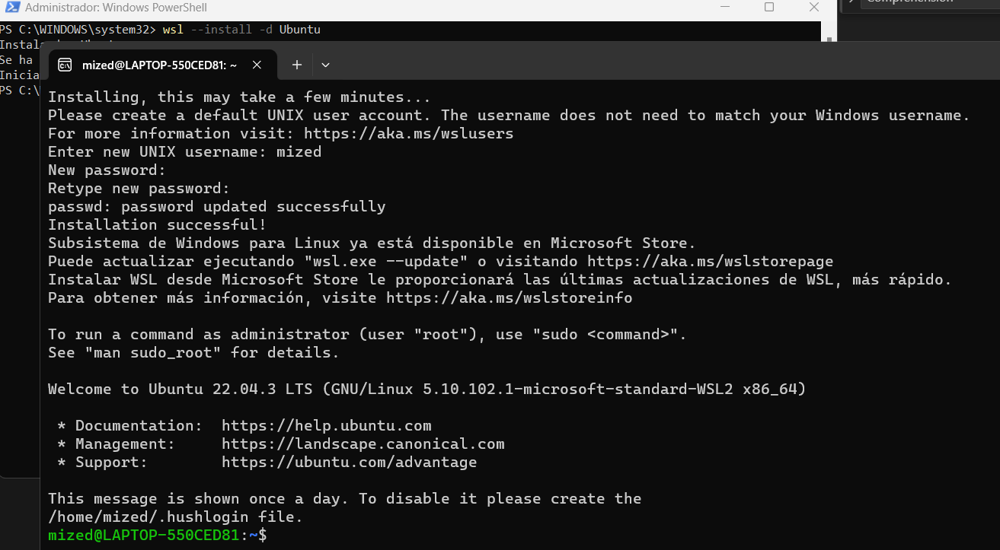

username: mized

5) comando para revisar las versiones instaladas
   
```bash
# listado 
 wsl --list

# ver la version en concreto
wsl -l -v
```
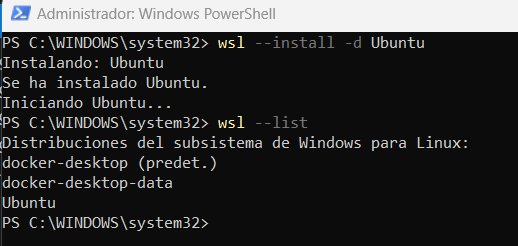

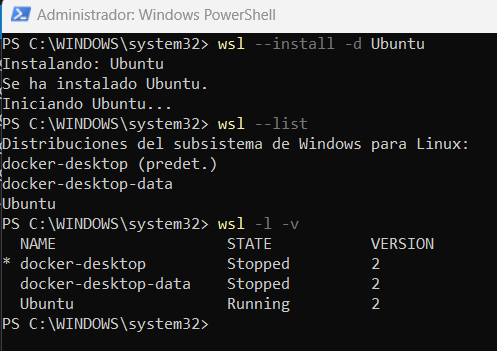

6) si ubuntu no esta con la version 1 

```bash
# Instalar Ubuntu 2
 wsl --set-version Ubuntu 2

# actualizar el kerner
wsl --update

# nuevamente la install Ubuntu 2

# para revisar el estado de lo instalado
wsl --status
```

7) ingresar a la terminal 

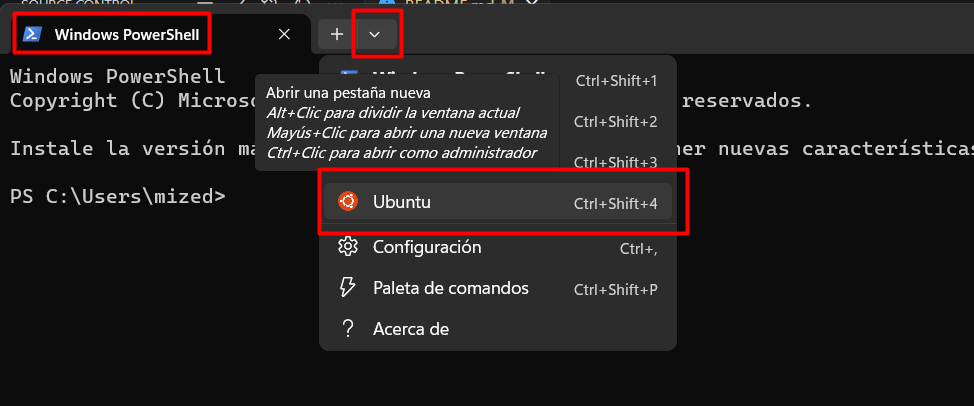

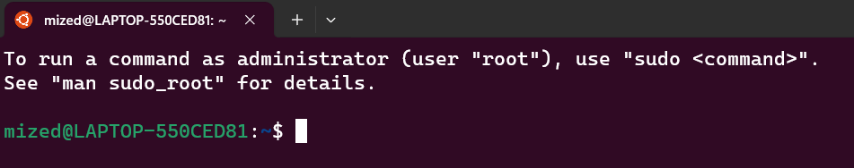


Python ya se encuentra instalado en wsl para comprovar desde la terminal de Ubuntu colocar python3 nos brindara la informacion.

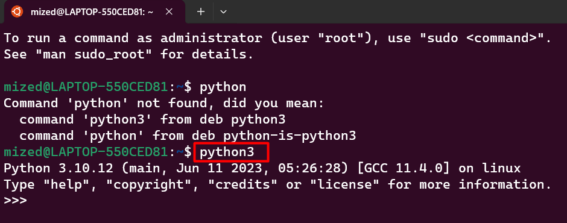

Comandos Utilizados

```bash
python

# interprete de python
python3

# para salir de la interfaz de python
exit()
```

Instalación

```bash
apt update

sudo apt update

sudo apt -y upgrade
```

```bash
# Verificar Instalación de python
python3 -V
```

```bash
# Instalación de gestor de paquetes de dependencias
sudo apt install -y python3-pip
```

```bash
# Verificar Instalación del gestor
pip3 -V
```
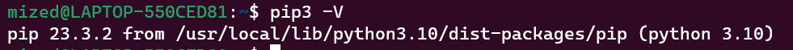

```bash
# Alternative Installation
curl https://bootstrap.pypa.io/get-pip.py -o get-pip.py
sudo python3 get-pip.py
```

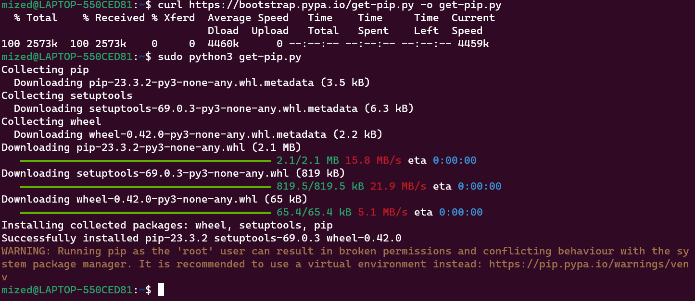

```bash
# Dependencias en entorno profesional
sudo apt install -y build-essential libssl-dev libffi-dev python3-dev
```
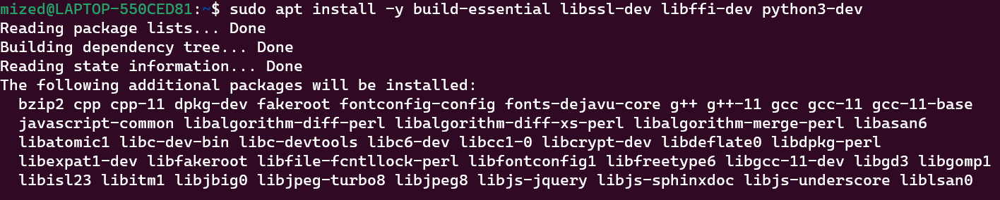

### Instalación en Mac

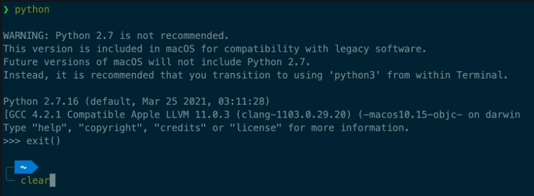

Comandos utilizados

```bash
python o python3

exit()
```

Normalmente viene instalado en Mac, en caso de que no lo tenga continuar con estos comandos Herramientas de codigo

```bash
sudo xcode-select --install

sudo xcode-select --reset
```

Instalación de python

```bash
brew install python3
```

Verificar la Instalación

```bash
python3
```

### Python con VSCode

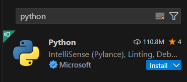

adicional si se esta usando WSL

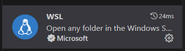

creamos el proyecto ingresamos a la carpeta y abrimos el visual

```bash
code .
```

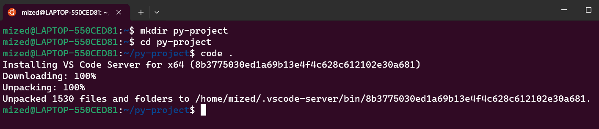

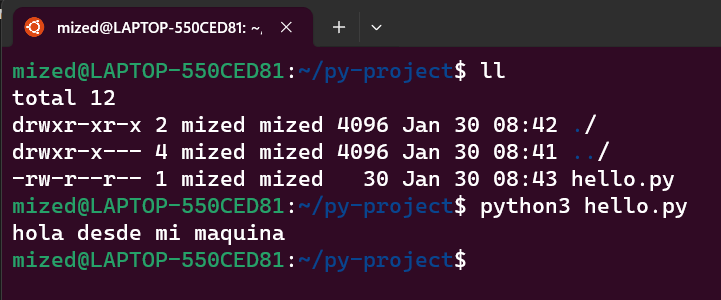

### Flujo de trabajo en Python

#### Game Project

Para iniciar el juego realizar lo siguiente en la terminal vscode

```sh
cd game
python3 main.py
```

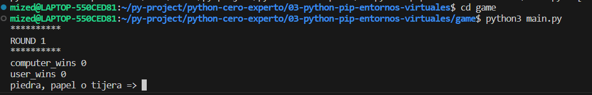


#### Recursos

https://replit.com/@NicolasMolina13/Python-102

https://github.com/platzi/curso-python-pip/commit/cdf98e624027091d89c93e6be71362e63e069ebc


### ¿Qué es pip?

pip es una herramienta en Python utilizada para gestionar paquetes de software. El nombre "pip" proviene de "Pip Installs Packages" (Pip Instala Paquetes). Los paquetes son módulos o bibliotecas de Python que se pueden instalar y utilizar en tus proyectos.

Algunas de las funciones clave de pip incluyen:

**Instalación de paquetes**: Puedes utilizar pip para instalar paquetes de Python desde el repositorio PyPI (Python Package Index) o desde otros repositorios.

```sh
pip install nombre_del_paquete
```

**Desinstalación de paquetes**: pip también te permite desinstalar paquetes que ya no necesitas.

```sh
pip uninstall nombre_del_paquete
```

**Listado de paquetes instalados**: Puedes ver la lista de paquetes instalados en tu entorno virtual o sistema global.

```sh
pip list
```

**Actualización de paquetes**: pip te permite actualizar los paquetes instalados a sus versiones más recientes.

```sh
pip install --upgrade nombre_del_paquete
```

**Requisitos del proyecto**: Puedes especificar los paquetes y sus versiones en un archivo requirements.txt y luego utilizar pip para instalar todos los paquetes listados en ese archivo.

```sh
pip install -r requirements.txt
```

En resumen, pip es una herramienta esencial para la gestión de dependencias en proyectos de Python, facilitando la instalación, actualización y desinstalación de paquetes de manera eficiente.

Ejemplo de instalacion de Dependecias

```sh
pip install matplotlib
```

ver Arbol de librerias dentro de la computadora con el comando 

```sh
pip3 freeze 
```

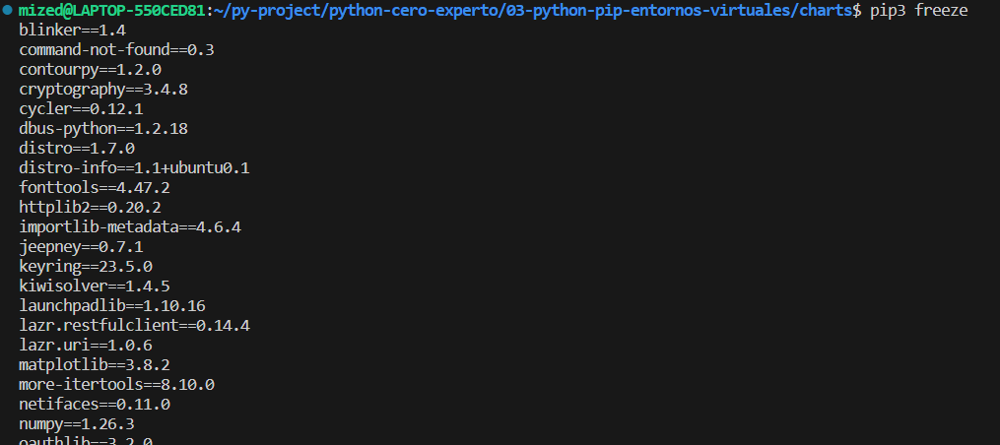

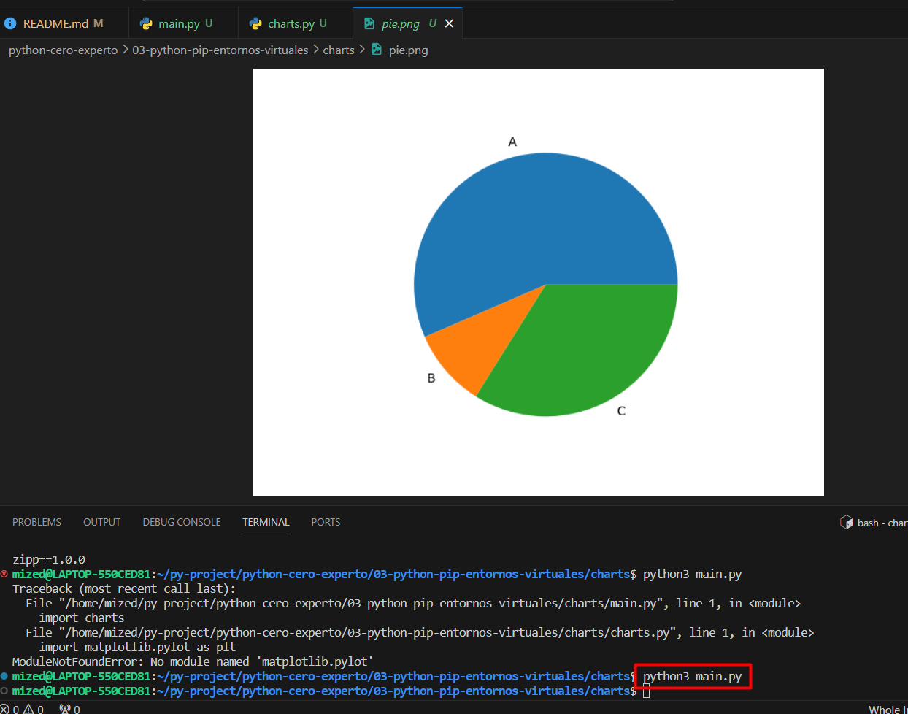

#### Recursos

https://pypi.org/


### Gráficas en Python con PIP

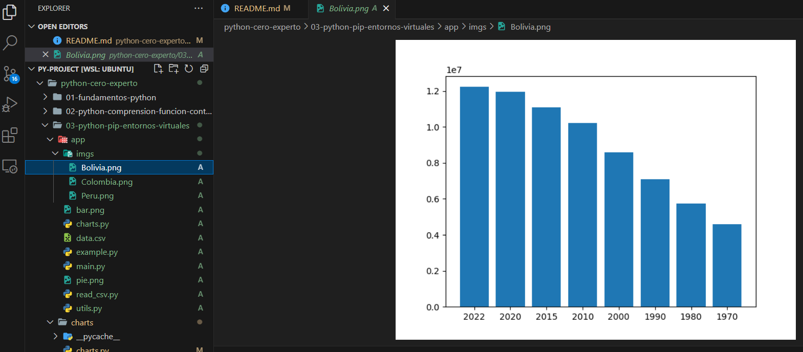

