## Curso de Python: PIP y Entornos Virtuales

### Python en tu propio entorno de desarrollo local


### Instalación en Windows (WSL) y Linux

Instalacion de WSL

1) PowerShell con permisos de administrador
2) comando para ver las distribuciones

```bash
 wsl --list --online
```


3) instalar la distribucion que se quiere este caso ubuntu


4) instala ubuntu asignar el user y pass en linux


username: mized

5) comando para revisar las versiones instaladas
   
```bash
# listado 
 wsl --list

# ver la version en concreto
wsl -l -v
```


6) si ubuntu no esta con la version 1 

```bash
# Instalar Ubuntu 2
 wsl --set-version Ubuntu 2

# actualizar el kerner
wsl --update

# nuevamente la install Ubuntu 2

# para revisar el estado de lo instalado
wsl --status
```

7) ingresar a la terminal 


Python ya se encuentra instalado en wsl para comprovar desde la terminal de Ubuntu colocar python3 nos brindara la informacion.


Comandos Utilizados

```bash
python

# interprete de python
python3

# para salir de la interfaz de python
exit()
```

Instalación

```bash
apt update

sudo apt update

sudo apt -y upgrade
```

```bash
# Verificar Instalación de python
python3 -V
```

```bash
# Instalación de gestor de paquetes de dependencias
sudo apt install -y python3-pip
```

```bash
# Verificar Instalación del gestor
pip3 -V
```


```bash
# Alternative Installation
curl https://bootstrap.pypa.io/get-pip.py -o get-pip.py
sudo python3 get-pip.py
```


```bash
# Dependencias en entorno profesional
sudo apt install -y build-essential libssl-dev libffi-dev python3-dev
```


### Instalación en Mac


Comandos utilizados

```bash
python o python3

exit()
```

Normalmente viene instalado en Mac, en caso de que no lo tenga continuar con estos comandos Herramientas de codigo

```bash
sudo xcode-select --install

sudo xcode-select --reset
```

Instalación de python

```bash
brew install python3
```

Verificar la Instalación

```bash
python3
```

### Python con VSCode


adicional si se esta usando WSL


creamos el proyecto ingresamos a la carpeta y abrimos el visual

```bash
code .
```


### Flujo de trabajo en Python

#### Game Project

Para iniciar el juego realizar lo siguiente en la terminal vscode

```sh
cd game
python3 main.py
```


#### Recursos

https://replit.com/@NicolasMolina13/Python-102

https://github.com/platzi/curso-python-pip/commit/cdf98e624027091d89c93e6be71362e63e069ebc


### ¿Qué es pip?

pip es una herramienta en Python utilizada para gestionar paquetes de software. El nombre "pip" proviene de "Pip Installs Packages" (Pip Instala Paquetes). Los paquetes son módulos o bibliotecas de Python que se pueden instalar y utilizar en tus proyectos.

Algunas de las funciones clave de pip incluyen:

**Instalación de paquetes**: Puedes utilizar pip para instalar paquetes de Python desde el repositorio PyPI (Python Package Index) o desde otros repositorios.

```sh
pip install nombre_del_paquete
```

**Desinstalación de paquetes**: pip también te permite desinstalar paquetes que ya no necesitas.

```sh
pip uninstall nombre_del_paquete
```

**Listado de paquetes instalados**: Puedes ver la lista de paquetes instalados en tu entorno virtual o sistema global.

```sh
pip list
```

**Actualización de paquetes**: pip te permite actualizar los paquetes instalados a sus versiones más recientes.

```sh
pip install --upgrade nombre_del_paquete
```

**Requisitos del proyecto**: Puedes especificar los paquetes y sus versiones en un archivo requirements.txt y luego utilizar pip para instalar todos los paquetes listados en ese archivo.

```sh
pip install -r requirements.txt
```

En resumen, pip es una herramienta esencial para la gestión de dependencias en proyectos de Python, facilitando la instalación, actualización y desinstalación de paquetes de manera eficiente.

Ejemplo de instalacion de Dependecias

```sh
pip install matplotlib
```

ver Arbol de librerias dentro de la computadora con el comando 

```sh
pip3 freeze 
```


#### Recursos

https://pypi.org/


### Gráficas en Python con PIP


### ¿Qué es un ambiente virtual?

Instalar a nivel global puede causar distintos problemas al momento de manejar diferentes proyectos, por ejemplo para algunos proyectos necesitaras otro tipo de version, libreria o modulos y para solucionar esto se creo un ambiente virtual en python el cual encapsula cada proyecto y no lo deja de forma compartida.

Para los que apenas comienzan, esto puede parecer contra intuitivo, porque es logico pensar, bueno, pero que tanto puede cambiar, de una version a otra, igual todo se programa de la misma manera, son los mismos comandos, siempre utilizo la misma manera de programar, etc... Pero si hay un gran problema, aunque no lo veamos a simple vista, pero la manera como configuramos un proyecto, puede ser muy diferente a como configuermos un segundo y asi sucesivamente, que sucede con esto, que las versiones de las librerias puedes ser diferentes, y si es cierto que no cambia la manera como programamos, si cambia la manera como estas pueden estar distribuidas en el codigo, y causas posteriores problemas. Y segundo, que apesar que sea un poco mas demorado hacer todo el proceso de crear entornos virtuales, si es mejor y mucho mas ordenado, para que sepamos exactamente como esta ubicado todo en nuestro computador, y posteriormente en Github o Gitlab.


Les dejo un resumen de qué son los entornos / ambientes virtuales y cuáles son los beneficios cuando lo comparamos con instalaciones de forma local 🌐vs🖥️ _

--

Los entornos virtuales son una forma de crear un sistema operativo virtual dentro de otro sistema operativo. Esto permite a un usuario tener varios sistemas operativos diferentes en un mismo equipo físico, lo que puede ser muy útil en situaciones en las que es necesario utilizar diferentes aplicaciones o tecnologías que requieren entornos diferentes

--

* Permiten utilizar varios sistemas operativos en un mismo equipo físico
* Permiten instalar y utilizar diferentes aplicaciones y tecnologías de manera segura, sin tener que hacer cambios permanentes en el sistema operativo principal
* Pueden ser fácilmente movidos o copiados, lo que significa que pueden ser utilizados en diferentes equipos o compartidos con otros usuarios
* También pueden ser fácilmente respaldados y restaurados en caso de que se produzca un problema, lo que puede ayudar a prevenir la pérdida de datos o el tiempo de inactividad
* Ofrecen una forma conveniente y segura de utilizar diferentes aplicaciones y tecnologías en un mismo equipo

-- En resumen, los entornos virtuales ofrecen una forma conveniente y segura 🔒 de utilizar diferentes aplicaciones y tecnologías en un mismo equipo, lo que puede ser muy útil para muchos usuarios y situaciones diferentes

### Usando entornos virtuales en Python     

Ambientes virtuales

Verificar donde esta python y pip

```sh
# para observar desde donde se ejecuta python
which python3

# para observar donde se ejecuta los paquetes de python
which pip3
```

Si estas en linus o wsl debes instalar

```sh
sudo apt install -y python3-venv
```


Poner en cada proyecto en su propio ambiente, entrar en cada carpeta.

```sh
python3 -m venv env
```


Activar el ambiente

```sh
source env/bin/activate
```


Salir del ambiente virtual

```sh
deactivate
```


Podemos instalar las librerias necesarias en el ambiente virtual como por ejemplo

```sh
pip3 install matplotlib==3.5.0
```

Verificar las instalaciones

```sh
pip3 freeze
```


### requirements.txt


D Requirements.txt = Archivo que gestiona todas las dependencias y en que versiones se necesitan.

Generar el archivo con el siguiente comando

```sh
pip3 freeze > requirements.txt
```


Revisar lo que hay dentro del archivo
```sh
cat requirements.txt
```


Instalar las dependencias necesarias para contribuir más rápido en proyectos
```sh
pip3 install -r requirements.txt
```


Preparar archivo para contribución

```md
# Instrucciones README.md del App Project
git clone
cd app
python3 -m venv env
source env/bin/activate
pip3 install -r requirements.txt
python3 main.py
```

### Solicitudes HTTP con Requests

Crear un entorno

```sh
python3 -m venv env
```

Activar un entorno virtual

```sh
source env/bin/activate
```


Verificar que estemos dentro del entorno virtual

```sh
which python3
```


Instalar la dependencia dentro del entorno virtual

```sh
pip3 install requests
```


Verificar la instalacion

```sh
pip3 freeze
```

Crear el archivo para que cualquier persona pueda desplegar el proyecto

```sh
pip freeze > requeriments.txt
```


#### Recursos

https://requests.readthedocs.io/en/latest/

https://github.com/platzi/curso-python-pip/tree/master/web-server


### Pandas

Es una de las librerias mas utilizadas en python y nos sirven para analizar y manipular datos de archivos duros

Activar anbiente del proyecto

```sh
source env/bin/activate
``` 
Verificar

```sh
which python3
``` 

Ver que hay dentro del archivo en el cual se evidencia que no hay pandas

```sh
cat reqruirements.txt
``` 

Agregar nueva libreria

```sh
pip3 install pandas
``` 


Verificar librerias instaladas

```sh
pip3 freeze
``` 


Actualizar el documento que contiene las librerias

```sh
pip3 freeze > requirements.txt
``` 

ver que se ha incluido pandas a requirements.txt

```sh
cat requirements.txt
``` 


#### Recursos

https://github.com/platzi/curso-python-pip/tree/master/app


### Python para Backend: web server con FastAPI

**FastAPI**

Es un framework de Python para crear aplicaciones web rápidas y seguras. Utilice la mejor OpenAPI para definir la interfaz de la aplicación y proporcione un conjunto de herramientas para validar y documentar la API de manera automática.

**Uvicorn**

Es un servidor ASGI (Asynchronous Server Gateway Interface) de alto rendimiento para ejecutar aplicaciones ASGI como FastAPI. Es una alternativa a otros servidores ASGI como Daphne y Hypercorn.

FastAPI y Uvicorn se utilizan juntos para proporcionar un entorno rápido y fácil de usar para el desarrollo y el uso de aplicaciones web basadas en ASGI.

```sh
pip3 install fastapi
```


```sh
pip3 install "uvicorn[standar]"
```


Actualizar el documento que contiene las librerias

```sh
pip3 freeze > requirements.txt
``` 

ver que se ha incluido pandas a requirements.txt

```sh
cat requirements.txt
``` 


A continuación, puede comenzar a crear su primera aplicación FastAPI. Por ejemplo, aquí tienes un ejemplo de una aplicación que expone una ruta "/" que recibe una solicitud GET y devuelve un mensaje de bienvenida:

```py
# web-server | main.py
import store
from fastapi import FastAPI
from fastapi.responses import HTMLResponse

app = FastAPI()

@app.get('/')
def get_list():
    return [1,2,3,]

@app.get('/contact', response_class=HTMLResponse)
def get_list():
    return """
        <h1>Hola soy una pagina</h1>
        <p>soy un parrafo</p>
    """

def run():
    store.get_categories()

if __name__ == '__main__':
    run()
```

Arancar el servidor de uvicorn aplicamos el flat --reload para que escuche los cambios y relance el servidor

```sh
uvicorn main:app --reload
```


#### Recursos

https://fastapi.tiangolo.com/#installation

https://fastapi.tiangolo.com/advanced/custom-response/#html-response

https://github.com/platzi/curso-python-pip/tree/master/web-server


### ¿Qué es Docker?


#### Recursos

https://docs.docker.com/


### Instalación de Docker

Según el sistema operativo que utilices puede variar la instalación, así que a continuación te daré las indicaciones base para la instalación según tu sistema operativo:

**Instalación en Windows con WSL (Recomendada)**🐧
Debes descargar el instalador desde la página de Docker for Windows.

https://docs.docker.com/desktop/install/windows-install/

Cuando ya tienes instalado Docker Desktop dentro de tus programas debes abrirlo y debes asegurarte que la opción “Use the WSL 2 based engine” está habilitada:

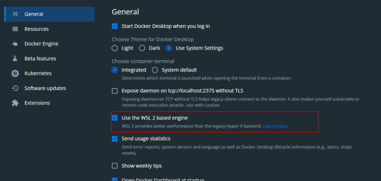

Luego en la sección “Resources > WSL Integration”, asegurarate que la opcion “Enable integration with my default WSL distro”, este habilitada:

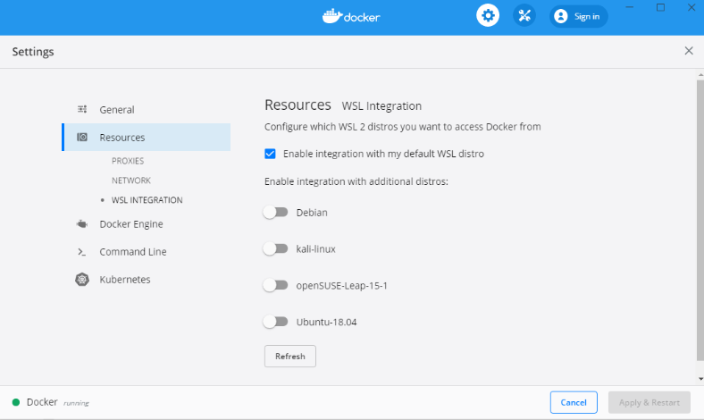

Puedes ver más detalles de Docker con WLS 👉 Docker Desktop WSL 2 backend
https://docs.docker.com/desktop/windows/wsl/

**Instalación en Windows** 🪟
Debes descargar el instalador desde la página de Docker for Windows.
https://docs.docker.com/desktop/install/windows-install/

Cuando ya tienes instalado Docker Desktop dentro de tus programas, una de las cosas que debes tener en cuenta en la instalación con Windows es que debes contar con Windows 10 de 64 Bits o superior y debes habilitar el Hyper-V de Windows. https://learn.microsoft.com/en-us/virtualization/hyper-v-on-windows/quick-start/enable-hyper-v

Si quieres conocer los detalles, aquí te dejo el detalle como habilitar Hyper-V desde la Interfaz de Windows

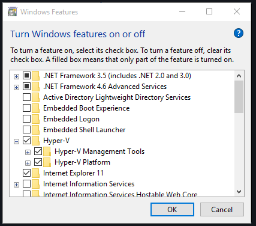

**Instalación en macOS** 🍎

En Mac tienes dos opciones. Todo dependerá si tienes los nuevos chips M1 o Intel, ya que hay un instalable apropiado para ambas arquitecturas de chip. Puedes escoger el instalable desde Install Docker Desktop on Mac. https://docs.docker.com/desktop/install/mac-install/

Adicionalmente, si cuentas con los nuevos chips M1, debes ejecutar la siguiente instrucción en tu terminal softwareupdate **--install-rosetta**

Una vez descargues el instalador adecuado, solo debes seguir los pasos y pasar Docker Desktop a tus aplicaciones.

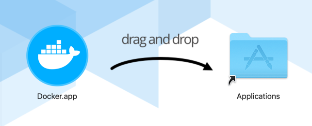

**Instalación en Ubuntu** 🐧

Estos son los pasos para instalarlo dentro de Ubuntu, sin embargo, también puedes ver directamente Install Docker Engine on Ubuntu https://docs.docker.com/engine/install/ubuntu/

```sh
sudo apt-get update
```

```sh
sudo apt-get install \
    ca-certificates \
    curl \
    gnupg \
    lsb-release
```

```sh
sudo mkdir -p /etc/apt/keyrings
```

```sh
curl -fsSL https://download.docker.com/linux/ubuntu/gpg | sudo gpg --dearmor -o /etc/apt/keyrings/docker.gpg
```

```sh
echo \
  "deb [arch=$(dpkg --print-architecture) signed-by=/etc/apt/keyrings/docker.gpg] https://download.docker.com/linux/ubuntu \
  $(lsb_release -cs) stable" | sudo tee /etc/apt/sources.list.d/docker.list > /dev/null
```

```sh
sudo apt-get update
```

```sh
sudo apt-get install docker-ce docker-ce-cli containerd.io docker-compose-plugin
```

```sh
sudo docker run hello-world
```

Para otras distribuciones de Linux:

* Install Docker Engine on CentOS https://docs.docker.com/engine/install/centos/
* Install Docker Engine on Debian https://docs.docker.com/engine/install/debian/
* Install Docker Engine on Fedora https://docs.docker.com/engine/install/fedora/


### Dockerizando scripts de Python

Archivos importantes

```yml
# python-cero-experto/03-python-pip-entornos-virtuales/app/docker-compose.yml

version: '3.7'
services:
  app-csv:
    build:
      context: .
      dockerfile: Dockerfile
    volumes:
      - .:/app
    ports:
     - '80:80'
```

```Dockerfile
# python-cero-experto/03-python-pip-entornos-virtuales/app/Dockerfile

FROM python:3.10

WORKDIR /app
COPY requirements.txt /app/requirements.txt

RUN pip install --no-cache-dir --upgrade -r /app/requirements.txt

COPY . /app

CMD bash -c "while true; do sleep 1; done"
```

1) iniciar docker desktop 
2) Crear Dockerfile
3) Crear docker-compose.yml
4) comando para construir el Sistema siguiendo los pasos del Dockerfile

```sh
docker-compose build
```

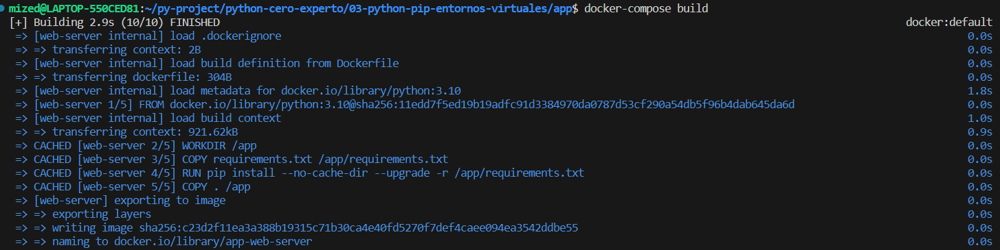

5) lanzar el contenedor

```sh
docker-compose up -d
```

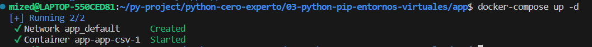

6) verificar el estado del contenedor 

```sh
docker-compose ps
```

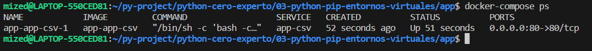


7) ingresar al ambiente 

```sh
docker-compose exec app-csv bash
```

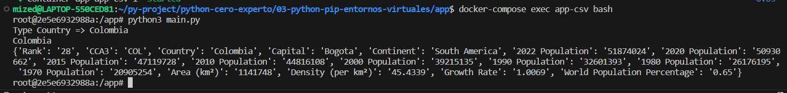

8) ejecutar el programa dentro del contenedor

```sh
python3 main.py
```


### Docker para el día a día: automatizando la vinculación de archivos

para realizar una mejor experiencia de usuario debemos enlazar los sistemas de archivo, agregar:

```yml
volumes:
    - .:/app
```

Quedaria de la siguiente manera

```yml
version: '3.7'
services:
  app-csv:
    build:
      context: .
      dockerfile: Dockerfile
    volumes:
      - .:/app
    ports:
     - '80:80'
```

#### Recurso

https://github.com/platzi/curso-python-pip/tree/master/app


### Dockerizando web services

Para tener el servidor encendido para subir ese contenedor a la nube 

Lanzar el servidor de uvicorn

```Dockerfile
CMD ["uvicorn", "main:app", "--host", "0.0.0.0", "--port", "80"]
```

Archivo completo

```Dockerfile
# python-cero-experto/03-python-pip-entornos-virtuales/web-server/Dockerfile
FROM python:3.10

WORKDIR /app
COPY requirements.txt /app/requirements.txt

RUN pip install --no-cache-dir --upgrade -r /app/requirements.txt

COPY . /app

CMD ["uvicorn", "main:app", "--host", "0.0.0.0", "--port", "80"]
```

Cambiamos en el docker-compose.yml el nombre a web-server y agregamos el enlace de los puertos:

```yml
    ports:
     - '80:80'
```


```yml
# python-cero-experto/03-python-pip-entornos-virtuales/web-server/docker-compose.yml
version: '3.7'
services:
  web-server:
    build:
      context: .
      dockerfile: Dockerfile
    volumes:
      - .:/app
    ports:
     - '80:80'
```

Construir la imagen del contenedor

```sh
docker-compose build
```

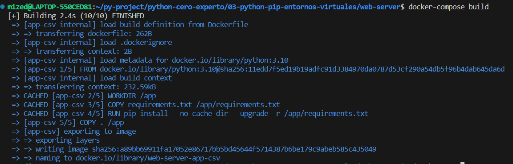

Lanzar el contenedor

```sh
docker-compose up -d
```

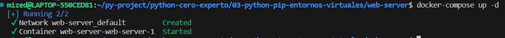

Ver el estado del contenedor

```sh
docker-compose ps
```

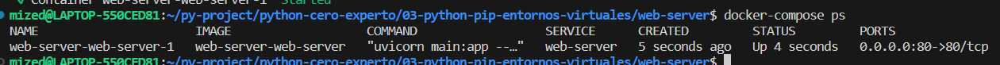

imagenes del proyecto web-server desde el contenedor

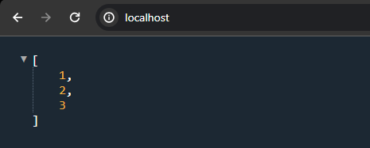

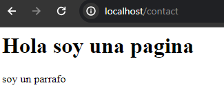

#### Recursos

https://github.com/platzi/curso-python-pip/tree/master/web-server
