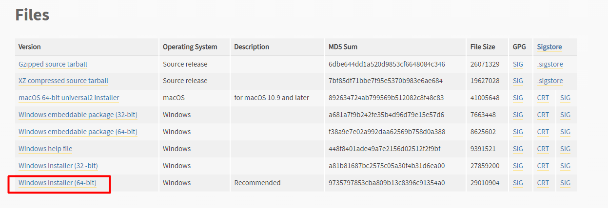
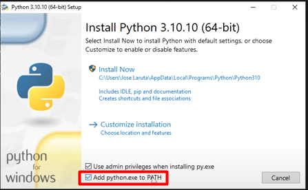
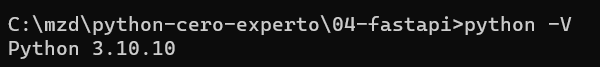
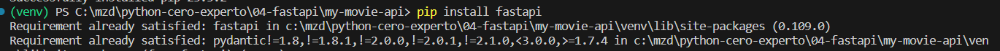
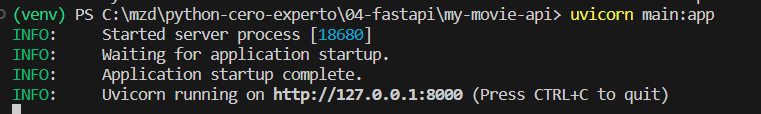
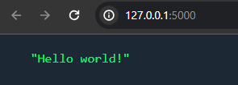
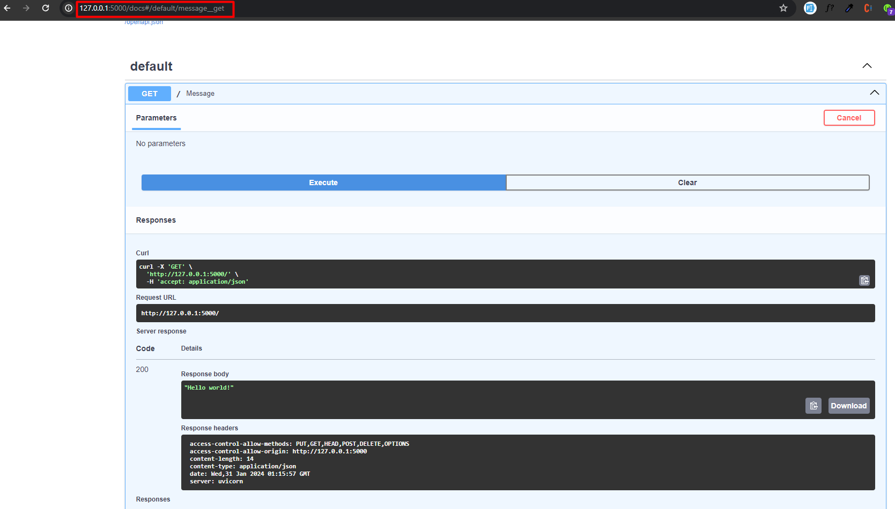
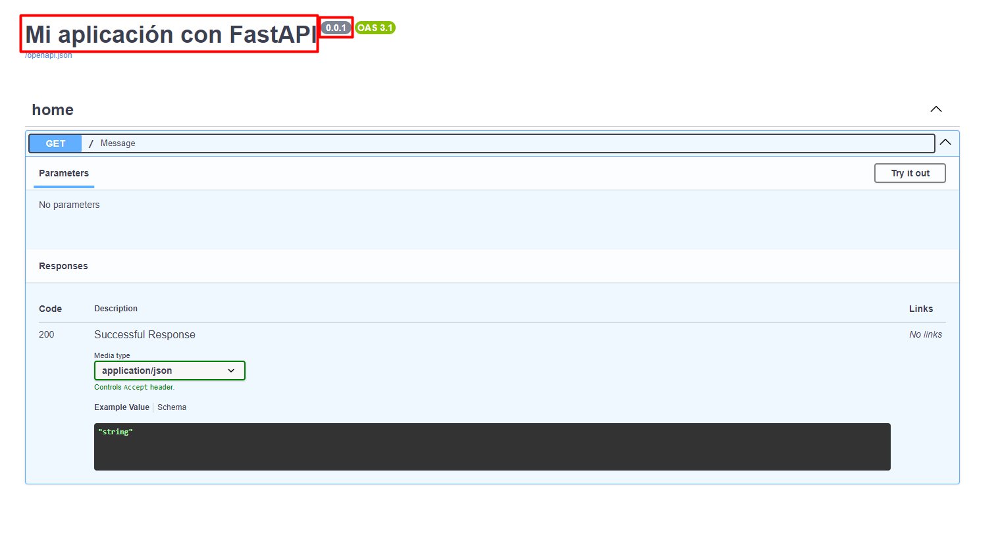
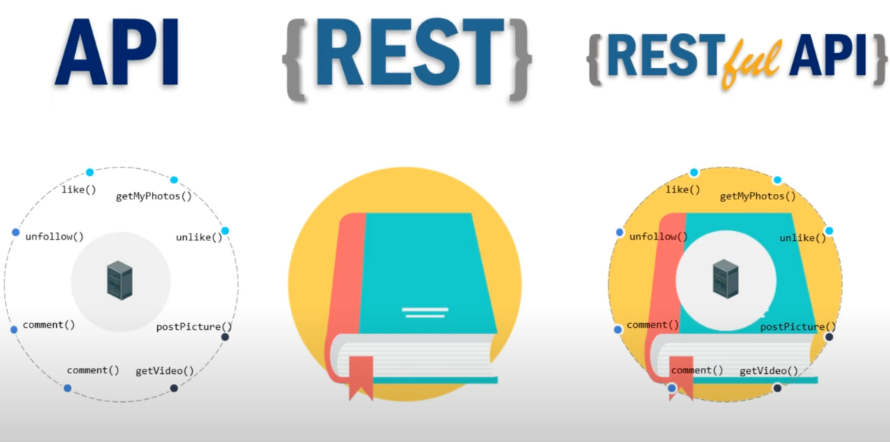

## Curso de FastAPI

### ¿Qué es FastAPI? con Sebastián Ramírez @Tiangolo

es un moderno y rápido marco (framework) web para construir APIs con Python 3.6+ basado en estándares y tipado de datos. Fue creado para ser fácil de usar y al mismo tiempo ofrecer alto rendimiento. Algunas de las características clave de FastAPI incluyen:

**Rápido y Eficiente:** FastAPI está diseñado para ser uno de los marcos web más rápidos disponibles para Python. Aprovecha la potencia de la anotación de tipos de datos para mejorar el rendimiento y también utiliza la biblioteca Starlette para manejar la capa de red.

**Tipado de Datos (Pydantic):** Utiliza anotaciones de tipos de datos para la validación y la documentación automática de la API. Además, se integra estrechamente con la biblioteca Pydantic, que facilita la validación y la serialización de datos de manera declarativa.

**APIs Autodocumentadas:** FastAPI genera automáticamente documentación interactiva (basada en Swagger y ReDoc) para tu API, lo que facilita a los desarrolladores comprender y probar la API sin necesidad de consultar la documentación por separado.

**Asíncrono por Defecto:** FastAPI es compatible con código asíncrono (async/await) de manera nativa, lo que permite manejar concurrencia de manera eficiente y aprovechar características avanzadas como WebSockets.

**Fácil Integración con Bibliotecas de Python:** Puedes integrar fácilmente FastAPI con otras bibliotecas populares de Python, como SQLAlchemy para el acceso a bases de datos, OAuth2 para la autenticación, y más.

**Seguridad Integrada:** FastAPI incluye características de seguridad integradas, como la validación y generación automática de esquemas OpenAPI, así como herramientas para manejar autorización y autenticación.

**Desarrollo Rápido (Rapid Development):** El marco está diseñado para facilitar el desarrollo rápido de aplicaciones, proporcionando características como la generación automática de código de cliente y la validación de datos de entrada y salida.

**Activo y en Desarrollo Continuo:** FastAPI es un proyecto activamente mantenido y actualizado. El creador del marco, Sebastián Ramírez, sigue agregando nuevas características y mejoras en cada versión.

En resumen, FastAPI es una opción poderosa y eficiente para construir APIs web con Python, especialmente si estás buscando un marco que combine velocidad, tipado de datos, documentación automática y soporte para programación asíncrona.


### Instalación de FastAPI y creación de tu primera aplicación

Instalar python en Windows 







crear el entorno de python

```sh
python -m venv venv
```

Activar el entorno

```sh
venv/Scripts/activate
```


Instalar depencias

```sh
pip install fastapi

pip install uvicorn
```



levantar el servidor de la app



```sh
uvicorn main:app --reload --port 5000 --host 0.0.0.0
```

**--host 0.0.0.0**  para que se muestre en red



#### Recurso

https://github.com/platzi/curso-fastapi/tree/clase-01-creacion-aplicacion


### Documentación automática con Swagger





#### Recurso

https://github.com/platzi/curso-fastapi/tree/clase-02-documentacion-swagger


### Métodos HTTP en FastAPI



**Métodos HTTP**

El protocolo HTTP es aquel que define un conjunto de métodos de petición que indican la acción que se desea realizar para un recurso determinado del servidor.

Los principales métodos soportados por HTTP y por ello usados por una API REST son:

* POST: crear un recurso nuevo.
* PUT: modificar un recurso existente.
* GET: consultar información de un recurso.
* DELETE: eliminar un recurso.

Como te diste cuenta con estos métodos podemos empezar a crear un CRUD en nuestra aplicación.

**¿De qué tratará nuestra API?**

El proyecto que estaremos construyendo a lo largo del curso será una API que nos brindará información relacionada con películas, por lo que tendremos lo siguiente:

**Consulta de todas las películas**
Para lograrlo utilizaremos el método GET y solicitaremos todos los datos de nuestras películas.

**Filtrado de películas**
También solicitaremos información de películas por su id y por la categoría a la que pertenecen, para ello utilizaremos el método GET y nos ayudaremos de los parámetros de ruta y los parámetros query.

**Registro de peliculas**
Usaremos el método POST para registrar los datos de nuestras películas y también nos ayudaremos de los esquemas de la librería pydantic para el manejo de los datos.

**Modificación y eliminación**
Finalmente para completar nuestro CRUD realizaremos la modificación y eliminación de datos en nuestra aplicación, para lo cual usaremos los métodos PUT y DELETE respectivamente.

Y lo mejor es que todo esto lo estarás construyendo mientras aprendes FastAPI, te veo en la siguiente clase donde te enseñaré cómo puedes utilizar el método GET.