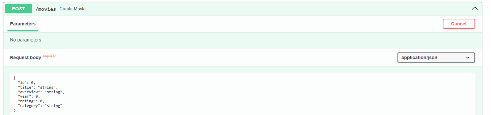
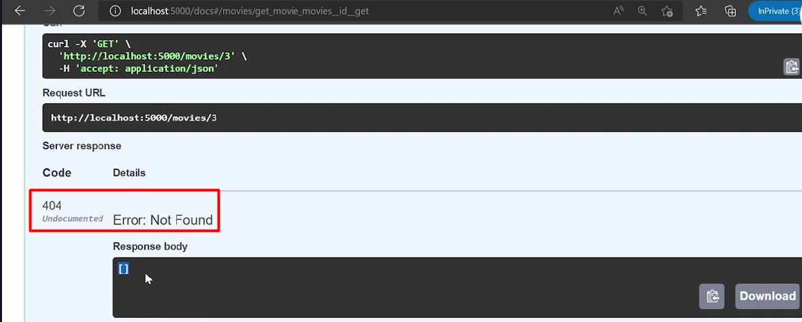

## Curso de FastAPI

### ¿Qué es FastAPI? con Sebastián Ramírez @Tiangolo

es un moderno y rápido marco (framework) web para construir APIs con Python 3.6+ basado en estándares y tipado de datos. Fue creado para ser fácil de usar y al mismo tiempo ofrecer alto rendimiento. Algunas de las características clave de FastAPI incluyen:

**Rápido y Eficiente:** FastAPI está diseñado para ser uno de los marcos web más rápidos disponibles para Python. Aprovecha la potencia de la anotación de tipos de datos para mejorar el rendimiento y también utiliza la biblioteca Starlette para manejar la capa de red.

**Tipado de Datos (Pydantic):** Utiliza anotaciones de tipos de datos para la validación y la documentación automática de la API. Además, se integra estrechamente con la biblioteca Pydantic, que facilita la validación y la serialización de datos de manera declarativa.

**APIs Autodocumentadas:** FastAPI genera automáticamente documentación interactiva (basada en Swagger y ReDoc) para tu API, lo que facilita a los desarrolladores comprender y probar la API sin necesidad de consultar la documentación por separado.

**Asíncrono por Defecto:** FastAPI es compatible con código asíncrono (async/await) de manera nativa, lo que permite manejar concurrencia de manera eficiente y aprovechar características avanzadas como WebSockets.

**Fácil Integración con Bibliotecas de Python:** Puedes integrar fácilmente FastAPI con otras bibliotecas populares de Python, como SQLAlchemy para el acceso a bases de datos, OAuth2 para la autenticación, y más.

**Seguridad Integrada:** FastAPI incluye características de seguridad integradas, como la validación y generación automática de esquemas OpenAPI, así como herramientas para manejar autorización y autenticación.

**Desarrollo Rápido (Rapid Development):** El marco está diseñado para facilitar el desarrollo rápido de aplicaciones, proporcionando características como la generación automática de código de cliente y la validación de datos de entrada y salida.

**Activo y en Desarrollo Continuo:** FastAPI es un proyecto activamente mantenido y actualizado. El creador del marco, Sebastián Ramírez, sigue agregando nuevas características y mejoras en cada versión.

En resumen, FastAPI es una opción poderosa y eficiente para construir APIs web con Python, especialmente si estás buscando un marco que combine velocidad, tipado de datos, documentación automática y soporte para programación asíncrona.

### Instalación de FastAPI y creación de tu primera aplicación

Instalar python en Windows


crear el entorno de python

```sh
python -m venv venv
```

Activar el entorno

```sh
venv/Scripts/activate
```


Instalar depencias

```sh
pip install fastapi

pip install uvicorn
```


levantar el servidor de la app


```sh
uvicorn main:app --reload --port 5000 --host 0.0.0.0
```

**--host 0.0.0.0**  para que se muestre en red


#### Recurso

<https://github.com/platzi/curso-fastapi/tree/clase-01-creacion-aplicacion>

### Documentación automática con Swagger


#### Recurso

<https://github.com/platzi/curso-fastapi/tree/clase-02-documentacion-swagger>

### Métodos HTTP en FastAPI


**Métodos HTTP**

El protocolo HTTP es aquel que define un conjunto de métodos de petición que indican la acción que se desea realizar para un recurso determinado del servidor.

Los principales métodos soportados por HTTP y por ello usados por una API REST son:

* POST: crear un recurso nuevo.
* PUT: modificar un recurso existente.
* GET: consultar información de un recurso.
* DELETE: eliminar un recurso.

Como te diste cuenta con estos métodos podemos empezar a crear un CRUD en nuestra aplicación.

**¿De qué tratará nuestra API?**

El proyecto que estaremos construyendo a lo largo del curso será una API que nos brindará información relacionada con películas, por lo que tendremos lo siguiente:

**Consulta de todas las películas**
Para lograrlo utilizaremos el método GET y solicitaremos todos los datos de nuestras películas.

**Filtrado de películas**
También solicitaremos información de películas por su id y por la categoría a la que pertenecen, para ello utilizaremos el método GET y nos ayudaremos de los parámetros de ruta y los parámetros query.

**Registro de peliculas**
Usaremos el método POST para registrar los datos de nuestras películas y también nos ayudaremos de los esquemas de la librería pydantic para el manejo de los datos.

**Modificación y eliminación**
Finalmente para completar nuestro CRUD realizaremos la modificación y eliminación de datos en nuestra aplicación, para lo cual usaremos los métodos PUT y DELETE respectivamente.

Y lo mejor es que todo esto lo estarás construyendo mientras aprendes FastAPI, te veo en la siguiente clase donde te enseñaré cómo puedes utilizar el método GET.

### Método GET en FastAPI


#### Recurso

<https://github.com/platzi/curso-fastapi/tree/clase-03-metodo-get>

### Crear parámetros de ruta en FastAPI


```py
@app.get('/movies/{id}', tags=['movies'])
def get_movie(id: int):
    for item in movies:
        if item["id"] == id:
            return item
    return []
```

#### Recurso

<https://github.com/platzi/curso-fastapi/tree/clase-04-parametros-de-ruta>

### Parámetros Query en FastAPI


```py
@app.get('/movies/', tags=['movies'])
def get_movies_by_category(category: str, year: int):
    return [ item for item in movies if item['category'] == category ]
```

#### Recurso

<https://github.com/platzi/curso-fastapi/tree/clase-05-parametros-query>

### Método POST en FastAPI



```py
@app.post('/movies', tags=['movies'])
def create_movie(id: int = Body(), title: str = Body(), overview:str = Body(), year:int = Body(), rating: float = Body(), category: str = Body()):
    movies.append({
        "id": id,
        "title": title,
        "overview": overview,
        "year": year,
        "rating": rating,
        "category": category
    })
    return movies
```

#### Recurso

<https://github.com/platzi/curso-fastapi/tree/clase-06-metodo-post>

### Métodos PUT y DELETE en FastAPI


```py
@app.put('/movies/{id}', tags=['movies'])
def update_movie(id: int, title: str = Body(), overview:str = Body(), year:int = Body(), rating: float = Body(), category: str = Body()):
 for item in movies:
  if item["id"] == id:
   item['title'] = title,
   item['overview'] = overview,
   item['year'] = year,
   item['rating'] = rating,
   item['category'] = category
   return movies

@app.delete('/movies/{id}', tags=['movies'])
def delete_movie(id: int):
    for item in movies:
        if item["id"] == id:
            movies.remove(item)
            return movies
```

#### Recurso

<https://github.com/platzi/curso-fastapi/tree/clase-07-metodo-put-delete>

### Creación de esquemas con Pydantic


```py
from pydantic import BaseModel
from typing import Optional


class Movie(BaseModel):
    id: Optional[int] = None
    title: str
    overview: str
    year: int
    rating: float
    category: str
```

#### Recurso

<https://github.com/platzi/curso-fastapi/tree/clase-8-creacion-esquemas>

### Validaciones de tipos de datos con Pydantic

validaciones por defecto


```py
class Movie(BaseModel):
    id: Optional[int] = None
    title: str = Field(min_length=5, max_length=15)
    overview: str = Field(min_length=15, max_length=50)
    year: int = Field(le=2022)
    rating:float = Field(default=10, ge=1, le=10)
    category:str = Field(default='Categoría', min_length=5, max_length=15)

    class Config:
        schema_extra = {
            "example": {
                "id": 1,
                "title": "Mi película",
                "overview": "Descripción de la película",
                "year": 2022,
                "rating": 9.8,
                "category" : "Acción"
            }
        }
```

**schema_extra**


#### Recurso

<https://github.com/platzi/curso-fastapi/tree/clase-09-validaciuon-de-datos>

### Validaciones de parámetros con Pydantic


muestra la validacion de movies cuando no existe el 0


```py
# min_length para validar el ingreso de los datos
rating:float = Field(ge=1, le=10)
category:str = Field(min_length=5, max_length=15)
```

#### Recurso

<https://github.com/platzi/curso-fastapi/tree/clase-10-validaciuon-de-parametros>

### JSONResponse: Tipos de respuestas en FastAPI

```py
# JSONResponse para retornar las respuestas
@app.get('/movies', tags=['movies'], response_model=List[Movie])
def get_movies() -> List[Movie]:
    return JSONResponse(content=movies)
```


#### Recurso

<https://github.com/platzi/curso-fastapi/tree/clase-11-tipos-de-respuesta>

### Códigos de estado HTTP en FastAPI


```py
# respuesta de codigos de estado status_code=200
@app.get('/movies', tags=['movies'], response_model=List[Movie], status_code=200)
def get_movies() -> List[Movie]:
    return JSONResponse(status_code=200, content=movies)
```



#### Recurso

<https://developer.mozilla.org/en-US/docs/Web/HTTP/Status>

<https://github.com/platzi/curso-fastapi/tree/clase-12-codigos-de-estado>

### Flujo de autenticación en FastAPI

**Flujo de autenticación**

Ahora empezaremos con el módulo de autenticaciones pero antes quiero explicarte un poco acerca de lo que estaremos realizando en nuestra aplicación y cómo será el proceso de autenticación y autorización.

**Ruta para iniciar sesión**

Lo que obtendremos como resultado al final de este módulo es la protección de determinadas rutas de nuestra aplicación para las cuales solo se podrá acceder mediante el inicio de sesión del usuario. Para esto crearemos una ruta que utilice el método POST donde se solicitarán los datos como email y contraseña.

**Creación y envío de token**

Luego de que el usuario ingrese sus datos de sesión correctos este obtendrá un token que le servirá para enviarlo al momento de hacer una petición a una ruta protegida.

**Validación de token**

Al momento de que nuestra API reciba la petición del usuario, comprobará que este le haya enviado el token y validará si es correcto y le pertenece. Finalmente se le dará acceso a la ruta que está solicitando.

En la siguiente clase empezaremos con la creación de una función que nos va a permitir generar tokens usando la librería pyjwt.

### Generando tokens con PyJWT

instalar un modulo para el pyJMT

```sh
# (venv) PS C:\mzd\python-cero-experto\04-fastapi\my-movie-api>
pip install pyjwt
```

```py
from jwt import encode

def create_token(data: dict):
    token: str = encode(payload=data, key="my_secrete_key", algorithm="HS256")
    return token
```

#### Recurso

<https://github.com/platzi/curso-fastapi/tree/clase-13-creacion-de-token>

### Validando tokens con PyJWT

Creamos metodos para crear y validar el token.

```py
# 04-fastapi\my-movie-api\jwt_manager.py
from jwt import encode, decode

def create_token(data: dict) -> str:
    token: str = encode(payload=data, key="my_secret_key", algorithm="HS256")
    return token

def validate_token(token: str) -> dict:
    data: dict = decode(token, key="my_secret_key", algorithms=['HS256'])
    return data
```

#### Recurso

<https://github.com/platzi/curso-fastapi/tree/clase-14-funcion-para-validar-token>

### Middlewares de autenticación en FastAPI

Incluir una proteccion a las rutas para este caso usando HTTPBearer.

```py
# 04-fastapi\my-movie-api\main.py
class JWTBearer(HTTPBearer):
    async def __call__(self, request: Request):
        auth = await super().__call__(request)
        data = validate_token(auth.credentials)
        if data['email'] != "admin@gmail.com":
            raise HTTPException(status_code=403, detail="Credenciales son invalidas")
```

#### Recurso

<https://github.com/platzi/curso-fastapi/tree/clase-15-funcion-para-solicitar-token>

### SQLAlchemy: el ORM de FastAPI

¿Que es un orm?

Es una libreria que nos permite manipular las tablas de una base de datos como si fueran objetos de nuestra aplicacion.


¿Que es SQLAlchemy?

Es una libreria para python que faciita el acceso a una base de datos relacional mapeando tablas SQL a clases.

### Instalación y configuración de SQLAlchemy

Instalar plugin para Vstudio Code llamado SQLite Viewer


Instalar el modulo para python de SQLAlchemy

Nota: verificar donde se intala hacerlo dentro del proyecto, para este caso **my-movie-api**

```sh
pip install sqlalchemy
```


Configuracion para la base de datos

* Crear la carpeta config
* Dentro de dicha carpeta crear el archivo **init**.py para que detecte la carpeta como un modulo.
* Crear otro archivo llamado database.py donde añadiremos las configuraciones.

#### Recurso

<https://github.com/platzi/curso-fastapi-sql/tree/01-configuracion-base-datos>

### Creación de modelos con SQLAlchemy

```sh
# 04-fastapi/my-movie-api/models/movie.py
from config.database import Base
from sqlalchemy import Column, Integer, String, Float

class Movie(Base):

    __tablename__ = "movies"

    id = Column(Integer, primary_key = True)
    title = Column(String)
    overview = Column(String)
    year = Column(Integer)
    rating = Column(Float)
    category = Column(String)
```

#### Recurso

<https://github.com/platzi/curso-fastapi-sql/commit/241df52bc5086321950133e1f023e265108eaad1>

### Registro de datos con SQLAlchemy


#### Recurso

<https://github.com/platzi/curso-fastapi-sql/commit/92eceba1dda37e50a0273c11fd34146c99999e85>

### Consulta de datos con SQLAlchemy


#### Recurso

<https://github.com/platzi/curso-fastapi-sql/commit/c5564562cec82d341fd84724f86afa665c8b619f>

### Modificación y eliminación de datos con SQLAlchemy


#### Recurso

<https://github.com/platzi/curso-fastapi-sql/commit/d423a552252850bf01fd76c2e8eedaa91629f7c5>

### SQLModel: el futuro ORM de FastAPI

Esta es una alternativa de ORM creada por el creador de FastAPi

<https://sqlmodel.tiangolo.com/>

Comando para instalar este ORM para el uso de este se debe desconectar el anterior de SQLAlchemy

```sh
pip install sqlmodel
```

### Manejo de errores y middlewares en FastAPI

Este se realiza para el control de errores desde un middleware que captura estos errores, ademas el bearer se incluira dentro de la carpeta middlewares.

```sh
# 04-fastapi/my-movie-api/middlewares/error_handler.py
from starlette.middleware.base import BaseHTTPMiddleware
from fastapi import FastAPI, Request, Response
from fastapi.responses import JSONResponse

class ErrorHandler(BaseHTTPMiddleware):
    def __init__(self, app: FastAPI) -> None:
        super().__init__(app)

    async def dispatch(self, request: Request, call_next) -> Response | JSONResponse:
        try:
            return await call_next(request)
        except Exception as e:
            return JSONResponse(status_code=500, content={'error': str(e)})
```


#### Recurso

<https://github.com/platzi/curso-fastapi-sql/commit/0990b0cf9d6b19f883774ab4cf923b5725252e48>

### Creación de routers en FastAPI

Dividir la aplicacion en modulos por medio de los routers

#### Recurso

<https://github.com/platzi/curso-fastapi-sql/commit/564412c78e72d0897b32998e2f3a999c659ae7a5>

### Servicios para consultar datos

Se crea route de user y se implementa los servicios para movies


#### Recurso

<https://github.com/platzi/curso-fastapi-sql/commit/7c6a36667500bbe3ea66da952aca3efe9f9612a9>
