# Indice

## Curso de Introducción al Pensamiento Computacional con Python

### Introducción al pensamiento computacional

Objetivos

* Aprender a resolver problemas de manera computacional
* Entender los puntos en común entre todos los lenguajes de programación
* Desarrollar las bases para una carrera en Computer Science

### Introducción al cómputo

**Resumen Introducción al Cómputo**

* **"Primera computadora"** creada por los griegos, calcula la posición del sol, luna y algunas constelaciones.

* En 1801, Telar de Jacquar, separa el resultado de la informacion que contiene las instrucciones.

* Siglo XIX, Motor analítico de Babbage, haciendo uso del avances en mecánica (engranajes) de su época logra separar instrucciones de calculo y realizar varios cálculos a la vez.

* Finales siglo XIX, ENIAC (Eectronic Numerical Integrator and Computer) usaba sistema decimal. creada por Alan Turing y Alonso. Esta época exigía exactitud en los cálculos que hacían que compañías dependieran de esta(Compañías Ferroviarias por ejemplo). Turing y Alonso, Descubrieron que matemáticamente todos los algoritmos podíamos reducirlos a una secuencia de soluciones matemáticas.

* En 1945, Arquitectura de Von Neumann, EDVAC (Electronic Discrete Variable Automatic Computer) usaba sistema binario. Su aporte fue el descubrimiento que dentro de los componentes electrónicos se puede usar una serie de hadward para realizar el computo y almacenar datos dentro de memoria.

* En 1950, Microchip, ejemplo Apple 1

* En siglo XX, Arquitectura de Feymann, aporta las bases matemáticas de computo cuántico.

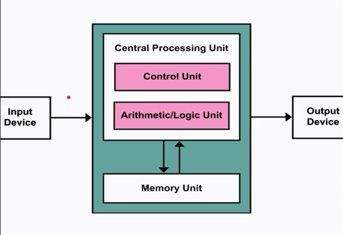

Cómputo y computadoras

* Las computadoras hacen dos cosas: hacen cálculos y recuerdan el resultado de dichos cálculos.
* Por la mayoría de la historia humana, estábamos limitados por la velocidad del cerebro y la mano.
* Aún con las computadoras modernas existen problemas que no podemos resolver.

### Introducción a los lenguajes de programación

¿Qué es un lenguaje de programación? Es un lenguaje formal que, mediante una serie de instrucciones, le permite a un programador escribir un conjunto de órdenes, acciones consecutivas, datos y algoritmos para, de esa forma, crear programas que controlen el comportamiento físico y lógico de una máquina.

¿Qué tipos de lenguaje de programación existen? El lenguaje de programación es la base para construir todas las aplicaciones digitales que se utilizan en el día a día y se clasifican en dos tipos principales: lenguaje de bajo nivel y de alto nivel.

Lenguaje de programación de bajo nivel Son lenguajes totalmente orientados a la máquina.

Este lenguaje sirve de interfaz y crea un vínculo inseparable entre el hardware y el software.

Además, ejerce un control directo sobre el equipo y su estructura física. Para aplicarlo adecuadamente es necesario que el programador conozca sólidamente el hardware. Éste se subdivide en dos tipos:

Lenguaje máquina Es el más primitivo de los lenguajes y es una colección de dígitos binarios o bits (0 y 1) que la computadora lee e interpreta y son los únicos idiomas que las computadoras entienden.

Ejemplo: 10110000 01100001

No entendemos muy bien lo que dice ¿verdad? Por eso, el lenguaje ensamblador nos permite entender mejor a qué se refiere éste código.

Lenguaje ensamblador El lenguaje ensamblador es el primer intento de sustitución del lenguaje de máquina por uno más cercano al utilizado por los humanos.

Un programa escrito en éste lenguaje es almacenado como texto (tal como programas de alto nivel) y consiste en una serie de instrucciones que corresponden al flujo de órdenes ejecutables por un microprocesador.

Sin embargo, dichas máquinas no comprenden el lenguaje emsamblador, por lo que se debe convertir a lenguaje máquina mediante un programa llamado Ensamblador.

Este genera códigos compactos, rápidos y eficientes creados por el programador que tiene el control total de la máquina.

Ejemplo: MOV AL, 61h (asigna el valor hexadecimal 61 al registro “AL”)

Lenguaje de programación de alto nivel Tienen como objetivo facilitar el trabajo del programador, ya que utilizan unas instrucciones más fáciles de entender.

Además, el lenguaje de alto nivel permite escribir códigos mediante idiomas que conocemos (español, inglés, etc.) y luego, para ser ejecutados, se traduce al lenguaje de máquina mediante traductores o compiladores.

++Traductor++ Traducen programas escritos en un lenguaje de programación al lenguaje máquina de la computadora y a medida que va siendo traducida, se ejecuta.

++Compilador++ Permite traducir todo un programa de una sola vez, haciendo una ejecución más rápida y puede almacenarse para usarse luego sin volver a hacer la traducción.

**Programación**

* Turing completeness

* Los lenguajes de programación modernos dan primitivos que son más convenientes que los primitivos de Turing.

**Lenguajes**

**Sintaxis** Define la secuencia de símbolos que está bienformada.

**Semántica estática** Define qué enunciados con sintaxis correcta tienen significado

**Semántica** Define el significado. En los lenguajes de programación sólo hay un significado.

### Preparación de tu computadora

Antes de comenzar este curso asegúrate de preparar tu entorno de trabajo para poder hacer todos los ejercicios. A continuación te compartiré los pasos que debes seguir para configurar tu computadora.

Si estás usando Windows asegúrate de instalar lo siguiente en tu computadora:

Python 3.7 (o superior)

1. Para obtener el instalador dirígete a <https://www.python.org/downloads/>

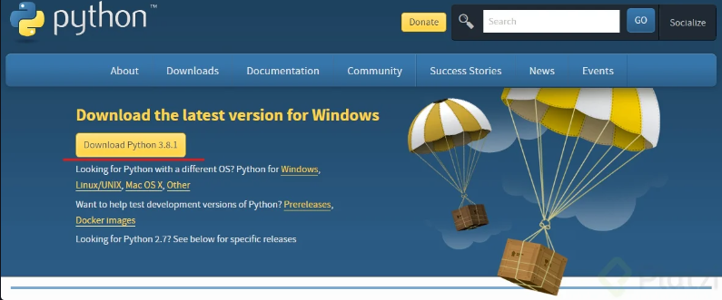

2. Descarga el instalador y ejecútalo en tu computadora.

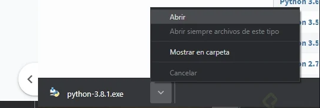

3. Habilita la casilla de verificación en Install launcher for all users y Add Python 3.8 to PATH. A continuación presiona en Install Now. Windows te solicitará permisos para instalar Python en tu computadora.

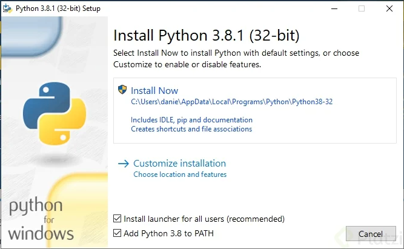

4. Al finalizar la instalación se abrirá una ventana como la siguiente, en ella deberás presionar en la opción Disable path length limit. Windows te solicitará permisos para realizar este cambio.

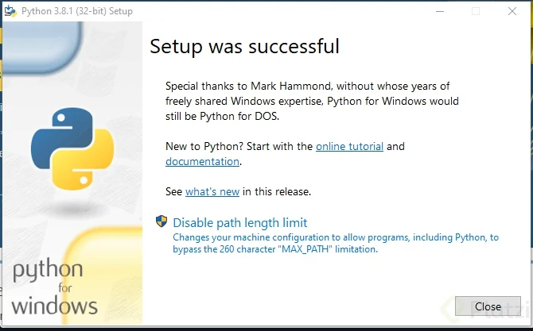

Visual Studio Code
En el curso el profesor utiliza Visual Studio Code, un editor de textos que tiene integradas varias herramientas que te ayudarán a desarrollar tus ejercicios con facilidad. Para obtenerlo en tu computadora, dirígete a: <https://code.visualstudio.com/>

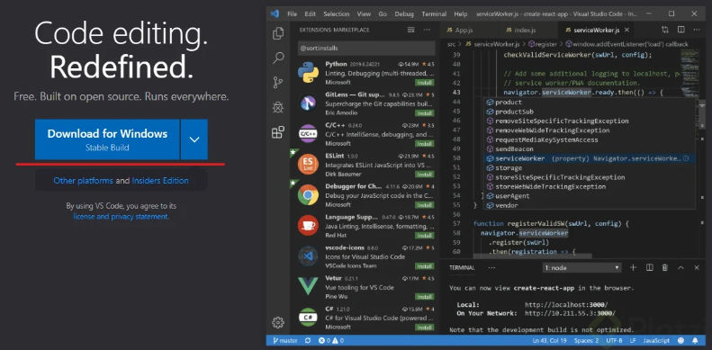

1. Realiza una instalación normal de Visual Studio code.

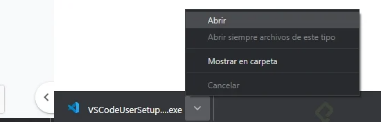

Una vez instalado se ejecutará Visual Studio Code.

2. En Visual Studio Code dirígete al panel de Extensiones, se encuentra en el panel lateral izquierdo. Ahí deberás buscar la extensión llamada Python.


3. Selecciona la extensión creada por Microsoft, la identificarás por ser similar a la que se muestra en la imágen. Una vez seleccionada, instálala

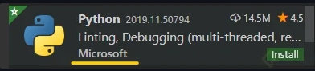

4. Una vez instalada, reinicia Visual Studio Code.
Listo con esto podrás correr los programas que escribas en python en la terminal de Visual Studio Code.

Cuando quieras correr tu programa en la terminal de Visual Studio Code, puedes introducir la dirección como lo muestra el profesor en el curso o presionar en el botón “Run Python File in Terminal”

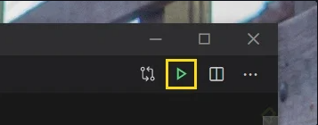

Para este caso en particular tengo instalado WSL Ubuntu

### Elementos básicos de Python

Lenguajes de programación

* Bajo nivel vs. alto nivel

* General vs. dominio específico

* Interpretado vs. compilado

**¿Qué es un lenguaje de programación?** Es un lenguaje formal que, mediante una serie de instrucciones, le permite a un programador escribir un conjunto de órdenes, acciones consecutivas, datos y algoritmos para, de esa forma, crear programas que controlen el comportamiento físico y lógico de una máquina.

**¿Qué tipos de lenguaje de programación existen?** El lenguaje de programación es la base para construir todas las aplicaciones digitales que se utilizan en el día a día y se clasifican en dos tipos principales: lenguaje de bajo nivel y de alto nivel.

Lenguaje de programación de bajo nivel Son lenguajes totalmente orientados a la máquina. Este lenguaje sirve de interfaz y crea un vínculo inseparable entre el hardware y el software.

Lenguaje de programación de alto nivel Tienen como objetivo facilitar el trabajo del programador, ya que utilizan unas instrucciones más fáciles de entender.

Lenguaje específico de dominio En desarrollo de software e ingeniería de dominio, un lenguaje específico de dominio, o "lenguaje específico del dominio", (en inglés domain-specific language, DSL) es un lenguaje de programación o especificación dedicado a resolver un problema en particular, representar un problema específico y proveer una técnica para solucionar una situación particular. El concepto no es nuevo pero se ha vuelto más popular debido al aumento del uso de modelaje específico del dominio.1​

Lenguaje de propósito general Se llama lenguaje de propósito general al lenguaje de programación cuyos procedimientos, instrucciones y estructuras de datos están diseñados para resolver todo tipo de problemas.

Lenguaje de interpretados y compilados La principal diferencia entre un lenguaje compilado y uno interpretado es que el lenguaje compilado requiere un paso adicional antes de ser ejecutado, la compilación, que convierte el código que escribes a lenguaje de máquina. Un lenguaje interpretado, por otro lado, es convertido a lenguaje de máquina a medida que es ejecutado.

Ejemplos de lenguajes compilados incluyen C, C++, Java, Go y Rust, entre muchos otros. Ejemplos de lenguajes interpretados incluyen Ruby, Python y JavaScript, entre muchos otros. A todos estos lenguajes se les conoce como lenguajes de alto nivel.

```py
1 + 1 # 1
'Platzi' / 5 # Error
'Platzi' * 3 #PlatziPlatziPlatzi
#PrintStatement
print('Hola mundo')
'Mr' + '. Internatuta'
2 + 2
```

**¿Que es un objeto?** Concepto, abstracción o cosa con límites bien definidos y con significado para el problema que se está manejando

* Escalares vs No escalares -Tipos int. float. bool. str.

```py
#Definiendo variables
my_int  = 1
my_float = 1.0
my_bool = True
my_none = None
my_str = 'Hola'
```

```py
#Imprimiendo el tipo
type(my_int)
type(my_float)
type(my_bool)
type(my_none)
type(my_str)
```

**¿Que pasa si ejecutas esto?**

```py
1 + 1 
2 - 5
2.0 * 3
6 // 2
6 // 4
6 / 4
7 % 2
2 ** 2
```

Resultado

```py
>>> 1 + 1
2
>>> 2 - 5
-3
>>> 2.0 * 3
6.0
>>> 6 // 2
3
>>> 6 // 4
1
>>> 6 / 4
1.5
>>> 7 % 2
1
>>> 2 ** 2
```

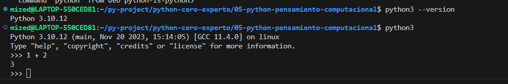

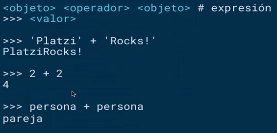

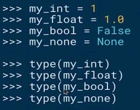

### Asignación de variables

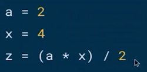

Corregir definicion de variables

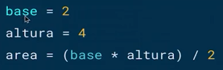

Reasignacion de memoria

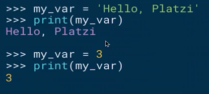

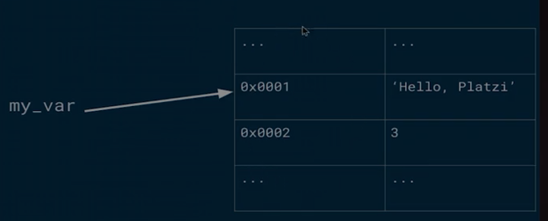

**Un recolector de basura (del inglés garbage collector)** es un mecanismo implícito de gestión de memoria implementado en algunos lenguajes de programación de tipo interpretado o semiinterpretado.

**Variables**

* Pueden contener mayúsculas, minúsculas, números (sin comenzar con uno) y el símbolo _
* No pueden llamarse como las palabras reservadas

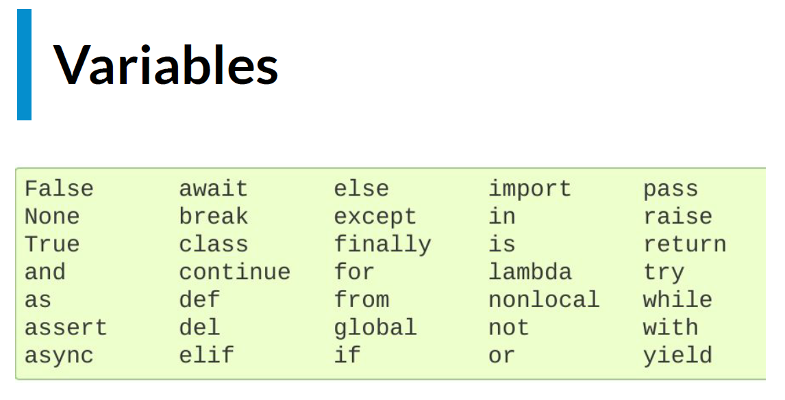

* Hacen los programas más comprensibles.
* Son simplemente nombres que apuntan a un valor en memoria.
* El operador de asignación (=) asocia una variable con un valor.

### Cadenas y entradas

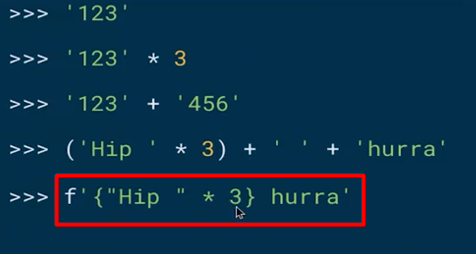

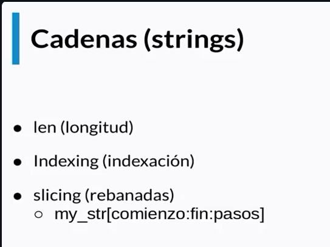

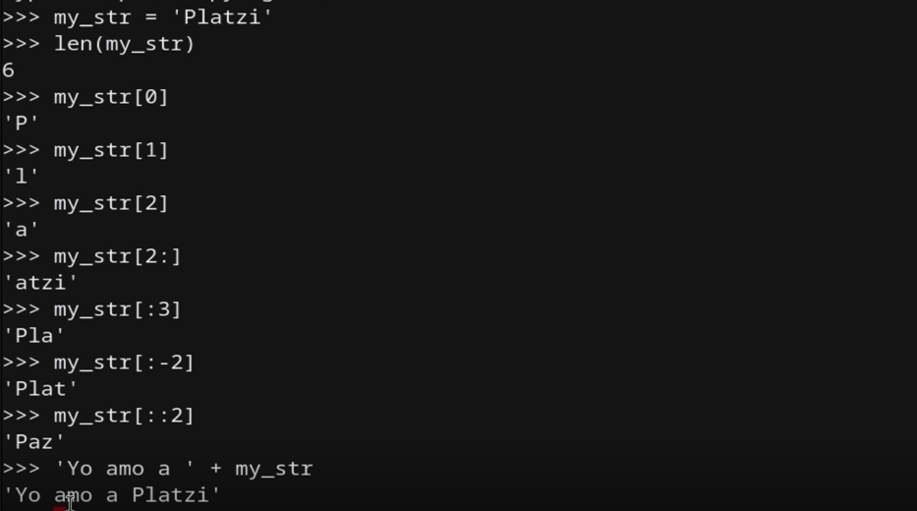

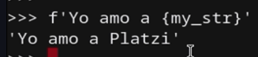

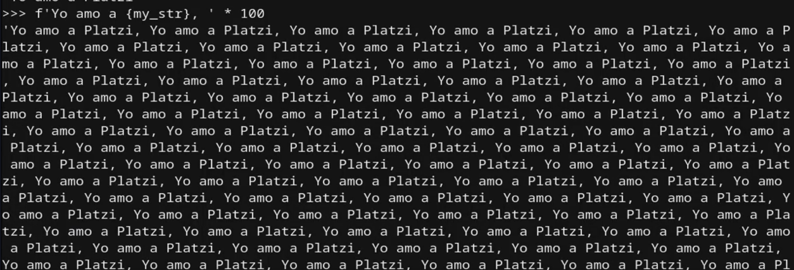

Cadenas (strings)

* Los objetos de tipo str pueden representarse con “ ” o ‘ ’.
* El operador + tiene diferente significado según el tipo de dato (overloaded). Con cadenas significa concatenación.
* El operador * es el operador de repetición con cadenas.
* Las cadenas son inmutables.

Entradas (inputs)

* Python tiene la función input para recibir datos del usuario del programa.
* Input siempre regresa cadenas, por lo que si queremos utilizar otro tipo, tenemos que hacer type casting.

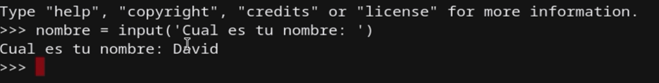

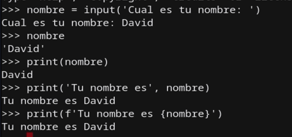

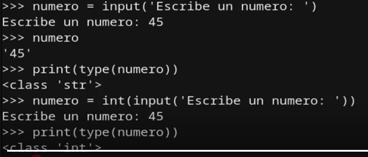

### Programas ramificados

```sh
>>> 2 == 3
>>> 2 != 3
>>> 2 > 3
>>> 2 < 3
>>> 2 <= 3
>>> 2 >= 3
```

```sh
>>> True and True
>>> False or True
>>> not True
```

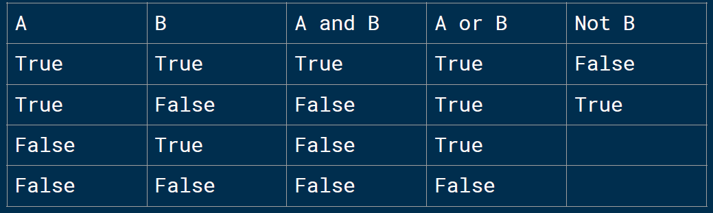

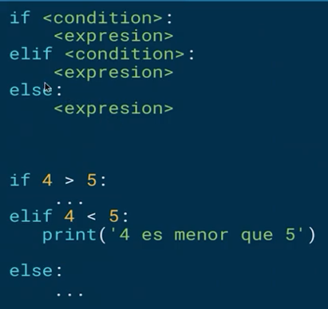

```sh
print("Bienvenido al comparador de edades.")
print("Ahora descubriremos juntos quien tiene mas edad entre dos personas.")
print("Para esto necesitare que me brindes información antes (Soy una computadora, no una adivina... por ahora...)")

nombre_persona_1 = input("Necesito el nombre de la primer persona. ¿Como se llama?: ")
edad_persona_1 = int( input("¿Que edad tiene?: "))
nombre_persona_2 = input("Necesito el nombre de la segunda persona. ¿Como se llama?: ")
edad_persona_2 = int( input("¿Que edad tiene?: "))

print("Despejare la incertidumbre...")

if edad_persona_1 > edad_persona_2:
    print(f"Claro como el agua, {nombre_persona_1} es mayor que {nombre_persona_2}.")
elif edad_persona_1 < edad_persona_2:
    print(f"¡Elemental Watson!, {nombre_persona_2} es mayor que {nombre_persona_1}.")
else:
    print(f"¡Basta de contiendas {nombre_persona_1} y {nombre_persona_2}, ambos tienen la misma edad!")

print("Gracias por usar este programa. ¡Nos vemos la proxima!")
```

### Iteraciones (loops)

* La mayoría de las tareas computacionales no se pueden lograr con ramificaciones.
* Cuando queremos que un programa haga lo mismo varias veces, utilizamos iteraciones.
* Se pueden escribir iteraciones dentro de iteraciones.
* Podemos utilizar break para salir anticipadamente de una iteración.
* Tener cuidado de iteraciones infinitas.

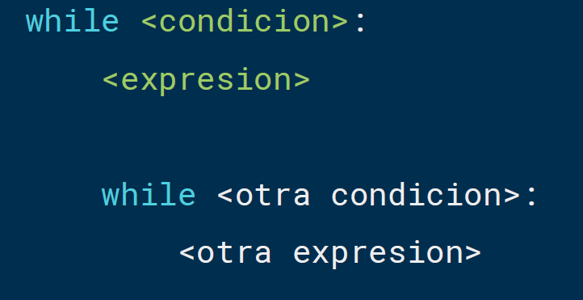

comando para ejecutar

```sh
python3 iteraciones.py
```

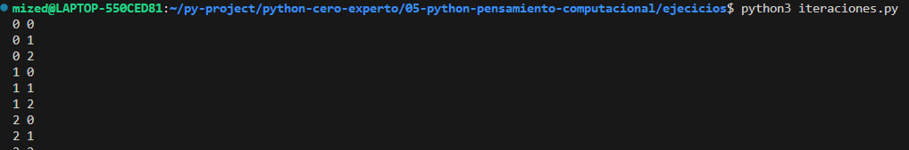

### Bucles for

Los bucles, en diversos lenguajes de programación pueden ser definidos o indefinidos. Los bucles definidos preestablecen las condiciones de la iteración por adelantado. Por su parte, los bucles indefinidos establecen la condición en la que una iteración terminará. En este último tipo de bucles existe el riesgo de que el bucle se vuelva infinito (cuando la condición de suspensión nunca se cumple).

Los bucles definidos se implementan en Python a través del keyword for. Por su parte, los bucles indefinidos se implementan con el keyword while.

Sin embargo, esta no es la única forma de implementar bucles definidos. Por ejemplo, Javascript puede implementar un bucle definido mediante el siguiente constructo:

```py
for (i = 0; i <= 10; i++) {
  <expresión>
}
```

El bucle se puede leer de la siguiente manera:

* Inicializa el bucle en 0
* Continua el bucle mientras i sea menor o igual que 10
* Incrementa i en uno al final de cada iteración

Es importante señalar que la expresión i++ es equivalente a lo que en Python escribiríamos como i += 1.

Una segunda forma de crear un bucle definido es iterando en una colección de objetos. Esta es la forma que Python utiliza:

```py
for <variable> in <iterable>:
    <expresión>
```

**El bucle for en Python**

En la definición anterior debemos entender <iterable> como una colección de objetos; y la <variable> como el elemento específico que se está exponiendo mediante el bucle en cada iteración.

```py
>>> frutas = ['manzana', 'pera', 'mango']
>>> for fruta in frutas:
        print(fruta)

manzana
pera
mango
```

**Iterables**

En Python, un iterable es un objeto que se puede utilizar en un bucle definido. Si un objeto es iterable significa que se puede pasar como argumento a la función iter. El iterable que se pasa como parámetro a la función iter
regresa un iterator.

```py
>>> iter('cadena') # cadena
>>> iter(['a', 'b', 'c']) # lista
>>> iter(('a', 'b', 'c')) # tupla
>>> iter({'a', 'b', 'c'}) # conjunto
>>> iter({'a': 1, 'b': 2, 'c': 3}) # diccionario
```

Todas las llamadas anteriores regresan un objeto de tipo iterator.

¿Qué pasa si le pasamos a la función iter un objeto que no es iterable? Obtendremos un TypeError que señala que el objeto no es un iterable. Esto es un ejemplo de programación defensiva en el que Python verifica el tipo del
objeto antes de proceder al cómputo. ¡Intentalo en tu consola!

Es importante señalar que estos no son los únicos tipos de objetos que pueden ser iterable. Existen gran cantidad de ejemplos en la librería estándar y, de hecho, casi cualquier objeto se puede convertir en un iterable (pero eso
ya lo veremos cuando hablemos de Python avanzado).

**Iterators**

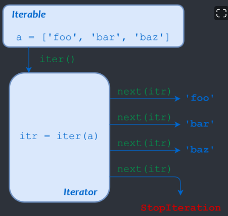

Ahora que ya sabemos cómo obtener un iterator, ¿Qué podemos hacer con él? Un iterator es un objeto que regresa sucesivamente los valores asociados con el iterable.

```py
>>> frutas = ['manzana', 'pera', 'mango']
>>> iterador = iter(frutas)
>>> next(iterador)
manzana
>>> next(iterador)
pera
>>> next(iterador)
mango
```

Como puedes ver, el iterator guarda el estado interno de la iteración, de tal manera que cada llamada sucesiva a next regresa el siguiente elemento. ¿Qué pasa una vez que ya no existan más elementos en el iterable? La llamada
a next arrojará un error de tipo StopIteration.

**¿Cómo implementa Python los bucles definidos?**

Ahora ya conocemos todos los elementos necesarios para entender que es lo que sucede en Python cuando ejecutamos un bucle for. Considera nuevamente el siguiente código:

```py
>>> frutas = ['manzana', 'pera', 'mango']
>>> for fruta in frutas:
        print(fruta)
```

Este bucle se puede describir con los conceptos que explicamos previamente:

* Python llama internamente la función iter para obtener un iterator
* Una vez que tiene un iterator llama repetidamente la función next para tener acceso al siguiente elemento en el bucle.
* Detiene el bucle una vez que se arroja el error StopIteration.

**Bucles for con diccionarios**

Para iterar a lo largo de un diccionario tenemos varias opciones:

* Ejecutar el bucle for directamente en el diccionario, lo cual nos permite iterar a lo largo de las llaves del diccionario.
* Ejecutar el bucle for en la llamada keys del diccionario, lo cual nos permite iterar a lo largo de las llaves del diccionario.
* Ejecutar el bucle for en la llamada values del diccionario, lo cual nos permite iterar a lo largo de los valores del diccionario.
* Ejecutar el bucle for en la llamada items del diccionario, lo cual nos permite iterar en una tupla de las llaves y los valores del diccionario.

```py
estudiantes = {
    'mexico': 10,
    'colombia': 15,
    'puerto_rico': 4,
}

for pais in estudiantes:
    ...

for pais in estudiantes.keys():
    ...

for numero_de_estudiantes in estudiantes.values():
    ...

for pais, numero_de_estudiantes in estudiantes.items():
    ...
```

**Modificación del comportamiento de un bucle for**

Podemos modificar el comportamiento de un bucle for mediante los keywords
break y continue.

break termina el bucle y permite continuar con el resto del flujo de nuestro
programa.

continue termina la iteración en curso y continua con el siguiente ciclo de
iteración.

**Conclusiones**

Como pudimos observar, Python implementa los bucles definidos mediante los bucles for. Esta implementación nos permite iterar a lo largo de cualquier objeto que sea iterable. Para iterar necesitamos un iterador que nos regresará
el siguiente valor en cada iteración. Todo esto, Python lo puede hacer por nosotros con el constructo for ... in ....

### Representación de flotantes

La mayoría del tiempo los números flotantes (tipo float) son una muy buena aproximación de los números que queremos calcular con nuestras computadoras. Sin embargo, “la mayoría del tiempo” no significa todo el tiempo, y cuando no se comportan de esta manera puede tener consecuencias inesperadas.

Por ejemplo, trata de correr el siguiente código:

```py
x = 0.0
for i in range(10):
    x += 0.1

if x == 1.0:
    print(f'x = {x}')
else:
    print(f'x != {x}')
```

Es probable que te hayas sorprendido con el resultado. La mayoría de nosotros esperaríamos que imprimiera 1.0 en vez de 0.999999999999. ¿Qué es lo que pasó?.

Para entender qué es lo que pasó tenemos que entender que es lo que pasa en la computadora cuando realizamos cómputos con números flotantes. Y para eso necesitamos entender números binarios.

Cuando aprendiste a contar, lo que en realidad aprendiste es una técnica combinatoria para manipular los siguientes símbolos que le llamamos números: 0, 1, 2, 3, 4, 5, 6, 7, 8, 9.

La forma en la que funciona esta técnica es asignando el número 10 a la 0 al número de la extrema derecha, 10 a la 1 al siguiente, 10 a la 2 al siguiente y así sucesivamente. De tal manera que el número 525 es simplemente la representación de (5 *100) + (2* 10) + (5 * 1).

Esto nos dice que el número de números que podemos representar depende de cuanto espacio tengamos. Si tenemos un espacio de 3, podemos representar 1,000 números (10 elevado a la 3) o la secuencia del 0 al 999. Si tenemos 4, podemos representar 10,000 (10 elevado a la 4) o la secuencia del 0 al 9,999. De manera general podemos decir que con una secuencia de tamaño n, podemos representar 10 elevado a la n números.

Los números binarios funcionan de la misma manera (de hecho cualquier número en cualquier base, por ejemplo, octales o hexadecimales). La única diferencia es cuántos símbolos tenemos para representar. En binario nada más tenemos 0, 1;
en hexadecimal tenemos 0, 1, 2, 3, 4, 5, 6, 7, 8, 9, a, b, c, d, e, f.

De esta manera podemos decir que el número de la extrema derecha es cantidad_de_simbolos**0, cantidad_de_simbolos**1, cantidad_de_simbolos**2, etc. Por lo que en binario, que nada más tenemos 2 símbolos, decimos 2**0, 2**1, 2**2, etc. Por ejemplo el número binario 101 es la representación de (1 *4) + (0* 2) + (1 * 1), es decir 5.

Esta representación nos permite trabajar con todos los números positivos enteros dentro del computador, pero ¿Qué hacemos con los negativos y los racionales?.

El caso de los números negativos es sencillo: simplemente agregamos un bit adicional que representa el signo y la añadimos en la extrema izquierda. Por lo que el número 0101 sería +5 y el número 1101 sería -5.

El caso de los racionales es más complejo. En la mayoría de los lenguajes de programación modernos los racionales utilizan una implementación llamada punto flotante. ¿Cómo funciona esta representación?.

Antes de pasar a binario, vamos a pretender que estamos trabajando con una computadora basada en decimales. Un número flotante lo representaríamos con un par de enteros: los dígitos significativos y el exponente. Por ejemplo, el número 2.345 se representaría como (2345 * 10**-3) o (2345, -3).

El número de dígitos significativos determinan la precisión con la que podemos representar número. Por ejemplo si nada más tuviéramos dos dígitos significativos el número 2.345 no se podría representar de manera exacta y tendríamos que convertirlo a una aproximación, en este caso 2.3.

Ahora pasemos a la verdadera representación interna de la computadora, que es en binario. ¿Cómo representarías el número 5/8 o 0.625? Lo primero que tenemos que saber es que 5/8 es en realidad el número 5 * 2**-3. Por lo que podríamos decir (101, -11) (recuerda que el número 5 es 101 en binario y el 3 es 11).

Regresemos a nuestro problema inicial: ¿Cómo representaremos 1/10 (que escribimos en Python cómo 0.1)? Lo mejor que podemos hacer con cuatro dígitos significativos es (0011, -101) que es equivalente a 3/32 (0.09375). ¿Qué tal si tuviéramos cinco dígitos significativos? La mejor representación sería (11001, -1000) que es equivalente a 25/256 (0.09765625). ¿Cuántos dígitos significativos necesitamos entonces? Un número infinito. No existe ningún número que cumpla con la siguiente ecuación: sim * 2**-exp.

En la mayoría de las implementaciones de Python tenemos 53 bits de precisión para números flotantes. Así que los dígitos significativos para representar el número 0.1 es igual a:

11001100110011001100110011001100110011001100110011001 que es equivalente al número decimal: 0.1000000000000000055511151231257827021181583404541015625

Muy cercano a 1/10 pero no exactamente 1/10. Ahora ya sabemos la razón de esa respuesta tan extraña. Hay muy pocas situaciones en la que 1.0 es aceptable, pero 0.9999999999999999 no. Pero ¿Cuál es la moraleja de esta historia?

Hasta ahora hemos verificado igualdad con el operador ==. Sin embargo, cuando estamos trabajando con flotantes es mejor asegurarnos que los números sean aproximados en vez de idénticos. Por ejemplo x < 1.0 and x > 0.99999.

### Enumeración exhaustiva

* También llamado “adivina y verifica”.
* Las computadoras actuales son muy muy rápidas.
* Uno de los primeros algoritmos que debes tratar.

### Aproximación de soluciones

Los algoritmos dependen del hadware.

* Similar a enumeración exhaustiva, pero no necesita una respuesta exacta.
* Podemos aproximar soluciones con un margen de error que llamaremos epsilon.

### Búsqueda Binaria

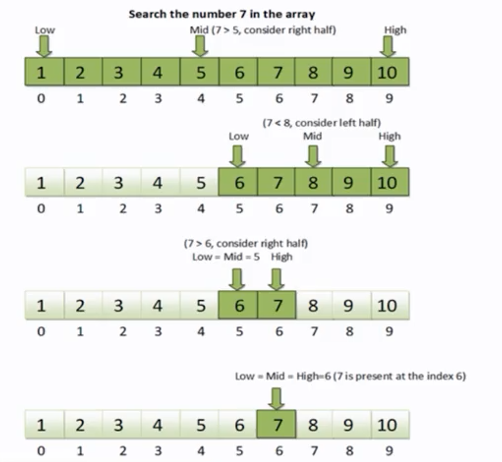

* Cuando la respuesta se encuentra en un conjunto ordenado, podemos utilizar búsqueda binaria
* Es altamente eficiente, pues corta el espacio de búsqueda en dos por cada iteración

### Funciones y abstracción

**Abstracción**

* No nesecita la forma de como funciona, pero como operarla ejemplo una caluladora.

**Decomposición**

* Permite dividir el código en componentes que colaboran con un fin en común.
* Se puede pensar como mini programas dentro de un programa mayor

Definición de funciones

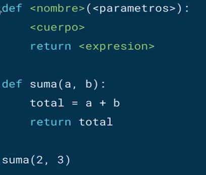

Argumentos de Keyword y valores por defecto

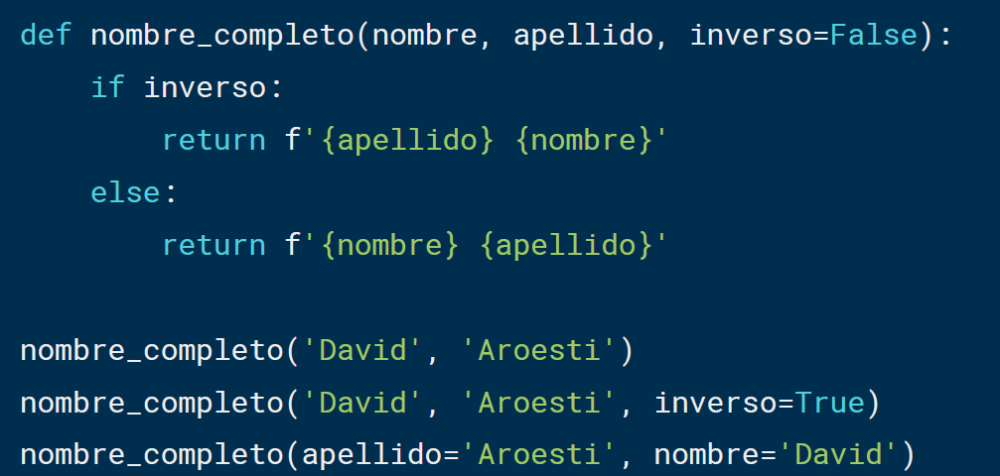

### Scope o Alcance

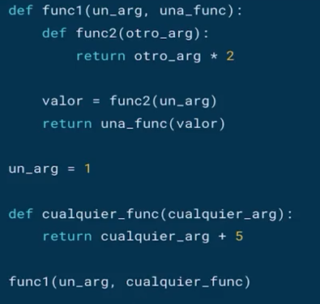

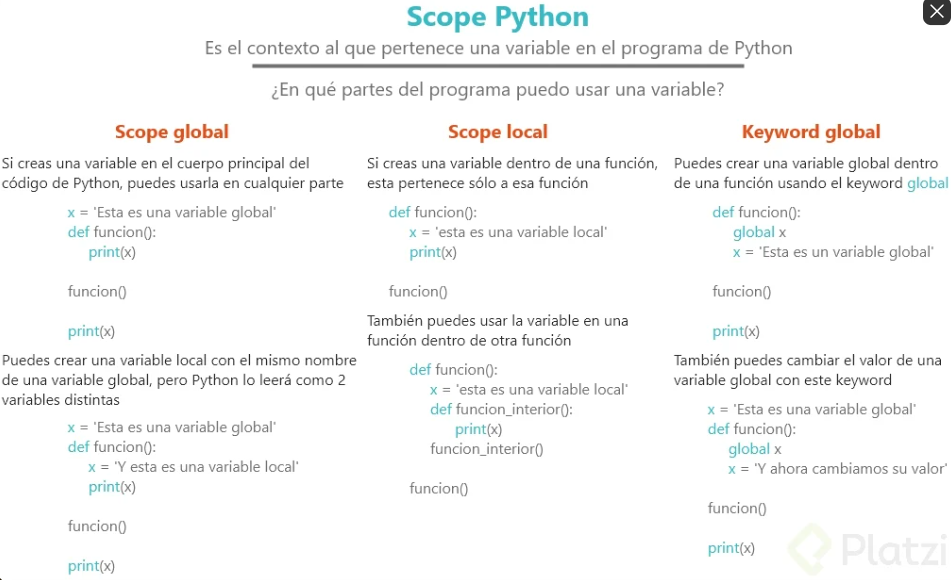