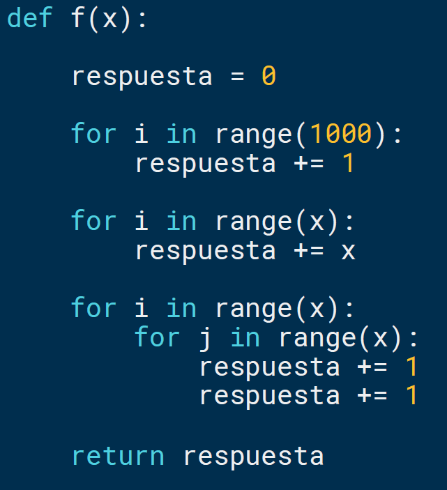
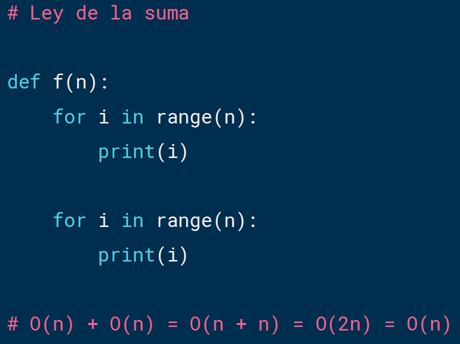
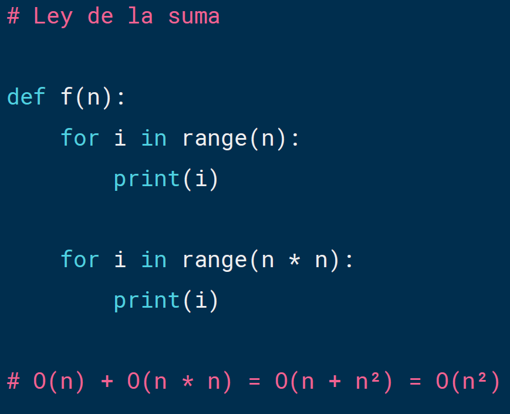
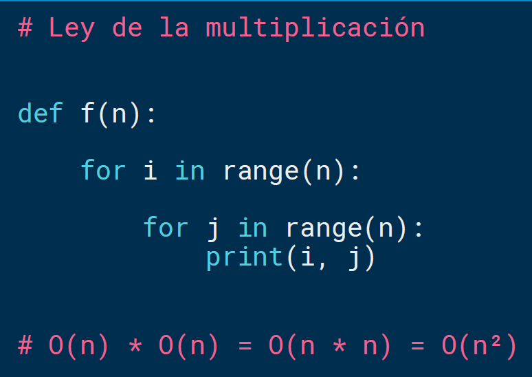
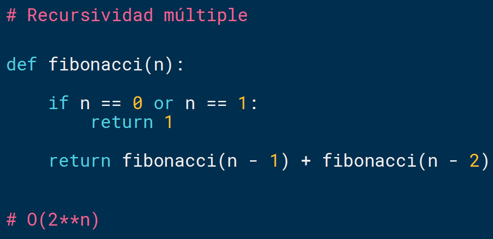
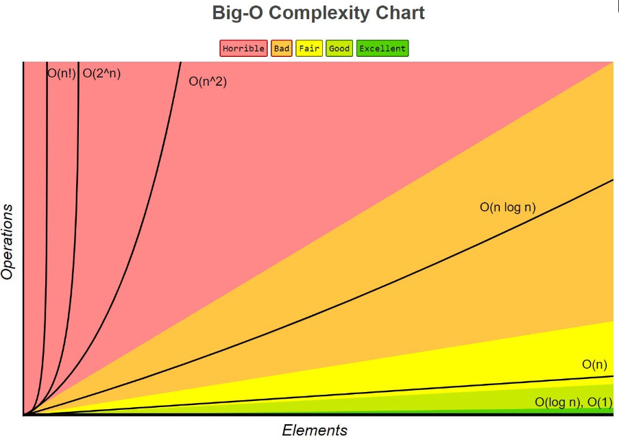
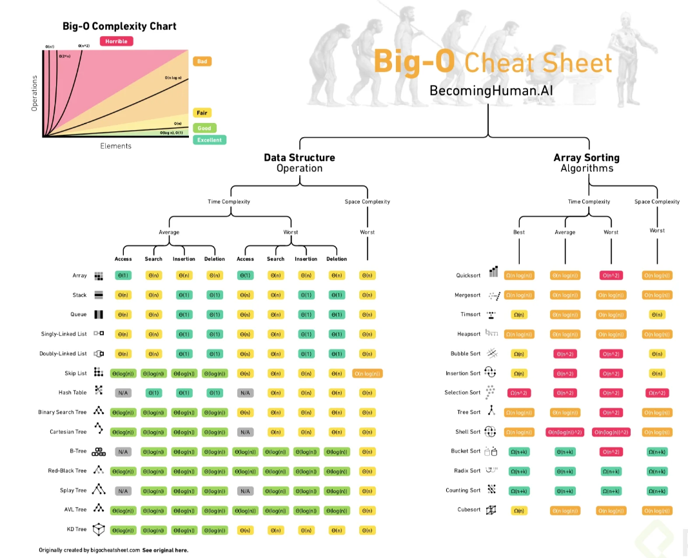
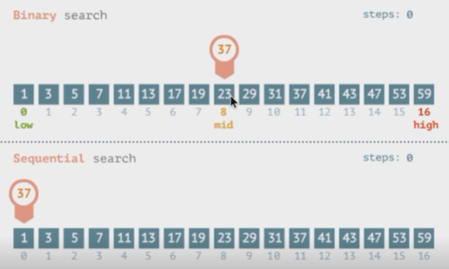

# Indice

## ¿Ya tomaste el Curso de Pensamiento Computacional?

**Objetivos**

* Entender cómo funciona la Programación Orientada a Objetos.
* Entender cómo medir la eficiencia temporal y espacial de nuestros algoritmos.
* Entender cómo y por qué graficar.
* Aprender a resolver problemas de búsqueda, ordenación y optimización.

## Introducción a la complejidad algorítmica

* ¿Por qué comparamos la eficiencia de un algoritmo?
* Complejidad temporal vs complejidad espacial
* Podemos definirla como T(n)

**Aproximaciones**

* Cronometrar el tiempo en el que corre un algoritmo.
* Contar los pasos con una medida abstracta de operación.
* Contar los pasos conforme nos aproximamos al infinito.

A continuación te dejo el código con una corrección en el returnde la función recursiva:

```sh
import time

def factorial(n):
    respuesta = 1

    while n > 1:
        respuesta *= n
        n -= 1

    return respuesta


def factorial_r(n):
    if n == 1:
        return 1

    return n * factorial_r(n - 1)


if __name__ == '__main__':
    n = 200000

    comienzo = time.time()
    factorial(n)
    final = time.time()
    print(final - comienzo)

    comienzo = time.time()
    factorial_r(n)
    final = time.time()
    print(final - comienzo)
```

## Abstracción



## Notación asintótica

**Crecimiento asintótico**

* No importan variaciones pequeñas.
* El enfoque se centra en lo que pasa conforme el tamaño del problema se acerca al infinito.
* Mejor de los casos, promedio, peor de los casos
* Big O
* Nada más importa el término de mayor tamaño









## Clases de complejidad algorítmica

Clases de complejidad algorítmica
Existen distintos tipos de complejidad algorítmica:

**O(1) Constante**: no importa la cantidad de input que reciba, siempre demorara el mismo tiempo.
**O(n) Lineal**: la complejidad crecerá de forma proporcional a medida que crezca el input.
**O(log n) Logarítmica**: nuestra función crecerá de forma logarítmica con respecto al input. Esto significa que en un inicio crecerá rápido, pero luego se estabilizara.
**O(n log n) Log lineal**: crecerá de forma logarítmica pero junto con una constante.
**O(n²) Polinomial**: crecen de forma cuadrática. No son recomendables a menos que el input de datos en pequeño.
**O(2^n) Exponencial**: crecerá de forma exponencial, por lo que la carga es muy alta. Para nada recomendable en ningún caso, solo para análisis conceptual.
**O(n!) Factorial**: crece de forma factorial, por lo que al igual que el exponencial su carga es muy alta, por lo que jamas utilizar algoritmos de este tipo.






## Búsqueda lineal

* Busca en todos los elementos de manera secuencial.
* ¿Cuál es el peor caso?

## Búsqueda binaria

Eficiencia para realizar esta busqueda.

* Divide y conquista.
* El problema se divide en 2 en cada iteración.
* ¿Cuál es el peor caso?



## Ordenamiento de burbuja

El ordenamiento de burbuja es un algoritmo que recorre repetidamente una lista que necesita ordenarse. Compara elementos adyacentes y los intercambia si están en el orden incorrecto. Este procedimiento se repite hasta que no se requieren más intercambios, lo que indica que la lista se encuentra ordenada.
