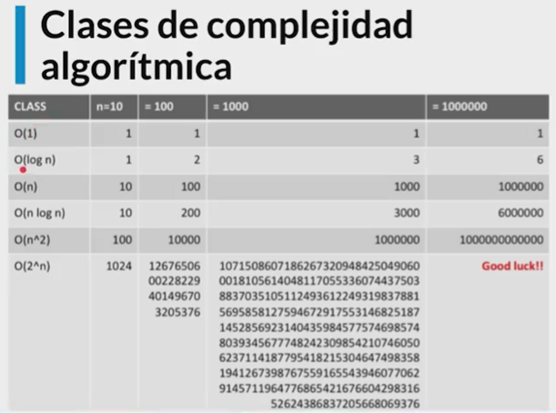

# Indice

## ¿Ya tomaste el Curso de Pensamiento Computacional?

**Objetivos**

* Entender cómo funciona la Programación Orientada a Objetos.
* Entender cómo medir la eficiencia temporal y espacial de nuestros algoritmos.
* Entender cómo y por qué graficar.
* Aprender a resolver problemas de búsqueda, ordenación y optimización.

## Introducción a la complejidad algorítmica

* ¿Por qué comparamos la eficiencia de un algoritmo?
* Complejidad temporal vs complejidad espacial
* Podemos definirla como T(n)

**Aproximaciones**

* Cronometrar el tiempo en el que corre un algoritmo.
* Contar los pasos con una medida abstracta de operación.
* Contar los pasos conforme nos aproximamos al infinito.

A continuación te dejo el código con una corrección en el returnde la función recursiva:

```sh
import time

def factorial(n):
    respuesta = 1

    while n > 1:
        respuesta *= n
        n -= 1

    return respuesta


def factorial_r(n):
    if n == 1:
        return 1

    return n * factorial_r(n - 1)


if __name__ == '__main__':
    n = 200000

    comienzo = time.time()
    factorial(n)
    final = time.time()
    print(final - comienzo)

    comienzo = time.time()
    factorial_r(n)
    final = time.time()
    print(final - comienzo)
```

## Abstracción


## Notación asintótica

**Crecimiento asintótico**

* No importan variaciones pequeñas.
* El enfoque se centra en lo que pasa conforme el tamaño del problema se acerca al infinito.
* Mejor de los casos, promedio, peor de los casos
* Big O
* Nada más importa el término de mayor tamaño


## Clases de complejidad algorítmica

Clases de complejidad algorítmica
Existen distintos tipos de complejidad algorítmica:

**O(1) Constante**: no importa la cantidad de input que reciba, siempre demorara el mismo tiempo.
**O(n) Lineal**: la complejidad crecerá de forma proporcional a medida que crezca el input.
**O(log n) Logarítmica**: nuestra función crecerá de forma logarítmica con respecto al input. Esto significa que en un inicio crecerá rápido, pero luego se estabilizara.
**O(n log n) Log lineal**: crecerá de forma logarítmica pero junto con una constante.
**O(n²) Polinomial**: crecen de forma cuadrática. No son recomendables a menos que el input de datos en pequeño.
**O(2^n) Exponencial**: crecerá de forma exponencial, por lo que la carga es muy alta. Para nada recomendable en ningún caso, solo para análisis conceptual.
**O(n!) Factorial**: crece de forma factorial, por lo que al igual que el exponencial su carga es muy alta, por lo que jamas utilizar algoritmos de este tipo.





## Búsqueda lineal

* Busca en todos los elementos de manera secuencial.
* ¿Cuál es el peor caso?

## Búsqueda binaria

Eficiencia para realizar esta busqueda.

* Divide y conquista.
* El problema se divide en 2 en cada iteración.
* ¿Cuál es el peor caso?


## Ordenamiento de burbuja

El ordenamiento de burbuja es un algoritmo que recorre repetidamente una lista que necesita ordenarse. Compara elementos adyacentes y los intercambia si están en el orden incorrecto. Este procedimiento se repite hasta que no se requieren más intercambios, lo que indica que la lista se encuentra ordenada.

## Ordenamiento por inserción

Mejor ordenamiento

El ordenamiento por inserción es uno de los algoritmos más comunes que estudian
los Científicos del Cómputo. Es intuitivo y fácil de implementar, pero es muy
ineficiente para listas de gran tamaño.

Una de las características del ordenamiento por inserción es que ordena en “su
lugar.” Es decir, no requiere memoria adicional para realizar el ordenamiento
ya que simplemente modifican los valores en memoria.

La definición es simple:

Una lista es dividida entre una sublista ordenada y otra sublista desordenada.
Al principio, la sublista ordenada contiene un solo elemento, por lo que por
definición se encuentra ordenada.

A continuación se evalua el primer elemento dentro la sublista desordenada para
que podamos insertarlo en el lugar correcto dentro de la lista ordenada.

La inserción se realiza al mover todos los elementos mayores al elemento que
se está evaluando un lugar a la derecha.

Continua el proceso hasta que la sublista desordenada quede vacia y, por lo
tanto, la lista se encontrará ordenada.

Veamos un ejemplo:

Imagina que tienes la siguiente lista de números:

7, 3, 2, 9, 8

Primero añadimos 7 a la sublista ordenada:

7, 3, 2, 9, 8

Ahora vemos el primer elemento de la sublista desordenada y lo guardamos en
una variable para mantener el valor. A esa variable la llamaremos valor_actual.
Verificamos que 3 es menor que 7, por lo que movemos 7 un lugar a la derecha.

7, 7, 2, 9, 8 (valor_actual=3)

3 es menor que 7, por lo que insertamos el valor en la primera posición.

3, 7, 2, 9, 8

Ahora vemos el número 2. 2 es menor que 7 por lo que lo movemos un espacio a la
derecha y hacemos lo mismo con 3.

3, 3, 7, 9, 8 (valor_actual=2)

Ahora insertamos 2 en la primera posición.

2, 3, 7, 9, 8

9 es más grande que el valor más grande de nuestra sublista ordenada por lo que
lo insertamos directamente en su posición.

2, 3, 7, 9, 8

El último valor es 8. 9 es más grande que 8 por lo que lo movemos a la derecha:

2, 3, 7, 9, 9 (valor_actual=8)

8 es más grande que 7, por lo que procedemos a insertar nuestro valor_actual.

2, 3, 7, 8, 9

Ahora la lista se encuentra ordenada y no quedan más elementos en la sublista
desordenada.

Antes de ver la implementación en Python, trata de implementarlo por ti mismo
y compártenos tu algoritmo en la sección de comentarios.

Esta es una forma de implementar el algoritmo anterior:

```py
def ordenamiento_por_insercion(lista):

    for indice in range(1, len(lista)):
        valor_actual = lista[indice]
        posicion_actual = indice

        while posicion_actual > 0 and lista[posicion_actual - 1] > valor_actual:
            lista[posicion_actual] = lista[posicion_actual - 1]
            posicion_actual -= 1

        lista[posicion_actual] = valor_actual
```

## Ordenamiento por mezcla

El ordenamiento por mezcla es un algoritmo de divide y conquista.
Primero divide una lista en partes iguales hasta que quedan sublistas de 1 o 0 elementos.
Luego las recombina en forma ordenada.


## Ambientes virtuales

* Permiten aislar el ambiente para poder instalar diversas versiones de paquetes.
* A partir de python 3 se incluye en la librería estándar en el módulo venv.
* Ningún ingeniero profesional de Python trabaja sin ellos.

**Pip**

* Permite descargar paquetes de terceros para utilizar en nuestro programa.
* Permite compartir nuestros paquetes con terceros.
* Permite especificar la versión del paquete que necesitamos.


```sh
# crear el ambiente virtual
python3 -m venv env
```

```sh
# Activar ambiente virtual
source env/bin/activate
```


```sh
# Instalar libreria o paquete de grafico
pip install bokeh
```


```sh
# Ver lo que se ha instalado
pip freeze
```


```sh
# Salir del ambiente virtual
pip freeze
```


## ¿Por qué graficar?

* Reconocimiento de patrones
* Predicción de una serie
* Simplifica la interpretación y las conclusiones acerca de los datos

```sh
# Ejecutar script
python3 graficado_simple.py
```

<https://docs.bokeh.org/en/latest/index.html>

## Introducción a la optimización

* El concepto de optimización permite resolver mucho problemas de manera computacional.
* Una función objetivo que debemos maximizar o minimizar.
* Una serie de limitantes que debemos respetar.

comparto con ustedes un video de derivando donde explica el problema p vs np: <https://www.youtube.com/watch?v=UR2oDYZ-Sao>
