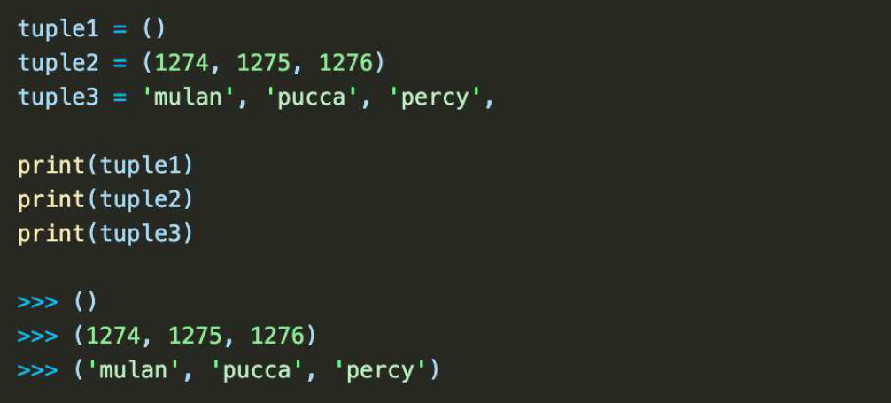
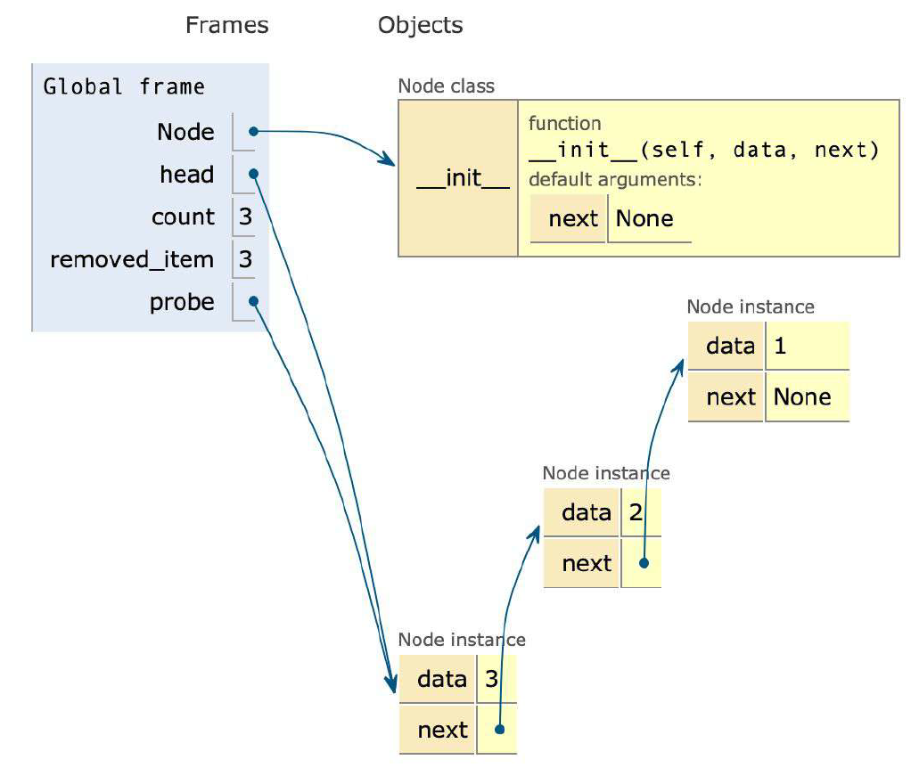

# Indice

Usar **Run and Debug de Vscode** para ver el codigo linea por linea y como cambian las variables.

## Python como base de programación

**De aprendizaje**

* Entender el concepto e importancia de estructuras de datos.
* Comprender el comportamiento, uso e implementación de estructuras de datos lineales con Python.
* Poner en práctica lo aprendido.

**Lenguaje**

* Sintaxis clara y simple
* Semántica segura
* Escalable
* Interactivo
* Propósito general
* Gratis y popular

**Estructuras de datos lineales**

* Arrays
* Nodes
* Linked lists
* Stacks
* Queues

## Elementos de la programación en Python

En esta clase se hizo una puntualización de lo que se debe saber en sí mismo para trabajar en este curso:

Requisitos Mínimos:

* Elementos léxicos de python o Keywords
* Convenciones de estilo PEP8
* Operadores, Manejo de Strings y Literals.
* Entender sobre Listas, Tuplas, Conjuntos, Diccionarios.

Tener claro:

* Declaración de funciones
* Recursividad
* Funciones anidades
* High Order Functions
* Funciones lambda.
* Programación Orientada a Objetos

Nice to Have:

* Manejo de excepciones
* Manipulación de archivos.


## Tipos de colecciones

Grupo de cero o más elementos que pueden tratarse como una unidad conceptual


Tipos de colecciones

Nos referimos a las estructuras de datos. Una colección es un grupo de cero o más elementos que pueden tratarse como una unidad conceptual.

**Tipos de datos.**

* Non-zeo Value
* Cero
* null
* undefined

Estos tipos de dato también pueden formar parte de una colección. Existen colecciones de tipo Dinámicas que son aquelas que pueden variar su tamaño y las Inmutables que no cambian su tamaño.

**Estructuras Lineales**

De forma general encontramos estructuras de datos lineales que están definidas por sus índices. Es decir puedo encotnrarme estrcuturas de datos lineales que sean dinámicas o inmutables, de ello variarán sus propiedades, como poner un elemento al final, (sucesor) o no.

Te encontrarás con Listas, Listas Ordenadas, Cola, Cola de prioridad y más.

* Es decir está ordenadas por posición.
* Solo el primer elementonotiene predecesor

**Ej:**

* Una fila para un concierto
* Una pila de platos por lavar, o una pila de libros por leer.
* Checklist, una lista de mercado, la lista de Schindler

**Estructuras Jerárquicas**

Estructuras basadas en una jerarquia definida. Los árboles pueden tener n números de nieleves hacia abajo o adyacentes. Te encotnrarás con árboles Binarios, Montículos.

* Ordendas como árbol invertido (raices)
* Solo el primer nodo no tiene predecesores, pero si sucesores.
* Es un sistema de padres e Hijos.

**Ej:**

* Libros, Capítulos, Temas.
* Abuelos, Madres, Hijos.

**Estructuras Grafos:**

* Cada dato puede tener varios predecesores y sucesores, se les llama vecinos
* Los elementos se relecionan entre si con n relaciones.

**Ej:**

* Vuelos aéreos, sistemas de recomendación
* La mismísima interntet es un grafo

**Estructuras Desordenadas:**

Estructuras como Bolsa, Bolsa ordenada, Conjuntos, DIccionarios, Diccionario ordenados.

* No tienen orden en particular
* No hay predecesores o sucesores.

**Ej:**

* Una bolsa de gomitas, no sabe de qué color te va a tocar.

**Estructuras Ordenadas:**

Son estructuras que imponen un orden con una regla. Generalmente una regla de orden. item <= item(i+1) Es decir que el tiem que sigue es el primer elemento +1.

**Ej:**

* Los directorios telefónicos, los catálogos,

**Conclusión:**

Suponga que tiene un dataset con muchos datos, una colección de libros, música, fotos, y desea ordenar esta colección, ante esta situación siempre existe el Trade Off entre rapidez/costo/memoria El conocimeinto de las propiedades de las colecciones te facilitará la selección de estructura de datos según sea el caso y velar por un software eficiente.


## Operaciones esenciales en colecciones


## Colecciones incorporadas en Python

### Listas

* Propósito general
* Estructura más utilizada
* Tamaño dinámico
* De tipo secuencial
* Ordenable


### Tuplas/Tuples

* Inmutable (no se pueden añadir o cambiar).
* Útiles para datos constantes.
* Más rápidas que las listas.
* Tipo secuencial.



### Conjuntos /Sets

* Almacenan objetos no-duplicados.
* De acceso rápido.
* Aceptan operaciones lógicas.
* Son desordenados


### Diccionarios/ Dictionaries

* Pares de llave/valor.
* Arrays asociativos (hash maps).
* Son desordenados


## Arrays

### ¿Qué es una estructura de datos?

Representación interna de una colección de información.

Conceptos clave

* Elemento: valor almacenado en las posiciones del array.
* Índice: referencia a la posición del elemento.

Array

1D Array

2D Array

3D Array = mayor complejidad

### Los array son restrictivos

No pueden:

* Agregar posiciones.
* Remover posiciones.
* Modificar su tamaño.
* Su capacidad se define al crearse.

### Modulo python array

* Solo almacena números y caracteres.
* Basado en listas

## Crear un array


## Arrays de dos dimensiones

Otros nombres

* Bi-dimensional array
* Two-dimensional array
* Grid
* Rejilla
* Malla
* Tabla

## Nodos y singly linked list

Las estructuras linked consisten en nodos conectados a otros, los más comunes son sencillos o dobles. No se accede por índice sino por recorrido. Es decir se busca en la lista de nodos hasta encontrar un valor.

**Data**: Será el valor albergado en un nodo.
**Next**: Es la referencia al siguiente nodo en la lista
**Previous**: Será el nodo anterior.
**Head**: Hace referencia al primer nodo en la lista
**Tail**: Hace referencia al último nodo.

**¿Cómo funciona en memoria los Linked Estructures?**

Estas estructuras de datos hablan de nodos/datos repartidos en memoria, diferentes a los arrays que son contiguos. Los nodos se conectan a diferentes espacios en memoria, podemos acceder a los datos saltando en memoria, siendo mucho más ágil. Los nodos nos sirven para crear otras estructuras más complejas, como Stacks, Queues, las llamadas pilas y colas. Es posible optimizar partes del código usando nodos.

**Double Linked Structure.**

Estos hacen que el nodo haga referencia al siguiente nodo y al anterior, es decir nos va a permitir ir en ambas direcciones. También nos permitirá realizar "formas" y contextos circulares.

El ejemplo clave aquí será función de ctrl+z y ctrl+y Estas opciones nos permiten hacer y deshacer un proceso en Windows.

El historial del navegador también es un buen ejemplo al permitirnos navegar entre el pasado y el presente.

Nota: Los linked list tienen una desventaja importante, si la lista crece mucho será más costoso computacionalmente recorrer toda la lista. Es importante saber cuando usarlas y cuando no.

## Crear nodos

Cada nodo almacenará un valor y cada nodo tiene un puntero que llevará a otro nodo con otro valor y así obtener los datos allí almacenados. Es muy útil al tener infromación dispersa en memoria y cuando queremos que sean consultas ágiles, es importante entender que los nodos son la base para implementaciones más elaboradas de estructuras de datos, Stacks, Qeues, Deque, Doubly, Singly List, Circular list, Graphs .

Cada estructura de datos servirá para un propósito dentro de un contexto, por ejemplo los grafos acíclicos, donde se usan para sistemas de recomendaciones al mostrar las relaciones entre objetos o representar los tipos de redes que se forman entre nodos. Para crear un nodo:

**Creamos una clase Node**
Referimos valores mediante argumentos de instancias.
Unimos los nodos iterando entre referencias.
Este script tiene como propósito crear nodos.

**Constructor:**

data= El dato del nodo.
next= está por defecto en None, porque en una serie de nodos el +ultimo te lleva a ninguna parte


## Crear singly linked list

```py
from node import Node
class LinkedList:
 def __init__(self):
  self.head=None

 def insert_at_begining(self, data):
  node=Node(data,self.head)
  self.head=node

 def insert_at_end(self, data):
  #caso de que sea el primero
  if self.head is None:
   self.head=Node(data, None)
   return
  itr =self.head
  while itr.next:
   itr=itr.next

  itr.next=Node(data, None)

 #de una Lista a una LinkedList
 def insert_value_from_list(self, data_list):
  self.head=None
  for data in data_list:
   self.insert_at_end(data)
def print(self):
  if self.head is None:
   print("Linked list is empty")
   return

  itr=self.head
  llstr=''
  
  while itr:
   llstr+=str(itr.data) + '-->'
   itr =itr.next

  print(llstr)
 
if __name__=="__main__":
 ll=LinkedList()
 ll.insert_value_from_list(["banana","mango","fresa"])
 ll.print()
```

## Operaciones en single linked structures

Variable auxiliar probe

* Puntero temporal.
* Recorre la lista consultando datos.

```py
 from node import Node

# * Creación de los nodos enlazados (linked list)
head = None
for count in range(1,6):
    head = Node(count, head)

# * Recorrer e imprimir valores de la lista
probe = head
print("Recorrido de la lista:")
while probe != None:
    print(probe.data)
    probe = probe.next
```

```sh
Recorrido de la lista:
5
4
3
2
1
```

## Operaciones a detalle


Búsqueda


Reemplazo


Insertar al inicio


Insertar al final


Eliminar primer nodo


Eliminar último nodo




Insertar en cualquier posición


Eliminar en cualquier posición


## Circular linked list

**listas enlazadas circulares**

Las listas enlazadas circulares son un tipo de lista enlazada en la que el último nodo apunta hacia el headde la lista en lugar de apuntar None. Esto es lo que los hace circulares.

Las listas enlazadas circulares tienen bastantes casos de uso interesantes:

* Dar la vuelta al turno de cada jugador en un juego multijugador
* Gestionar el ciclo de vida de la aplicación de un sistema operativo determinado
* Implementando un montón de Fibonacci

Así es como se ve una lista enlazada circular:

Una de las ventajas de las listas enlazadas circulares es que puede recorrer toda la lista comenzando en cualquier nodo. Dado que el último nodo apunta al headde la lista, debe asegurarse de dejar de atravesar cuando llegue al punto de partida. De lo contrario, terminarás en un bucle infinito.

En términos de implementación, las listas enlazadas circulares son muy similares a la lista enlazada individualmente. La única diferencia es que puede definir el punto de partida cuando recorre la lista:

```py
class CircularLinkedList:
    def **init**(self):
        self.head = None

    def traverse(self, starting_point=None):
        if starting_point is None:
            starting_point = self.head
        node = starting_point
        while node is not None and (node.next != starting_point):
            yield node
            node = node.next
        yield node

    def print_list(self, starting_point=None):
        nodes = []
        for node in self.traverse(starting_point):
            nodes.append(str(node))
        print(" -> ".join(nodes))
```

Atravesar la lista ahora recibe un argumento adicional starting_point, que se usa para definir el inicio y (debido a que la lista es circular) el final del proceso de iteración. Aparte de eso, gran parte del código es el mismo que teníamos en nuestra LinkedListclase.


## Double linked list


Cómo utilizar listas doblemente enlazadas

Las listas doblemente enlazadas se diferencian de las listas enlazadas individualmente en que tienen dos referencias:

* El previous campo hace referencia al nodo anterior.
* El next campo hace referencia al siguiente nodo.

El resultado final se ve así:


```py
class Node:
    def __init__(self, data):
        self.data = data
        self.next = None
        self.previous = None
```

Este tipo de implementación le permitiría atravesar una lista en ambas direcciones en lugar de solo atravesar usando next. Puede utilizar next para avanzar y previous retroceder.

En términos de estructura, así es como se vería una lista doblemente enlazada:


## ¿Qué son stacks?

* Colección lineal
* Basados en arrays
  * linked lists
* LIFO (last-in first-out)
* Añadir: push
* Remover: pop
* Top
* Bottom


**Aplicaciones**

* Invertir el orden de una lista.
* Implementar “undo”.
* Mantener historiales.
* Backtracking.

**Stack vs. list**

* Similares, no iguales.
* List: append, pop.
* Es afectada por sus otros métodos.

**Métodos de stacks**


## Crear un stack

¿Qué hicimos?


## ¿Qué son las queues?

Conceptos importantes

* FIFO: First-In, First-Out.
* Rear: último elemento.
* Front: primer elemento.
* Priority queues: se basa en FIFO con elementos de mayor/menor prioridad.

**Operaciones fundamentales**

* pop(): remover front.
* add(): añadir a rear.


**Métodos de queues**


## Queue basada en listas

¿Qué hicimos?


## Queue basada en dos stacks


Qué hicimos


## Queue basada en nodos

¿Por qué y cómo?

* Agregar y eliminar elementos son O(1).
* Usando doubly linked list.

Qué hicimos


