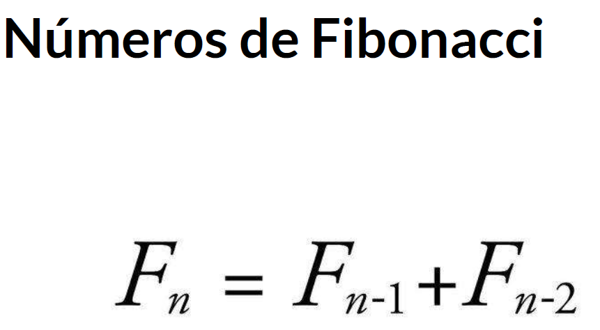
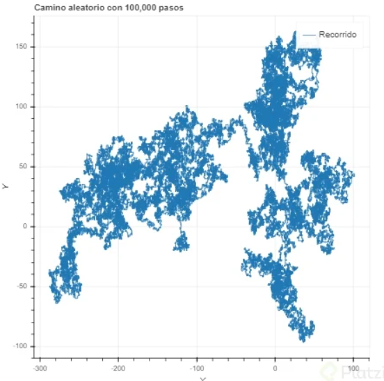
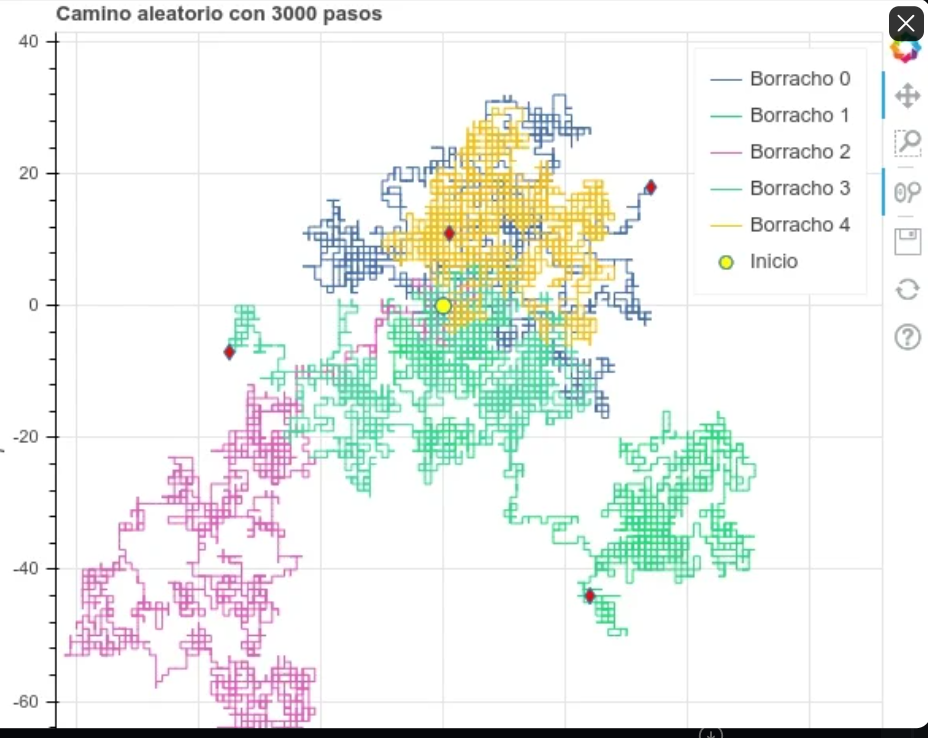
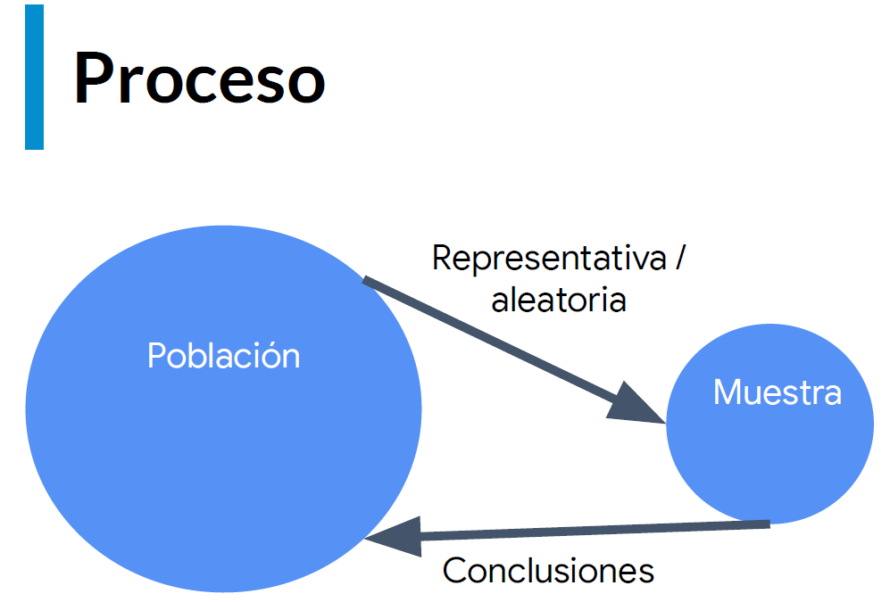
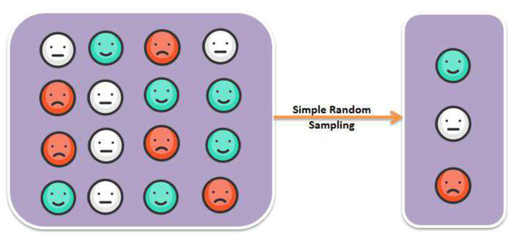
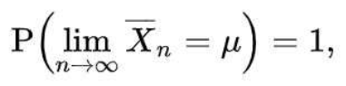

# Indice

## Curso de Estadística Computacional con Python

### Objetivos del Curso

Objetivos

* Aprender cuándo utilizar Programación Dinámica y sus beneficios
* Entender la diferencia entre programas deterministas y estocásticos
* Aprender a utilizar Programación Estocástica
* Aprender a crear simulaciones computacionales válidas

### Introducción a la Programación Dinámica

En la década de los 50s Richard Bellman necesitaba financiamiento del gobierno para poder continuar con sus investigaciones, por lo que necesitaba un nombre rimbombante para que no fueran capaz de rechazar su solicitud, por lo que eligió programación dinámica. Las propias palabras de Bellman fueron:

"[El nombre] Programación Dinámica se escogió para esconder a patrocinadores gubernamentales el hecho que en realidad estaba haciendo Matemáticas. La frase Programación Dinámica es algo que ningún congresista puede oponerse." - Richard Bellman.

Ya sabiendo que Programación Dinámica no esta relacionado con su nombre, lo cierto es que si es una de las técnicas mas poderosas para poder optimizar cierto tipos de problemas.

Los problemas que puede optimizar son aquellos que tienen una subestructura óptima, esto significa que una solución óptima global se puede encontrar al combinar soluciones óptimas de subproblemas locales.

También nos podemos encontrar con los problemas empalmados, los cuales implican resolver el mismo problema en varias ocasiones para dar con una solución óptima.

Una técnica para obtener una alta velocidad en nuestro programa es la Memorización, el cual consiste en guardar cómputos previos y evitar realizarlos nuevamente. Normalmente se utiliza un diccionario, donde las consultas se pueden hacer en O(1), y para ello hacemos un cambio de tiempo por espacio.

**Programación Dinámica**

* Subestructura Óptima. Una solución global óptima se puede encontrar al combinar soluciones óptimas de subproblemas locales.
* Problemas empalmados. Una solución óptima que involucra resolver el mismo problema en varias ocasiones.

**Memoization**

* La Memorización es una técnica para guardar cómputos previos y evitar realizarlos nuevamente.
* Normalmente se utiliza un diccionario, donde las consultas se pueden hacer en O(1).
* Intercambia tiempo por espacio.

### Optimización de Fibonacci

### ¿Qué son los caminos aleatorios?

* Es un tipo de simulación que elige aleatoriamente una decisión dentro de un conjunto de decisiones válidas
* Se utiliza en muchos campos del conocimiento cuando los sistemas no son deterministas e incluyen elementos de aleatoriedad

### Entendiendo la aleatoriedad con Python

Tu propuesta es bastante interesante me recordo a un algoritmo llamado "conway's game of life" es un algoritmo aleatorio que por asi decirlo una celda, o particula como desees verlo depende de las demas que le rodeany de eso dependera si vive o muere la actual casilla, es bastante extenso pero pudiera interesarte. Creo es muy a fin a tu propuesta.

El Juego de la Vida - DotCSV <https://www.youtube.com/watch?v=omMcrvVGTMs>

### Camino de Borrachos

<https://github.com/karlbehrensg/programacion-dinamica-y-estocastica>

Este es un ejercicio donde empezando desde un punto 0 aleatoriamente podemos decidir que dirección tomar, dependiendo de las opciones establecidas.

### Visualización de Caminos Aleatorios

### Introducción a la Programación Estocástica

* Un programa es determinístico si cuando se corre con el mismo input produce el mismo output
* Los programas determinísticos son muy importantes, pero existen problemas que no pueden resolverse de esa manera
* La programación estocástica permite introducir aleatoriedad a nuestros programas para crear simulaciones que permiten resolver otro tipo de problemas
* Los programas estocásticos se aprovechan de que las distribuciones probabilísticas de un problema se conocen o pueden ser estimadas

### Cálculo de Probabilidades

* La probabilidad es una medida de la certidumbre asociada a un evento o suceso futuro y suele expresarse como un número entre 0 y 1
* Una probabilidad de 0 significa que un suceso jamás sucederá
* Una probabilidad de 1 significa que un suceso está garantizado de suceder en el futuro
* Al hablar de probabilidad preguntamos qué fracción de todos los posibles eventos tiene la propiedad que buscamos
* Por eso es importante poder calcular todas las posibilidades de un evento para entender su probabilidad
* La probabilidad de que un evento suceda y de que no suceda es siempre 1

* P(A) + P(~A) = 1
  * Ley del complemento

* P(A y B) = P(A) * P(B)
  * Ley multiplicativa

* P(A o B) = P(A) + P(B) (mutuamente exclusivos)

* P(A o B) = P(A) + P(B) - P(A y B) (no exclusivos)
  * Ley aditiva

### Inferencia Estadística

El principio guía de la Inferencia Estadística es que una muestra aleatoria tiende a exhibir las mismas propiedades que la población de la cual fue extraída.

* Con las simulaciones podemos calcular las probabilidades de eventos complejos sabiendo las probabilidades de eventos simples
* ¿Qué pasa cuando no sabemos las probabilidades de los eventos simples?
* Las técnicas de la Inferencia Estadística nos permiten inferir/concluir las propiedades de una población a partir de una muestra aleatoria.

Ley de los grandes números

* En pruebas independientes repetidas con la misma probabilidad p de un resultado, la fracción de desviaciones de p converge a cero conforme las cantidad de pruebas se acerca al infinito.

**Falacia del apostador**

* La falacia del apostador señala que después de un evento extremo, ocurrirán eventos menos extremos para nivelar la media
* La regresión a la media señala que después de un evento aleatorio extremo, el siguiente evento probablemente será menos extremo.
