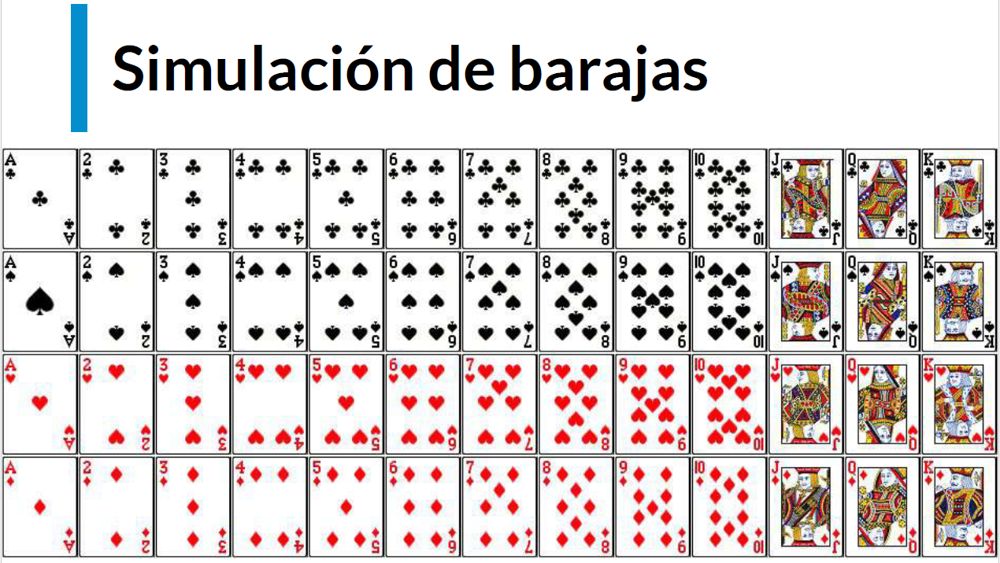

# Indice

## Curso de Estadística Computacional con Python

### Objetivos del Curso

Objetivos

* Aprender cuándo utilizar Programación Dinámica y sus beneficios
* Entender la diferencia entre programas deterministas y estocásticos
* Aprender a utilizar Programación Estocástica
* Aprender a crear simulaciones computacionales válidas

### Introducción a la Programación Dinámica

En la década de los 50s Richard Bellman necesitaba financiamiento del gobierno para poder continuar con sus investigaciones, por lo que necesitaba un nombre rimbombante para que no fueran capaz de rechazar su solicitud, por lo que eligió programación dinámica. Las propias palabras de Bellman fueron:

"[El nombre] Programación Dinámica se escogió para esconder a patrocinadores gubernamentales el hecho que en realidad estaba haciendo Matemáticas. La frase Programación Dinámica es algo que ningún congresista puede oponerse." - Richard Bellman.

Ya sabiendo que Programación Dinámica no esta relacionado con su nombre, lo cierto es que si es una de las técnicas mas poderosas para poder optimizar cierto tipos de problemas.

Los problemas que puede optimizar son aquellos que tienen una subestructura óptima, esto significa que una solución óptima global se puede encontrar al combinar soluciones óptimas de subproblemas locales.

También nos podemos encontrar con los problemas empalmados, los cuales implican resolver el mismo problema en varias ocasiones para dar con una solución óptima.

Una técnica para obtener una alta velocidad en nuestro programa es la Memorización, el cual consiste en guardar cómputos previos y evitar realizarlos nuevamente. Normalmente se utiliza un diccionario, donde las consultas se pueden hacer en O(1), y para ello hacemos un cambio de tiempo por espacio.

**Programación Dinámica**

* Subestructura Óptima. Una solución global óptima se puede encontrar al combinar soluciones óptimas de subproblemas locales.
* Problemas empalmados. Una solución óptima que involucra resolver el mismo problema en varias ocasiones.

**Memoization**

* La Memorización es una técnica para guardar cómputos previos y evitar realizarlos nuevamente.
* Normalmente se utiliza un diccionario, donde las consultas se pueden hacer en O(1).
* Intercambia tiempo por espacio.

### Optimización de Fibonacci

### ¿Qué son los caminos aleatorios?

* Es un tipo de simulación que elige aleatoriamente una decisión dentro de un conjunto de decisiones válidas
* Se utiliza en muchos campos del conocimiento cuando los sistemas no son deterministas e incluyen elementos de aleatoriedad

### Entendiendo la aleatoriedad con Python

Tu propuesta es bastante interesante me recordo a un algoritmo llamado "conway's game of life" es un algoritmo aleatorio que por asi decirlo una celda, o particula como desees verlo depende de las demas que le rodeany de eso dependera si vive o muere la actual casilla, es bastante extenso pero pudiera interesarte. Creo es muy a fin a tu propuesta.

El Juego de la Vida - DotCSV <https://www.youtube.com/watch?v=omMcrvVGTMs>

### Camino de Borrachos

<https://github.com/karlbehrensg/programacion-dinamica-y-estocastica>

Este es un ejercicio donde empezando desde un punto 0 aleatoriamente podemos decidir que dirección tomar, dependiendo de las opciones establecidas.

### Visualización de Caminos Aleatorios

### Introducción a la Programación Estocástica

* Un programa es determinístico si cuando se corre con el mismo input produce el mismo output
* Los programas determinísticos son muy importantes, pero existen problemas que no pueden resolverse de esa manera
* La programación estocástica permite introducir aleatoriedad a nuestros programas para crear simulaciones que permiten resolver otro tipo de problemas
* Los programas estocásticos se aprovechan de que las distribuciones probabilísticas de un problema se conocen o pueden ser estimadas

### Cálculo de Probabilidades

* La probabilidad es una medida de la certidumbre asociada a un evento o suceso futuro y suele expresarse como un número entre 0 y 1
* Una probabilidad de 0 significa que un suceso jamás sucederá
* Una probabilidad de 1 significa que un suceso está garantizado de suceder en el futuro
* Al hablar de probabilidad preguntamos qué fracción de todos los posibles eventos tiene la propiedad que buscamos
* Por eso es importante poder calcular todas las posibilidades de un evento para entender su probabilidad
* La probabilidad de que un evento suceda y de que no suceda es siempre 1

* P(A) + P(~A) = 1
  * Ley del complemento

* P(A y B) = P(A) * P(B)
  * Ley multiplicativa

* P(A o B) = P(A) + P(B) (mutuamente exclusivos)

* P(A o B) = P(A) + P(B) - P(A y B) (no exclusivos)
  * Ley aditiva

### Inferencia Estadística

El principio guía de la Inferencia Estadística es que una muestra aleatoria tiende a exhibir las mismas propiedades que la población de la cual fue extraída.

* Con las simulaciones podemos calcular las probabilidades de eventos complejos sabiendo las probabilidades de eventos simples
* ¿Qué pasa cuando no sabemos las probabilidades de los eventos simples?
* Las técnicas de la Inferencia Estadística nos permiten inferir/concluir las propiedades de una población a partir de una muestra aleatoria.

Ley de los grandes números

* En pruebas independientes repetidas con la misma probabilidad p de un resultado, la fracción de desviaciones de p converge a cero conforme las cantidad de pruebas se acerca al infinito.

**Falacia del apostador**

* La falacia del apostador señala que después de un evento extremo, ocurrirán eventos menos extremos para nivelar la media
* La regresión a la media señala que después de un evento aleatorio extremo, el siguiente evento probablemente será menos extremo.

### Media

* Es una medida de tendencia central
* Comúnmente es conocida como el promedio
* La media de una población se denota con el símbolo μ. La media de una muestra se denota con x̅

### Varianza y Desviación Estándar

**Varianza**

* La varianza mide qué tan propagados se encuentran un conjunto de valores aleatorios de su media.
* Mientras que la media nos da una idea de dónde se encuentran los valores, la varianza nos dice que tan dispersos se encuentran.
* La varianza siempre debe entenderse con respecto a la media.

**Desviación estándar**

* La desviación estándar es la raíz cuadrada de la varianza.
* Nos permite entender, también, la propagación y se debe entender siempre relacionado a la media.
* La ventaja sobre la varianza es que la desviación estándar está en las mismas unidades que la media.

### Distribución Normal

* Es una de las distribuciones más recurrentes en cualquier ámbito
* Se define completamente por su media y su desviación estándar
* Permite calcular intervalos de confianza con la regla empírica

**Regla empírica**

* También conocida como la regla 68-95-99.7
* Señala cuál es la dispersión de los datos en una distribución normal a uno, dos y tres sigmas
* Permite calcular probabilidades con la densidad de la distribución normal

### Simulaciones de Montecarlo

* Permite crear simulaciones para predecir el resultado de un problema
* Permite convertir problemas determinísticos en problemas estocásticos
* Es utilizado en una gran diversidad de áreas, desde la ingeniería hasta la biología y el derecho.

### Simulación de Barajas

¡Hola! ¿Cómo van con el reto? Noten que cuando digo “barajas” me refiero a los “naipes/cartas” individuales. Puede darse el caso de que en algunos países la palabra “baraja” sea sinónimo de “mazo”, pero en esta clase no es así, siempre me estoy refiriendo a los elementos de forma individual.

### Cálculo de PI

### Implementación del Cálculo de PI

### Muestreo

* Hay ocasiones en la que no tenemos acceso a toda la población que queremos explorar
* Uno de los grandes descubrimientos de la estadística es que las muestras aleatorias tienden a mostrar las mismas propiedades de la población objetivo
* El tipo de muestreo que hemos hecho hasta ahora es muestreo probabilístico
* En un muestreo aleatorio cualquier miembro de la población tiene la misma probabilidad de ser escogido
* En un muestreo estratificado tomamos en consideración las características de la población para partirla en subgrupos y luego tomamos muestras de cada subgrupo.
  * Incrementa la probabilidad de que el muestreo sea representativo de la población

El muestreo es muy importante cuando no tenemos acceso a toda la población que queremos explorar. Uno de los grandes descubrimientos de la estadística es que las muestras aleatorias tienden a mostrar las mismas propiedades de la población objetivo. Hasta este punto todos los muestreos que hemos hecho son de tipo probabilísticos.

En un muestreo aleatorio cualquier miembro de la población tiene la misma probabilidad de ser escogido.

En un muestreo estratificado tomamos en consideración las características de la población para partirla en subgrupos y luego tomamos muestras de cada subgrupo, esto incrementa la probabilidad de que el muestreo sea representativo de la población.

### Teorema del Límite Central

* Es uno de los teoremas más importantes de la estadística
* Establece que muestras aleatorias de cualquier distribución van a tener una distribución normal
* Permite entender cualquier distribución como la distribución normal de sus medias y eso nos permite aplicar todo lo que sabemos de distribuciones normales
* Mientras más muestras obtengamos, mayor será la similitud con la distribución normal
* Mientras la muestra sea de mayor tamaño, la desviación estándar será menor

<http://195.134.76.37/applets/AppletCentralLimit/Appl_CentralLimit2.html>

### ¿Cómo trabajar con datos experimentales?

* Es la aplicación del método científico
* Es necesario comenzar con una teoría o hipótesis sobre el resultado al que se quiere llegar
* Basado en la hipótesis se debe crear un experimento para validar o falsear la hipótesis
* Se valida o falsea una hipótesis midiendo la diferencia entre las mediciones experimentales y aquellas mediciones predichas por la hipótesis

En la exploración de la ciencia y sus métodos, nos encontramos con la necesidad de trabajar con datos no solo teóricos o simulados, sino con aquellos que se obtienen de la experimentación real. Comprender cómo se aplican los métodos computacionales a los datos experimentales es esencial. Esta comprensión y aplicación se basa en el método científico, una piedra angular de la investigación que utiliza teoría e hipótesis como guías iniciales para el diseño de experimentos objetivos y la posterior verificación o refutación de dichas hipótesis. Veremos cómo teorías ampliamente reconocidas han sido contrastadas con la realidad experimental y discutiremos la relevancia de aplicar análisis estadísticos, como las regresiones lineales, para interpretar los resultados de estos experimentos. Te animo a unirte a este continuo aprendizaje y a aportar ejemplos interesantes en los que podamos indagar juntos.

**El método científico y la hipótesis**
¿Cómo se vinculan la teoría y la experimentación en el método científico? El punto de partida es siempre una hipótesis o teoría, posibilitando la creación de experimentos diseñados objetivamente para su comprobación. En este proceso, es fundamental abordar la experimentación sin prejuicios, buscando la verdad de la hipótesis sin intentar forzar los resultados a favor de nuestras creencias iniciales.

**Diseño y ejecución de experimentos**
¿Cuál es la importancia del diseño y ejecución de experimentos? Una vez formulada la hipótesis, se procede a diseñar un experimento que permita confirmarla o refutarla. La ejecución de dicho experimento proporciona datos que, al compararlos con las predicciones teóricas, nos indican si la teoría se sostiene ante la evidencia empírica o si, por el contrario, debe ser cuestionada o incluso descartada.

**Comparación entre teoría y datos experimentales**
¿Qué sucede cuando se comparan los datos experimentales con las teorías? A lo largo de la historia, muchas teorías han sido confirmadas a través de experimentos, como es el caso de la mecánica cuántica y la teoría general de la relatividad. Sin embargo, el hecho de que estas teorías sean incompatibles entre sí, plantea desafíos significativos e invita a profundizar en el conocimiento y la investigación científica.

**Leyes de Hooke y de Joule, y verificación experimental**
¿Cómo se verifica experimentalmente la ley de Hooke y la ley de Joule? Tomemos como ejemplo la ley de Hooke y la ley de plasticidad de Joule. Estas nos permiten saber la fuerza necesaria para estirar un resorte y la fuerza que este ejercerá para volver a su forma original. Para validar estas leyes se realizan experimentos objetivos, estirando un resorte con diferentes pesos y observando su comportamiento lineal.

**Uso de regresiones lineales para validar teorías**
¿Cómo pueden las regresiones lineales ayudarnos a validar teorías científicas? En la próxima clase, exploraremos cómo las regresiones lineales se utilizan para determinar si los datos experimentales se alinean con una teoría. Además, veremos cómo esta técnica estadística también es útil para desarrollar descripciones matemáticas cuando no existe una teoría previa.

Recuerda que el camino del conocimiento está lleno de descubrimientos fascinantes, y tú también puedes contribuir con ejemplos de experimentos que consideres relevantes. No dudes en compartir tus ideas o propuestas que podamos revisar juntos para seguir aprendiendo sobre la maravillosa interacción entre la teoría y la experimentación. ¡Te espero en la próxima clase para continuar este viaje de descubrimiento científico!

### Regresión Lineal

* Permite aproximar una función a un conjunto de datos obtenidos de manera experimental
* No necesariamente permite aproximar funciones lineales, sino que sus variantes permiten aproximar cualquier función polinómica

<https://colab.research.google.com/drive/1c0Lx0xQyxuoZsnVKZzMFcANykA5VWN5F#scrollTo=M-ydNFdSi8PN>

### Conclusiones

* La programación dinámica permite optimizar problemas que tienen subestructura óptima y subproblemas empalmados
* Las computadoras pueden resolver problemas determinísticos y estocásticos
* Podemos generar simulaciones computacionalespara responder preguntas del mundo real
* La inferencia estadística nos permite tener confianza de que nuestras simulaciones arrojan resultados válidos
