# Indice

## Curso de Introducción al Pensamiento Probabilístico - 09-python-intro-pensamiento-probabilistico

La programación probabilística es una herramienta utilizada para crear modelos estadísticos, y realizar inferencias sobre dichos modelos. Aprender las bases te permitirá desarrollar habilidades para dominar lenguajes y librerías especializadas en ejecutar cómputos, como Pyro de Uber, un lenguaje de programación para hacer Inteligencia Artificial.

### Introducción a la programación probabilística

* La programación probabilística utiliza probabilidades y modelos probabilísticos para ejecutar cómputos.
* Se utiliza en una gran cantidad de campos: investigación científica, inteligencia artificial, medicina, etc.
* Existen lenguajes y librerías especializadas para ejecutar este tipo de cómputo, como Pyro de Uber.

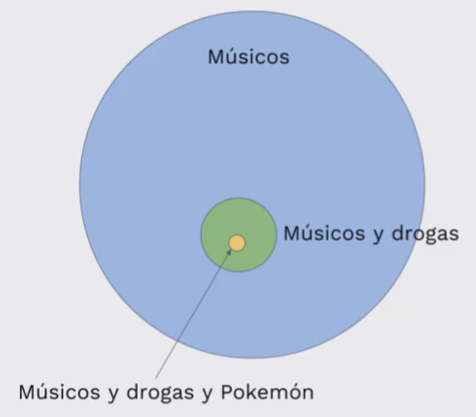

### Probabilidad condicional

La probabilidad condicional es la probabilidad de que ocurra un evento A, sabiendo que también sucede otro evento B. La probabilidad condicional se escribe P(A|B), y se lee «la probabilidad de A dado B».

No tiene por qué haber una relación causal o temporal entre A y B. A puede preceder en el tiempo a B, sucederlo o pueden ocurrir simultáneamente. A puede causar B, viceversa o pueden no tener relación causal. Las relaciones causales o temporales son nociones que no pertenecen al ámbito de la probabilidad. Pueden desempeñar un papel o no, dependiendo de la interpretación que se le dé a los eventos.

La notación para escribir,

«la probabilidad de A y B suceden»: 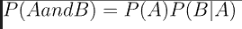

«la probabilidad de B»: 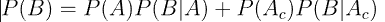

Un ejemplo de esto puede ser la probabilidad que una persona tenga cáncer, luego de realizar pruebas.

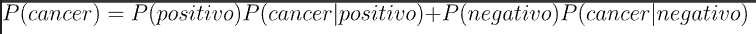

Otro ejemplo es cual es la probabilidad de que una persona use drogas, pero como dato adicional esta persona es músico.

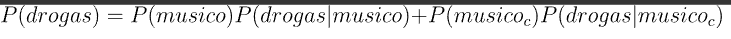

### Teorema de Bayes

El teorema de Bayes, en la teoría de la probabilidad, es una proposición planteada por el matemático inglés Thomas Bayes (1702-1761)​ y publicada póstumamente en 1763,​ que expresa la probabilidad condicional de un evento aleatorio A dado B en términos de la distribución de probabilidad condicional del evento B dado A y la distribución de probabilidad marginal de solo A.

En términos más generales y menos matemáticos, el teorema de Bayes es de enorme relevancia puesto que vincula la probabilidad de A dado B con la probabilidad de B dado A. Es decir, por ejemplo, que sabiendo la probabilidad de tener un dolor de cabeza dado que se tiene gripe, se podría saber (si se tiene algún dato más), la probabilidad de tener gripe si se tiene un dolor de cabeza. Muestra este sencillo ejemplo la alta relevancia del teorema en cuestión para la ciencia en todas sus ramas, puesto que tiene vinculación íntima con la comprensión de la probabilidad de aspectos causales dados los efectos observados.

Sea  un conjunto de sucesos mutuamente excluyentes y exhaustivos, y tales que la probabilidad de cada uno de ellos es distinta de cero (0). Sea B un suceso cualquiera del que se conocen las probabilidades condicionales . Entonces, la probabilidad  viene dada por la expresión:


donde:

*  son las probabilidades a priori,
*  es la probabilidad de B en la hipótesis A,
*  son las probabilidades a posteriori.

Como sabemos que  podemos reemplazarlo en la ecuación y nos quedaría:


En este  <https://www.youtube.com/watch?v=HZGCoVF3YvM&t> (en inglés) podras encontrar un video práctico sobre el Teorema de Bayes.

### Análisis de síntomas

En el siguiente ejercicio implementaremos la posibilidad de tener síntomas dado a que una persona tenga cáncer.

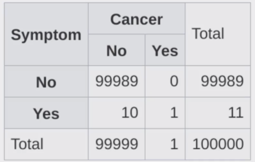

```py
# Implementamos la P(B) = P(A)P(B|A) + P(¬A)P(B|¬A)
def prob_b(prob_a, prob_b_dado_a, prob_b_complemento_a):
    calculo = prob_a * prob_b_dado_a + (1-prob_a) * prob_b_complemento_a
    return calculo

# Implementamos la P(A|B) = P(B|A)P(A) / P(B)
def cal_bayes(prob_a, prob_b_dado_a, prob_b_complemento_a):
    prob_evento = prob_b(prob_a, prob_b_dado_a, prob_b_complemento_a)
    calculo = (prob_b_dado_a * prob_a)/prob_evento

    return calculo

if __name__ == "__main__":
    prob_cancer = 1 / 100000
    prob_sintoma_dado_cancer = 1
    prob_sintoma_dado_no_cancer = 10 / 99999
    
    resultado = cal_bayes(prob_cancer, prob_sintoma_dado_cancer, prob_sintoma_dado_no_cancer)

    print(resultado)
```

Vamos a la consola y ejecutamos nuestro programa.

```py
python3 sintomas.py # Ejecutamos nuestro programa

# Y este sera nuestro resultado.
0.09090909090909091
```

### Aplicaciones del Teorema de Bayes

El Teorema de Bayes es uno de los mecanismos matemáticos más importantes en la actualidad. A grandes rasgos, nos permite medir nuestra certidumbre con respecto a un suceso tomando en cuenta nuestro conocimiento previo y la evidencia que tenemos a nuestra disposición. El Teorema de Bayes permea en tu vida diaria, desde descubrimientos científicos hasta coches autónomos, el Teorema de Bayes es el motor conceptual que alimenta mucho de nuestro mundo moderno.
​
En esta lectura me gustaría darte ejemplos de cómo se utiliza en la vida moderna para que puedas comenzar a implementarlo en tus proyectos, análisis y hasta en
tu vida personal.
​

**Turing y el código enigma de los Nazis**
​
Casi todos sabemos que Alan Turing es uno de los padres del cómputo moderno; pocos saben que fue gracias a él que los aliados pudieron tener una ventaja decisiva cuando Turing logró descifrar el código enigma que encriptaba todas las comunicaciones nazis; pero aún menos saben que para romper este código utilizó el Teorema de Bayes.
​
Lo que hizo Turing fue aplicar el Teorema para descifrar un segmento de un mensaje, calcular las probabilidades iniciales y actualizar las probabilidades
de que el mensaje era correcto cuando nueva evidencia (pistas) era presentada.
​

**Finanzas**
​
Una de las decisiones más difíciles cuando estás manejando un portafolio de inversión es determinar si un instrumento financiero (acciones, valores, bonos, etc.) se va a apreciar en el futuro y por cuánto, o si, por el contrario se debe vender el instrumento. Los portafolios managers más exitosos utilizan el Teorema de Bayes para analizar sus portafolios.
​
En pocas palabras, puedes determinar las probabilidades iniciales basándote en el rendimiento previo de tu portafolio o en el rendimiento de toda la bolsa y
luego añadir evidencia (estados financieros, proyecciones del mercado, etc.) para tener una mayor confianza en las decisiones de venta o compra.
​

**Derecho**
​
El Derecho es uno de los campos más fértiles para aplicar pensamiento bayesiano. Cuando un abogado quiere defender a su cliente, puede comenzar a evaluar una probabilidad de ganar (basada en su experiencia previa, o en estadísticas sobre el número de juicios y condenados con respecto del tema legal que competa) y actualiza su probabilidad conforme vayan sucediendo los eventos del proceso jurisdiccional.
​
Cada nueva notificación, cada prueba y evidencia que encuentre, etc. sirve para actualizar la confianza del abogado.
​

**Inteligencia artificial**
​
El Teorema de Bayes es central en el desarrollo de sistemas modernos de inteligencia artificial. Cuando un coche autónomo se encuentra navegando en las calles, tiene que identificar todos los objetos que se encuentran en su "campo de visión" y determinar cuál es la probabilidad de tener una colisión. Esta probabilidad se actualiza con cada movimiento de cada objeto y con el propio movimiento del vehículo autónomo. Esta constante actualización de probabilidades es lo que permite que los vehículos autónomos tomen decisiones
acertadas que eviten accidentes.
​
En esta rama existen muchos ejemplos como para cubrirlos todos, pero quiero por lo menos mencionar algunos casos de uso: filtros de spam, reconocimiento de voz, motores de búsqueda, análisis de riesgo crediticio, ofertas automáticas, y un largo etcétera.
​
Para terminar, me gustaría compartir una cita del famoso economista John Maynard Keynes que resume perfectamente el tipo de pensamiento que quiero que desarrolles: "Cuando los hechos cambian, yo cambio mi opinión. ¿Qué hace usted, señor?"

### Garbage in, garbage out (Mentiras estadísticas)

* La calidad de nuestros datos es igual de fundamental que la precisión de nuestros cómputos.
* Cuando los datos son errados, aunque tengamos un cómputo prístino nuestros resultados serán erróneos.
* En pocas palabras: con datos errados las conclusiones seránerradas.

En dos ocasiones me han preguntado (miembros del parlamento) ‘Disculpe, Sr. Babbage, si introduce en la máquina números incorrectos, la respuesta correcta saldrá’. Me cuesta trabajo apreciar la confusión de ideas que puede provocar dichas preguntas.

En pocas palabras: con datos errados las conclusiones serán erradas.


### Imágenes engañosas

* Las visualizaciones son muy importantes para entender un conjunto de datos.
* Sin embargo, cuando se juega con la escala se puede llegar a conclusiones incorrectas.
* Nunca se debe confiar en una gráfica sin escalas o etiquetas

### Cum Hoc Ergo Propter Hoc

* Dos variables están positivamente correlacionadas cuando se mueven en la misma dirección y negativamente correlacionadas cuando se mueven en direcciones opuestas.
* Correlación no implica causalidad.
* Pueden existir variables escondidas que generen la correlación
* Después de esto, eso; entonces a consecuencia de esto, eso.

### Prejuicio en el muestreo

* Para que un muestreo pueda servir como base para la inferencia estadística tiene que ser aleatorio y representativo.
* El prejuicio en el muestreo elimina la representatividad de las muestras.
* A veces conseguir muestras es difícil, por lo que se utiliza a la población de más fácil acceso (caso estudios universitarios).

### Falacia del francotirador de Texas

* Esta falacia se da cuando no se toma la aleatoriedad en consideración.
* También sucede cuando uno se enfoca en la similitudes e ignora las diferencias.
* Cuando fallamos al tener una hipótesis antes de recolectar datos estamos en alto riesgo de caer en esta falacia (muy común en Data Science).

### Porcentajes confusos

* Cuando no sabemos la cuenta total del cual se obtiene un porcentaje tenemos el riesgo de concluir falsos resultados.
* Siempre es importante ver el contexto.
* Los porcentajes, en vacío, no significan mucho.

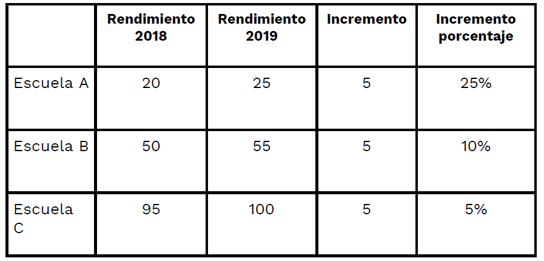

* Escuela A incrementó su rendimiento en 25%
* Escuela B incrementó su rendimiento en 10%
* Escuela C incrementó su rendimiento en 5%

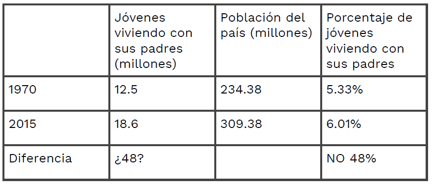

* En 1970, 12.5 millones de jóvenes vivían con sus padres
* En 2015 esta cifra se incrementó a 18.6 millones
* ¿Esto representa un incremento del 48%?

### Falacia de regresión

* Muchos eventos fluctúan naturalmente, por ejemplo, la temperatura promedio de una ciudad, el rendimiento de un atleta, los rendimientos de un portafolio de inversión, etc.
* Cuando algo fluctúa y se aplican medidas correctivas se puede creer que existe un vínculo de causalidad en lugar de una regresión a la media.

### Introducción a Machine Learning

"Es el campo de estudio que le da a las computadoras la habilidad de aprender sin ser explícitamente programadas." - Arthur Samuel, 1959.

* Machine learning se utiliza cuando:

  * Programar un algoritmo es imposible.
  * El problema es muy complejo o no se conocen altoritmos para resolverlo.
  * Ayuda a los humanos a entender patrones (data mining).

* Aprendizaje supervisado vs no supervisado vs semisupervisado.

* Batch vs online learning.

### Feature vectors

Se utilizan para representar características simbólicas o numéricas llamadas features.

* Permiten analizar un objeto desde una perspectiva matemática.
* Los algoritmos de machine learning típicamente requieren representaciones numéricas para poder ejecutar el cómputo.
* Uno de los feature vectors más conocidos es la representación del color a través de RGB ○ color = [R, G, B]
* Procesamiento de imágenes: ○ Gradientes, bordes, áreas, colores, etc.
* Reconocimiento de voz: ○ Distancia de sonidos, nivel de ruido, razón ruido / señal, etc.
* Spam: ○ Dirección IP, estructura del texto, frecuencia de palabras, encabezados, etc.

### Métricas de Distancia

* Muchos de los algoritmos de machine learning pueden clasificarse como algoritmos de optimización.
* Lo que desean optimizar es una función que en muchas ocasiones se refiere a la distancia entre features.
* Distancia euclidiana
* Distancia de Manhattan

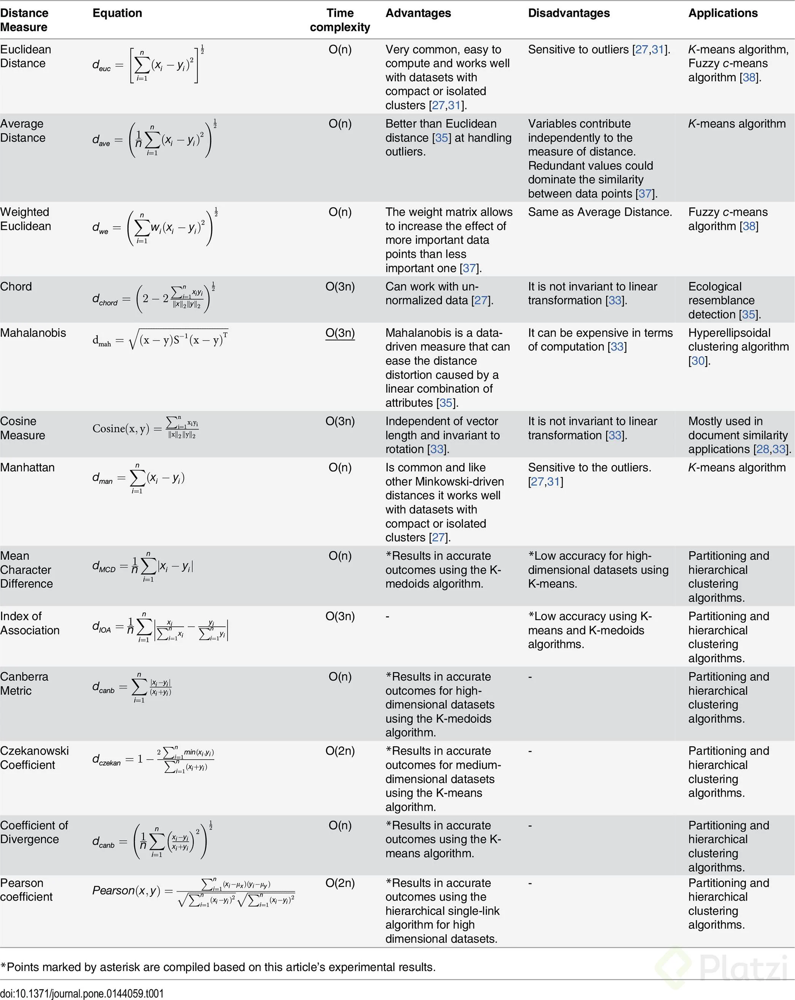

### Introducción al agrupamiento

* Es un proceso mediante el cual se agrupan objetos similares en clusters que los identifican.
* Se clasifica como aprendizaje no supervisado ya que no requiere la utilización de etiquetas.
* Permite entender la estructura de los datos y la similitud entre los mismos.
* Es utilizado en motores de recomendación, análisis de redes sociales, análisis de riesgo crediticio, clasificación de genes, riesgos médicos, etc.

### Agrupamiento jerárquico

* Es un algoritmo que agrupa objetos similares en grupos llamados clusters
* El algoritmo comienza tratando a cada objeto como un cluster individual y luego realiza los siguientes pasos de manera recursiva:
  * Identifica los dos clusters con menor distancia (los más similares)
  * Agrupa los dos clusters en uno nuevo
* El output final es un dendrograma que muestra la relación entre objetos y grupos.
* Es importante determinar qué medida de distancia vamos a utilizar y los puntos a utilizar en cada cluster (linkage criteria)

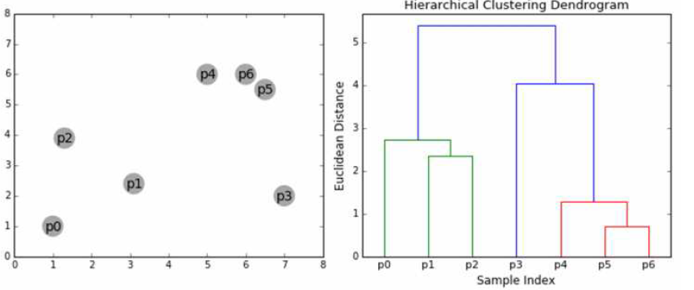

### Agrupamiento K-means

* Es un algoritmo que agrupa utilizando centroides.
* El algoritmo funciona asignando puntos al azar (K define el número inicial de clusters) y después:
  * En cada iteración el punto se ajusta a su nuevo centroide y cada punto se recalcula con la distancia con respecto de los centroides
  * Los puntos se reasignan al nuevo centro
  * El algoritmo se repite de manera iterativa hasta que ya no existen mejoras

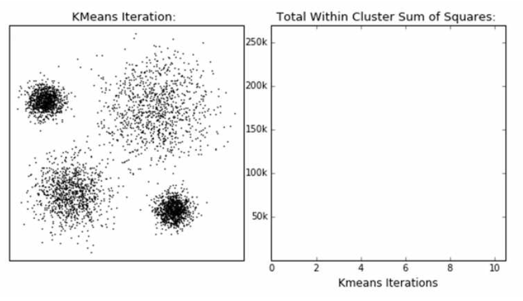